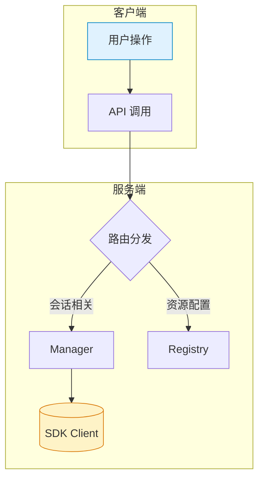
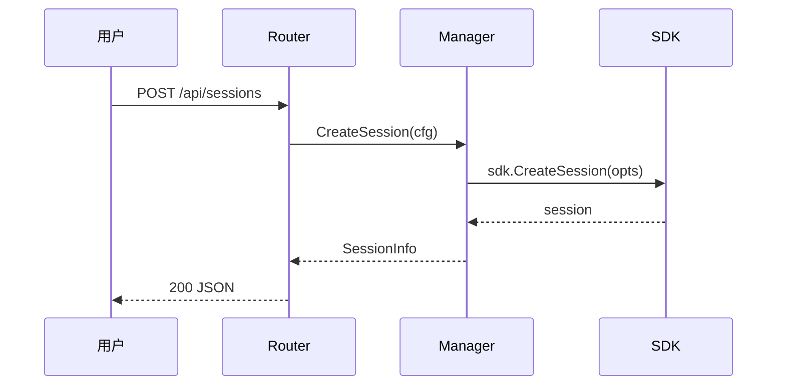

# Coagent — 项目指引

Coagent 是一个基于 GitHub Copilot SDK (`github.com/github/copilot-sdk/go`) 的 Go 后端 + 纯静态前端控制台，用于管理 Copilot 会话、事件可视化和资源配置。

## ⚠️ 核心规则：先文档，后代码

**任何功能开发或重大改动，必须先输出文档，经用户确认后才能开始写代码。**

文档至少包含以下内容（按需裁剪）：

1. **设计文档**：目标、约束、方案选型及理由
2. **系统架构**：涉及的组件、模块边界、数据流向
3. **功能描述**：输入/输出、状态变化、边界条件
4. **交互流程**：用户操作 → 系统响应的完整链路

### 文档格式要求

- 用 Mermaid 图 + 文字说明结合的方式，图文并茂
- Mermaid 图要清晰美观：合理分组、配色、方向（优先 `graph TD` 或 `sequenceDiagram`）
- 每张图前后配文字段落，解释图中要点

Mermaid 风格参考：





### 何时可以跳过

- 单行 bug 修复、拼写纠正等微小改动
- 用户明确说"直接改"或"不要文档"

## 架构概览

```
cmd/coagent/main.go             — 入口：HTTP 服务启动、信号处理
internal/copilot/manager.go      — SDK 客户端与会话生命周期管理（并发安全）
internal/copilot/registry.go     — 模型/技能/提示词/MCP/工具/任务模板/Workflow定义 配置中心
internal/copilot/config.go       — 共享配置结构体（SessionConfig、MissionTemplate、SkillInfo 等）
internal/copilot/workflow.go     — Workflow 引擎（定义模型 + expr 条件引擎 + 步骤执行循环）
internal/copilot/team.go         — 团队编排器（阶段状态机 + RunPipeline）
internal/copilot/rolerouter.go   — 任务→角色路由（关键词匹配）
internal/copilot/planning.go     — 规划文档发现（PRD/TestSpec/DeepInterview）
internal/copilot/persistence.go  — Registry JSON 持久化（~/.coagent/）
internal/copilot/eventstore.go   — 事件/会话 SQLite 存储
internal/copilot/changelog.go    — Changelog AI 生成与版本管理
internal/copilot/mcpprobe.go     — MCP 服务器探测
internal/api/router.go           — REST + SSE 路由层（Go 1.22+ ServeMux 语法）
internal/api/handlers_extended.go — 扩展 handler（任务模板、团队编排、规划等）
internal/api/handlers_workflow.go — Workflow 定义 CRUD + 运行控制 handler
internal/api/helpers.go          — JSON 响应/解码/错误工具函数
skills/                          — 36 个内置技能定义（SKILL.md 文件）
web/                             — 纯静态前端（Alpine.js + Tailwind，无构建工具）
```

- **Manager** 是唯一持有 SDK Client 的组件，所有会话操作通过 Manager 进行；持有 `Orchestrator` 实例用于团队编排，持有 `WorkflowEngine` 实例用于 Workflow 执行。
- **Registry** 内置 33 个 prompt 模板 + 13 个任务模板 + 39 个技能目录元数据 + 3 个 Workflow 定义，支持 `~/.coagent/*.json` 持久化。
- **WorkflowEngine** 基于声明式步骤定义的工作流引擎：每个 Workflow 定义包含多步骤 + expr 条件分支，启动时创建独立 `workflow-` 前缀 session，后台 goroutine 按步骤循环执行。
- **TeamOrchestrator** 管理团队运行的阶段状态机（plan→prd→exec→verify→fix→complete），每个阶段映射到对应的 prompt 角色。
- **Router** 是薄封装层：参数校验 → 调 Manager/Registry/Orchestrator → JSON 响应。
- **前端**通过 `web/assets/api.js` 与后端一一映射的 REST API 交互。

## 构建与测试

```bash
make build          # 构建
make run            # 运行（默认 :8080）
make run-auto-start # 启动时自动连接 Copilot
make test           # 测试（当前无测试文件）
make vet            # 静态检查
```

命令行参数：`-addr`、`-log-level`、`-cwd`、`-auto-start`

## 代码风格

### Go

- Go 1.25+，使用标准库 `net/http` 路由（`"METHOD /path/{id}"` 语法）。
- 并发保护：Manager 和 Registry 使用 `sync.RWMutex`。
- 错误包装统一用 `fmt.Errorf("context: %w", err)`。
- 创建/恢复会话必须设置 `OnPermissionRequest: sdk.PermissionHandler.ApproveAll`，否则运行时崩溃。
- JSON tag 作为 API 合同；`json:"-"` 表示字段仅内部使用。

### 前端 (web/)

- 无构建工具，CDN 依赖（Alpine.js、Tailwind、vis-network）。
- `api.js` 封装所有 HTTP 调用，`main.js` 管理状态与交互。
- 事件可视化 CSS 类名统一用 `ev-` 前缀。
- 路径参数一律 `encodeURIComponent`。

## 约定

- 有 Makefile（`make run`、`make build`），也可直接用 `go` 命令。
- API 模型默认回退：请求中模型为空时自动设为 `gpt-5.3-codex`。
- SSE 端点 `/api/sessions/{id}/stream` 使用 `event:` + `data:` 格式推送。
- Registry 新增对象无 ID 时自动分配 `uuid.New().String()`。
- 内置 prompt/mission/skill 通过 `Builtin: true` 标记，持久化时跳过 builtin 数据。
- TeamOrchestrator 阶段转换有严格有效性校验，fix 阶段有最大重试次数限制。
- `skills/` 目录下的 `SKILL.md` 文件在启动时作为默认技能路径加载。

## 易踩的坑

- 不要对 protobuf message 做值拷贝（含 `sync.Mutex`），需要快照用 `proto.Clone`。
- 运行 `go test ./...` 前确保 cwd 在仓库根目录，子目录运行会误报。
- Registry 持久化到 `~/.coagent/*.json`，启动时自动恢复；builtin 数据仅在内存 seed，不写文件。
- TeamOrchestrator 是内存态，运行数据不持久化。
- WorkflowEngine 是内存态，运行数据不持久化；Workflow 定义通过 Registry 持久化到 `~/.coagent/workflow_defs.json`。
- WorkflowEngine 创建 session 时自动组合系统提示词（base 框架 + 用户自定义 + 步骤流程描述），使用 `expr-lang/expr` 评估条件表达式。
- `RouteTaskToRole` 是纯关键词匹配，不涉及 LLM 调用。
