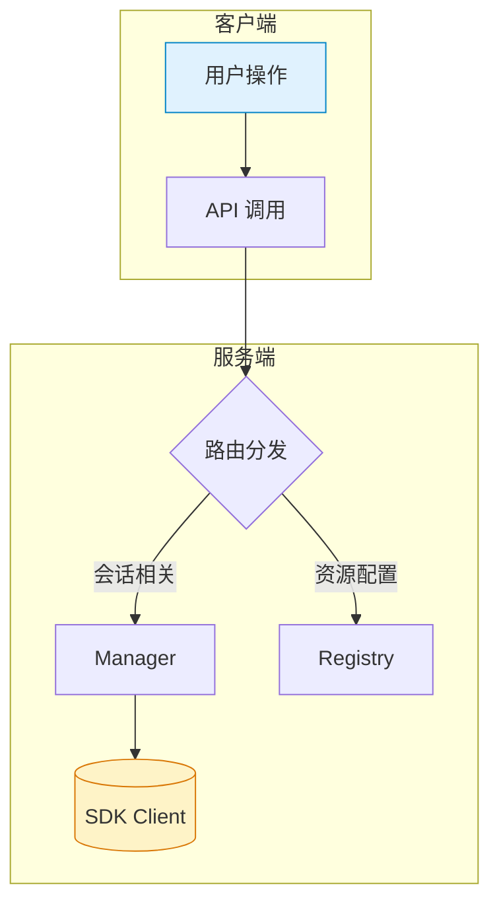

# 文档编写约定

## 基本格式

- 所有文档统一用 Markdown（.md），结构清晰、层级分明
- 标题层级规范：一级标题用于文档名，二级及以下分章节
- 代码示例用三反引号包裹，注明语言类型
- 重要术语、接口、参数等用粗体或反引号标识

## Mermaid 图规范

- 复杂流程、架构、数据流必须配 Mermaid 图
- 图前后需有文字说明，解释核心要点和设计意图
- 图类型优先选用 `graph TD`（流程/结构）和 `sequenceDiagram`（时序/交互）
- 合理分组（subgraph）、节点命名清晰、配色简洁
- 图例、注释适当补充，避免歧义

### 示例

- 上述图用于展示系统模块边界与主要数据流

## 图文并茂要求

- 每个关键设计、流程、接口说明，必须“图+文”结合
- 图用于全局把控、结构梳理，文字补充细节、边界、约束
- 文字说明应紧贴图示，避免“图文分离”导致理解断层

## 其他要求

- 文档目录结构与代码结构对应，便于查找
- 变更记录、设计决策等建议单独文档归档（如 design-changelog.md）
- 重要文档需定期维护，保持与实现一致
