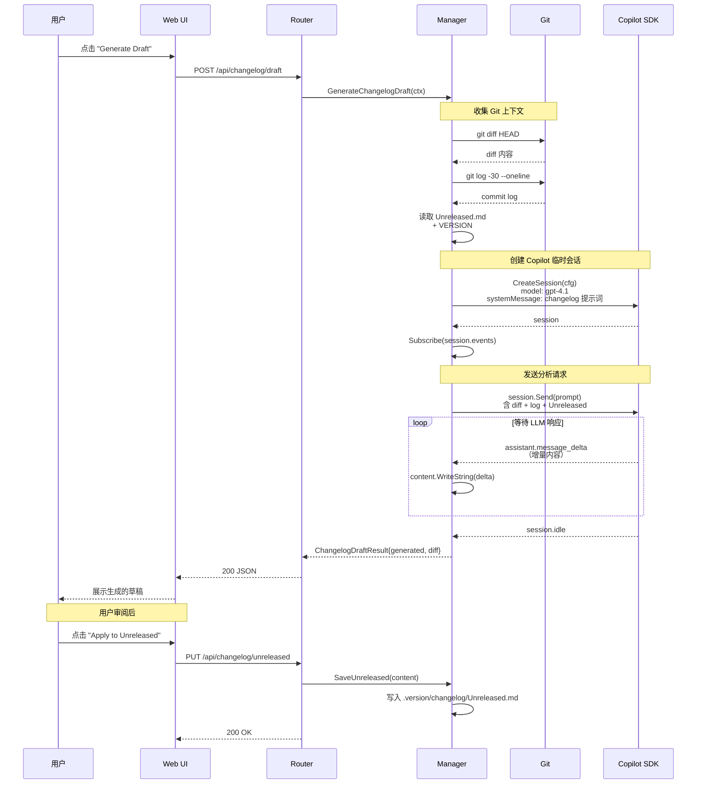
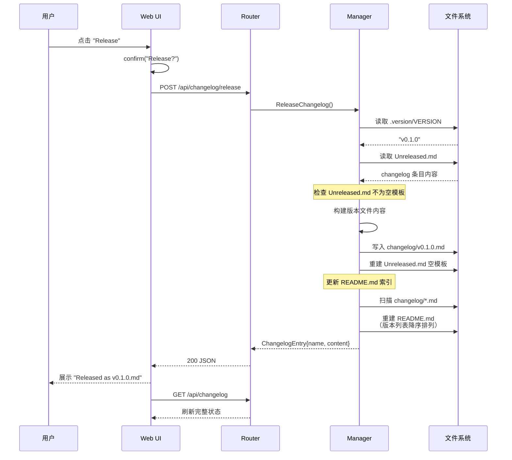
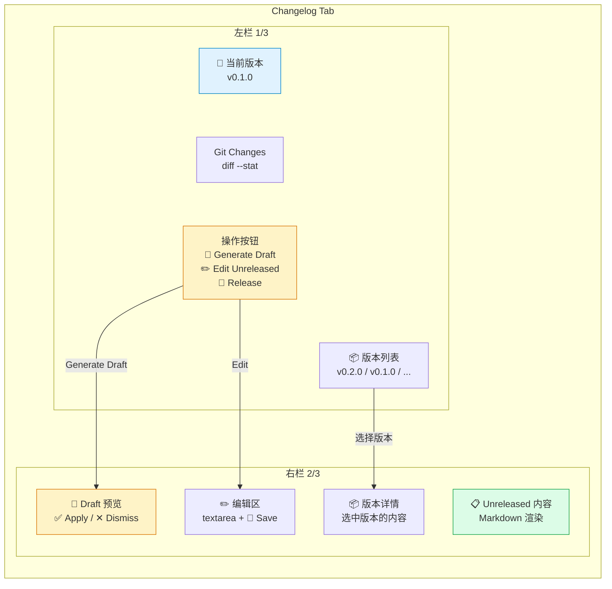
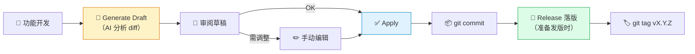

# Changelog 自动维护 — 设计文档

## 目标

为 CoAgent 新增 **Changelog 自动维护功能**：程序运行在 git repo 下，通过 Copilot 会话（LLM）自动分析 git 变更并生成结构化 changelog 条目，支持 draft（草稿生成）和 release（版本落版）两种模式，并在前端提供完整的查看、编辑、发布界面。

### 参考源

本功能从 [redant](https://github.com/pubgo/redant) 项目提取并适配，参考文件：

- `docs/CHANGELOG_LLM_PROMPT.md` — LLM 提示词模板（模板 A/B）
- `.github/prompts/changelog-maintenance.prompt.md` — Agent 提示词（draft/release 模式）
- `.github/instructions/changelog.instructions.md` — Changelog 专项维护规范

---

## 系统架构

```mermaid
graph TD
    subgraph 前端 Web UI
        TAB[📝 Changelog Tab]
        TAB --> VIEW[查看<br/>Unreleased + 版本列表]
        TAB --> DRAFT[🤖 Generate Draft]
        TAB --> EDIT[✏️ Edit Unreleased]
        TAB --> REL[🚀 Release]
    end

    subgraph 后端 API Layer
        H1["GET /api/changelog"]
        H2["GET /api/changelog/diff"]
        H3["POST /api/changelog/draft"]
        H4["PUT /api/changelog/unreleased"]
        H5["POST /api/changelog/release"]
    end

    subgraph Manager — changelog.go
        GIT[Git Helper<br/>diff / log / branch]
        LLM[Copilot Session<br/>CreateSession → Send → 收集响应]
        FIO[File I/O<br/>读写 .version/ 文件]
        README[README 索引更新]
    end

    subgraph 文件系统 .version/
        VER[VERSION]
        UNR["changelog/Unreleased.md"]
        VFILES["changelog/vX.Y.Z.md"]
        RIDX["changelog/README.md"]
    end

    VIEW --> H1
    DRAFT --> H3
    EDIT --> H4
    REL --> H5

    H1 --> FIO
    H2 --> GIT
    H3 --> GIT
    H3 --> LLM
    H3 --> FIO
    H4 --> FIO
    H5 --> FIO
    H5 --> README

    FIO --> VER
    FIO --> UNR
    FIO --> VFILES
    README --> RIDX

    LLM -.->|"创建临时会话<br/>system prompt + diff"| SDK["Copilot SDK<br/>sdk.Client"]

    style TAB fill:#e0f2fe,stroke:#0284c7
    style DRAFT fill:#fef3c7,stroke:#d97706
    style LLM fill:#fef3c7,stroke:#d97706
    style SDK fill:#fce7f3,stroke:#db2777
    style UNR fill:#dcfce7,stroke:#16a34a
    style VFILES fill:#dcfce7,stroke:#16a34a
```

前端 Changelog Tab 通过 5 个 REST API 与后端交互。后端的核心逻辑集中在 `Manager` 的 changelog 方法中：git 命令获取变更信息，Copilot SDK 创建临时会话生成草稿，文件 I/O 读写 `.version/` 目录。

---

## 文件目录结构

```
.version/
├── VERSION                     # 当前版本号，如 v0.1.0
└── changelog/
    ├── README.md               # 索引页（release 时自动重建）
    ├── Unreleased.md           # 开发中变更（draft 写入此处）
    ├── v0.1.0.md               # 已发布版本
    └── v0.0.1.md               # ...
```

与 redant 项目完全一致的目录结构和文件格式。

---

## Draft 流程（AI 生成 Changelog）

这是核心功能——利用 Copilot 会话分析 git 变更，自动生成 changelog 条目。



**关键设计点：**

- **临时会话**：每次 draft 创建独立 Copilot 会话，日常聊天不受影响
- **System Prompt**：融合了 redant 三份参考文件的规则——归类标准、中文技术文风、增量追加、去重合并
- **同步等待**：通过事件订阅 `session.idle` 判断完成，超时 120s
- **增量追加**：如果 Unreleased.md 已有条目，LLM 会在已有基础上追加，不重复

---

## Release 流程（版本落版）

纯文件操作，不需要 LLM 参与。



**落版步骤：**

1. 读取 `.version/VERSION` 获取版本号
2. 读取 `Unreleased.md` 内容
3. 创建 `changelog/<VERSION>.md`，头格式为 `# [<VERSION>] - <YYYY-MM-DD>`
4. 重建 `Unreleased.md` 为空模板（四个分类，初始值"暂无"）
5. 重建 `changelog/README.md` 索引（遍历所有版本文件，降序排列）

---

## API 端点一览

| 方法 | 路径 | 描述 | 处理函数 |
|------|------|------|----------|
| GET | `/api/changelog` | 获取完整状态（VERSION + Unreleased + 版本列表 + diff） | `handleGetChangelog` |
| GET | `/api/changelog/diff` | 获取当前 git diff | `handleGetGitDiff` |
| POST | `/api/changelog/draft` | AI 生成 changelog 草稿 | `handleChangelogDraft` |
| PUT | `/api/changelog/unreleased` | 手动保存 Unreleased.md | `handleSaveUnreleased` |
| POST | `/api/changelog/release` | 执行版本落版 | `handleChangelogRelease` |

---

## 前端 UI 结构



- **左栏**：版本号、git diff 概览、操作按钮、历史版本列表
- **右栏**：根据操作切换显示 Draft 预览 / 编辑器 / Unreleased 内容 / 版本详情
- Copilot 未启动时，Generate Draft 按钮置灰并提示

---

## System Prompt 设计

系统提示词综合了 redant 三份参考文件的核心规则：

```mermaid
graph TD
    subgraph "参考来源"
        A["CHANGELOG_LLM_PROMPT.md<br/>模板 A：开发阶段"]
        B["changelog-maintenance.prompt.md<br/>draft 模式规则"]
        C["changelog.instructions.md<br/>结构与内容约束"]
    end

    subgraph "融合后的 System Prompt"
        R1[归类规则<br/>feat→新增 / fix→修复<br/>重构→变更 / docs→文档]
        R2[内容约束<br/>不杜撰 / 中文技术文风<br/>动词开头 / 去重合并]
        R3[结构约束<br/># &#91;Unreleased&#93; 头格式<br/>四分类固定顺序]
        R4[增量逻辑<br/>已有条目基础上追加<br/>不重复已有内容]
        R5[输出格式<br/>直接输出完整文件<br/>不附加解释文字]
    end

    A --> R1
    A --> R2
    B --> R4
    B --> R5
    C --> R3
    C --> R2

    style A fill:#fef3c7,stroke:#d97706
    style B fill:#e0f2fe,stroke:#0284c7
    style C fill:#dcfce7,stroke:#16a34a
    style R1 fill:#f1f5f9,stroke:#64748b
    style R4 fill:#fce7f3,stroke:#db2777
```



---

## 代码定位

| 文件 | 职责 |
|------|------|
| `internal/copilot/changelog.go` | 核心逻辑：git helper、LLM 交互、文件读写、release 落版 |
| `internal/api/handlers_extended.go` | 5 个 HTTP handler |
| `internal/api/router.go` | 路由注册 |
| `web/assets/api.js` | 前端 API 函数 |
| `web/assets/app.js` | Changelog 状态与方法 |
| `web/partials/changelog.html` | Changelog Tab UI |
| `web/index.html` | 侧栏入口 + section 注册 |
| `.version/VERSION` | 当前版本号 |
| `.version/changelog/` | Changelog 文件目录 |

---

## 推荐工作流



1. 功能开发完成后 → 点击 **Generate Draft**（AI 自动分析）
2. 审阅 → 需要调整则 **Edit**，满意则 **Apply**
3. 提交代码
4. 准备发版时 → 点击 **Release**（自动落版 + 重建模板 + 更新索引）
