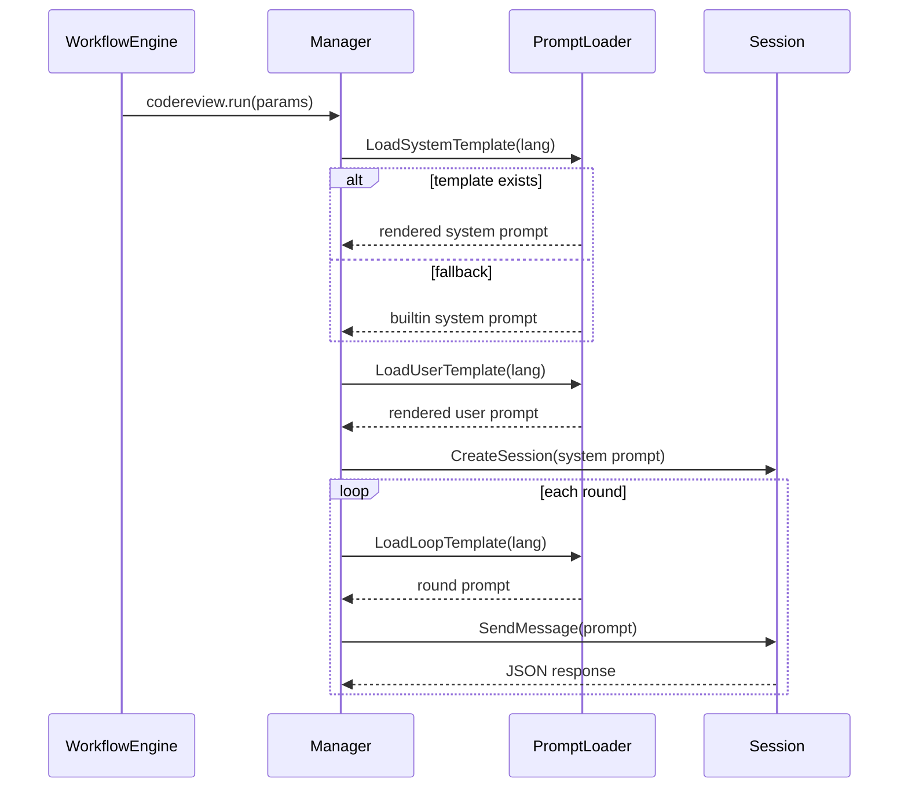

# CodeReview Workflow Agent 模板对齐设计

> 状态：Implemented（已实施）
> 日期：2026-04-17

## 背景与目标

当前 `coagent` 的 CodeReview 流程（`internal/copilot/codereview.go`）使用内嵌字符串构建 system/user/round prompt；
而 `.local/codereview/cmd/codereview/templates/agent` 已沉淀了更完整的评审规则（只读约束、覆盖门禁、轮次约束、结论结构等）。

本设计目标：

1. 让 `coagent` 的 codereview workflow agent 复用（或对齐）`.local` 的模板能力。
2. 保持现有 API/Workflow 兼容，不破坏 `codereview.run/await/submit` 行为。
3. 提供回退机制：模板不可用时仍可使用现有内嵌 prompt。

## 非目标

- 不引入对 `.local/codereview` 子模块的运行时强依赖。
- 不修改前端交互协议。
- 不改变审查结果 JSON 合同（继续兼容 `comments/findings` 与覆盖字段）。

## 方案选型

### 候选方案

- 方案 A：运行时直接读取 `.local/codereview/.../templates/agent`
- 方案 B：将模板同步到 `coagent` 内部目录，运行时优先读内部模板，读不到再回退内嵌字符串

### 选择

选择 **方案 B**。

理由：

- 避免跨模块路径耦合（`.local` 可能不存在或被忽略）。
- 发布与部署可控（模板与主程序同仓同版本）。
- 回退路径清晰，风险最低。

## 系统架构

```mermaid
graph TD
    A[Workflow: wf-codereview-business] --> B[codereview.run]
    B --> C[Manager.RunCodeReview]
    C --> D[Prompt Loader]

    subgraph Prompt Sources
        D --> E[internal/copilot/templates/agent/*.md]
        D --> F[Fallback: crSystemPromptTemplate/crBuildUserPrompt]
    end

    C --> G[CreateSession(SystemMessage)]
    C --> H[Round Prompt Builder]
    H --> I[SendMessage -> Parse JSON]

    style A fill:#e0f2fe,stroke:#0284c7
    style D fill:#fef3c7,stroke:#d97706
    style E fill:#dcfce7,stroke:#16a34a
    style F fill:#fde68a,stroke:#d97706
```

说明：

- 仅扩展 Prompt 构建阶段。
- 审查执行、覆盖闭环、提交流程保持不变。

## 功能描述

### 输入

- 现有运行参数：`lang/base_branch/rounds/zero_stop/disable_coverage_gate/...`
- PR 上下文：`pr number/title/body/url`
- Diff 与 changed files

### 输出

- 与现状一致：单个 JSON 评审结果（含 `summary/event/comments`，可含 `file_coverage/category_coverage/findings`）

### 状态变化

- 新增“模板解析阶段”，不引入新的运行状态。
- 模板失败时记录 warning，自动回退到内嵌 prompt。

## 交互流程



## 目录与文件规划

新增（已落地）：

- `internal/copilot/templates/agent/copilot-agent-instructions-cn.md`
- `internal/copilot/templates/agent/copilot-agent-instructions.md`
- `internal/copilot/templates/agent/review-user-prompt-cn.md`
- `internal/copilot/templates/agent/review-user-prompt.md`
- `internal/copilot/templates/agent/review-loop-prompt-cn.md`
- `internal/copilot/templates/agent/review-loop-prompt.md`

代码改造（已落地）：

- `internal/copilot/codereview_prompt_templates.go`
  - 新增模板加载函数（system/user/loop）
  - 使用 embed 打包模板文件并按语言选择
- `internal/copilot/codereview.go`
  - `crBuildSystemPrompt`/`crBuildUserPrompt`/`crBuildRoundPrompt` 改为“模板优先，内嵌回退”
- `internal/copilot/codereview_test.go`
  - 增加模板接入路径验证测试

## 边界条件与兼容性

- `lang` 非 `en` 统一走中文模板。
- 模板缺失/为空/渲染失败：回退到内嵌 prompt，不中断 run。
- 保持 `disable_coverage_gate` 与现有覆盖闭环逻辑不变。

## 风险与缓解

- 风险：模板和 JSON 合同不一致导致解析失败
  - 缓解：保留现有解析兼容层（`comments` + `findings`）并增加测试
- 风险：模板文本改动导致输出漂移
  - 缓解：在测试中校验关键约束关键词（JSON-only、category tag、coverage fields）

## 验证结果

- 已执行 `go test ./internal/copilot/...`，通过。
- 已执行 `go test ./...`，通过。

## 实施结果

1. 已同步 `.local` agent 模板到 `internal/copilot/templates/agent`。
2. 已新增模板加载与渲染器（模板变量替换 + embed）。
3. 已将 prompt 构建切换为模板优先策略。
4. 已完成测试与全量回归。

---

该设计已在当前代码中生效，后续如需继续对齐 `.local` 模板，只需更新 `internal/copilot/templates/agent/*.md` 即可。
