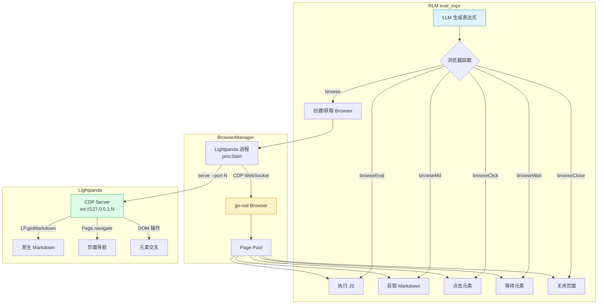
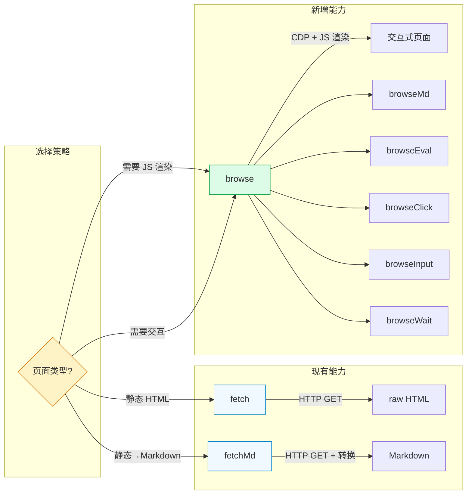
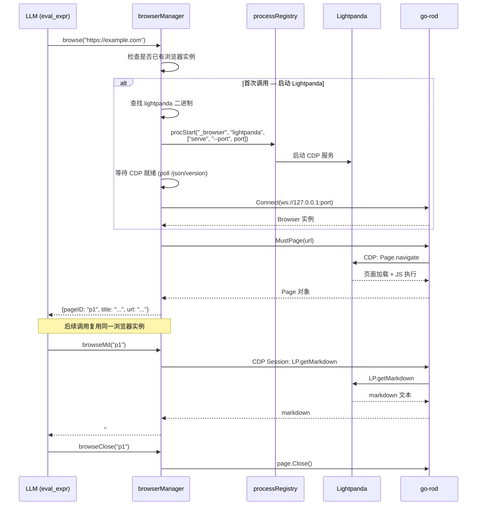

# 设计文档：Lightpanda + go-rod 浏览器自动化集成

## 1. 目标

为 Coagent 的 RLM (eval_expr) 引擎提供 **真实浏览器自动化能力**，解决现有 `fetch`/`fetchMd` 无法处理的场景：

- JavaScript 渲染后的动态页面采集
- 表单填写、按钮点击等交互操作
- SPA/CSR 页面内容提取
- 需要等待异步加载完成的场景

使用 **Lightpanda**（Zig 编写的轻量无头浏览器）替代 Chrome，配合 **go-rod**（Go CDP 客户端）实现：

| 维度     | Chrome Headless | Lightpanda          |
| -------- | --------------- | ------------------- |
| 启动时间 | 秒级            | 毫秒级              |
| 内存峰值 | ~2GB (933 页)   | ~123MB (同场景)     |
| 执行速度 | 基准            | 9x 更快             |
| 依赖体积 | ~200MB+         | ~30MB 单文件        |
| 图形渲染 | 有（浪费）      | 无（专为 headless） |
| CDP 兼容 | 完整            | 逐步完善            |

## 2. 约束

- Lightpanda 是外部二进制，需要 `brew install` 或 `curl` 安装
- Lightpanda CDP 实现尚在发展中，部分 Chrome CDP 命令不支持
- go-rod 连接 Lightpanda 时需要手动注入 `Sec-WebSocket-Key`（gorilla/websocket 要求 base64）
- 浏览器进程生命周期必须与工作流绑定，防止泄漏

## 3. 架构设计

### 3.1 整体架构



核心思路：利用已有的 **procStart** 进程管理能力启动 Lightpanda CDP 服务，通过 go-rod 连接 WebSocket，向 RLM 暴露高级浏览器操作函数。

### 3.2 与现有能力的关系



`fetch`/`fetchMd` 适合静态页面（快速、无依赖）；`browse*` 系列覆盖需要 JS 渲染和用户交互的场景。LLM 根据任务需要自行选择。

## 4. 功能设计

### 4.1 新增 expr 函数

| 函数               | 签名                                           | 说明                                                               |
| ------------------ | ---------------------------------------------- | ------------------------------------------------------------------ |
| `browse`           | `browse(url, opts?) → {pageID, title, url}`    | 打开页面（自动启动 Lightpanda 如未运行），返回 pageID              |
| `browseMd`         | `browseMd(pageID?) → string`                   | 调用 `LP.getMarkdown` 获取当前页面 Markdown（Lightpanda 原生支持） |
| `browseEval`       | `browseEval(pageID, js) → any`                 | 在页面上下文执行 JavaScript，返回结果                              |
| `browseClick`      | `browseClick(pageID, selector) → string`       | 点击 CSS 选择器匹配的元素                                          |
| `browseInput`      | `browseInput(pageID, selector, text) → string` | 向输入框填写文本                                                   |
| `browseWait`       | `browseWait(pageID, selector, opts?) → string` | 等待元素出现，opts: `{timeout: 5000}`                              |
| `browseClose`      | `browseClose(pageID?) → string`                | 关闭页面（不传 pageID 则关闭所有）                                 |
| `browseScreenshot` | `browseScreenshot(pageID, path) → string`      | 页面截图保存到文件                                                 |

### 4.2 Lightpanda 进程管理

利用已有的 `processRegistry` 自动管理 Lightpanda 进程：



关键设计点：

- **懒启动**：首次调用 `browse()` 时才启动 Lightpanda 进程
- **端口分配**：动态选择可用端口（避免冲突）
- **就绪检测**：启动后 poll `http://127.0.0.1:{port}/json/version` 直到响应
- **复用实例**：同一工作流内所有 `browse*` 调用共享同一个浏览器实例
- **自动清理**：工作流结束时通过 `processRegistry.killAll()` 清理

### 4.3 browserManager 结构

```go
// browserManager 管理一个 Lightpanda + go-rod 浏览器实例。
// 挂在 processRegistry 同级别（per WorkflowRun）。
type browserManager struct {
    mu       sync.Mutex
    browser  *rod.Browser
    ws       *cdp.WebSocket
    pages    map[string]*rod.Page  // pageID → Page
    port     int
    procName string                // processRegistry 中的名称
    ready    bool
}
```

### 4.4 go-rod 连接 Lightpanda 的关键代码

参考 [lightpanda-io/demo/rod/title/main.go](https://github.com/lightpanda-io/demo/blob/main/rod/title/main.go)，连接时需要手动注入 `Sec-WebSocket-Key`：

```go
func connectLightpanda(ctx context.Context, wsURL string) (*rod.Browser, *cdp.WebSocket, error) {
    // Lightpanda 使用 gorilla/websocket, 要求 base64 编码的 Sec-WebSocket-Key
    buf := make([]byte, 16)
    _, _ = rand.Read(buf)
    key := base64.StdEncoding.EncodeToString(buf)

    ws := &cdp.WebSocket{}
    err := ws.Connect(ctx, wsURL, http.Header{
        "Sec-WebSocket-Key": {key},
    })
    if err != nil {
        return nil, nil, fmt.Errorf("connect CDP: %w", err)
    }

    cli := cdp.New()
    cli.Start(ws)

    b := rod.New()
    b.Client(cli)

    return b, ws, nil
}
```

### 4.5 LP.getMarkdown — Lightpanda 原生 Markdown

Lightpanda 独有的 CDP 扩展命令，**无需外部 HTML→Markdown 转换**，直接从浏览器引擎输出：

```go
// 通过 go-rod 的 CDP session 调用 LP.getMarkdown
page := browser.MustPage(url)
page.MustWaitLoad()

// 获取 CDP client
client := page.GetContext() // 或通过 proto 包调用
// 发送自定义 CDP 命令
result := proto.Call(client, "LP.getMarkdown", map[string]any{})
```

对比现有 `fetchMd`（基于 html-to-markdown 库转换）：

| 维度     | fetchMd             | browseMd (LP.getMarkdown) |
| -------- | ------------------- | ------------------------- |
| JS 渲染  | ❌ 不执行            | ✅ 执行后转换              |
| 转换来源 | raw HTML            | 渲染后 DOM                |
| 依赖     | html-to-markdown 库 | Lightpanda 原生           |
| SPA 支持 | ❌                   | ✅                         |
| 性能     | 快（无浏览器）      | 更慢（需浏览器）          |

## 5. 依赖管理

### 5.1 Go 依赖

```
go get github.com/go-rod/rod
```

go-rod 是纯 Go 实现，无 CGO 依赖。

### 5.2 Lightpanda 二进制

Lightpanda 是外部二进制，**不作为 Go 依赖构建**。安装方式：

```bash
# macOS (Homebrew)
brew install lightpanda-io/browser/lightpanda

# 或 curl 一键安装
curl -fsSL https://pkg.lightpanda.io/install.sh | bash

# 或手动下载 (macOS ARM)
curl -L -o lightpanda \
  https://github.com/lightpanda-io/browser/releases/download/nightly/lightpanda-aarch64-macos
chmod a+x ./lightpanda
```

### 5.3 可用性检测

```go
// 启动时检测 lightpanda 是否可用
path, err := exec.LookPath("lightpanda")
if err != nil {
    // 降级：browse* 函数返回友好错误提示安装方式
}
```

## 6. 典型使用场景

### 6.1 采集 JavaScript 渲染页面

```javascript
// 打开 SPA 页面
let page = browse("https://spa-app.com/dashboard");

// 等待数据加载
browseWait(page.pageID, ".data-table");

// 获取渲染后的 Markdown
let content = browseMd(page.pageID);

// 关闭
browseClose(page.pageID);
```

### 6.2 表单交互

```javascript
let page = browse("https://example.com/login");
browseInput(page.pageID, "#username", "user@example.com");
browseInput(page.pageID, "#password", "***");
browseClick(page.pageID, "button[type=submit]");
browseWait(page.pageID, ".dashboard");
let result = browseMd(page.pageID);
browseClose(page.pageID);
```

### 6.3 多页面并发采集

```javascript
// 启动浏览器（自动懒启动）
let urls = ["https://a.com", "https://b.com", "https://c.com"];
let pages = map(urls, {browse(#)});

// 等待所有页面加载
map(pages, {browseWait(#.pageID, "body")});

// 提取内容
let contents = map(pages, {browseMd(#.pageID)});

// 清理
browseClose(); // 关闭所有页面
```

### 6.4 与 procStart 组合使用

```javascript
// 也可以手动管理 Lightpanda 进程
procStart("lp", "lightpanda", ["serve", "--port", "9333"], {"desc": "浏览器引擎"});
sleep(1000);

// 用 browse 连接（指定端口）
let page = browse("https://example.com", {"port": 9333});
```

## 7. 实现计划

### Phase 1: 核心浏览器管理

1. 添加 `go-rod` 依赖
2. 实现 `browserManager` 结构（懒启动、连接、页面池）
3. 实现 `browse()` 和 `browseClose()` 函数
4. 集成到 `exprProcFunctions` / `evalExprForRLM`

### Phase 2: 页面操作函数

5. 实现 `browseMd()` — 调用 LP.getMarkdown
6. 实现 `browseEval()` — 执行 JS
7. 实现 `browseClick()` / `browseInput()` — 元素交互
8. 实现 `browseWait()` — 等待元素

### Phase 3: 增强

9. 实现 `browseScreenshot()` — 截图
10. 更新 RLM 文档描述
11. 编写测试（需要 lightpanda 安装的用 `t.Skip`）
12. Lightpanda 不可用时的降级提示

## 8. 设计决策

| 决策          | 选择                                  | 理由                                         |
| ------------- | ------------------------------------- | -------------------------------------------- |
| 浏览器引擎    | Lightpanda（非 Chrome）               | 9x 更快、16x 更省内存、单文件部署            |
| CDP 客户端    | go-rod（非 chromedp）                 | API 更简洁、链式调用、官方有 Lightpanda demo |
| 进程管理      | 复用 processRegistry                  | 已有基础设施，自动生命周期管理               |
| Markdown 获取 | LP.getMarkdown（非 html-to-markdown） | Lightpanda 原生支持，JS 渲染后转换           |
| 函数命名      | `browse*` 前缀                        | 与 `fetch*`/`proc*` 区分，语义清晰           |
| 多页面        | pageID 寻址                           | 支持同时操作多个标签页                       |
| 安装方式      | 外部 `PATH` 查找                      | 不打包二进制，保持 Go 构建简洁               |

## 9. 风险与缓解

| 风险                  | 影响                     | 缓解                                     |
| --------------------- | ------------------------ | ---------------------------------------- |
| Lightpanda CDP 不兼容 | 某些 go-rod 操作可能失败 | 优先测试核心操作，提供 fallback 错误提示 |
| 用户未安装 Lightpanda | browse* 无法使用         | 首次调用时检查并返回安装指引             |
| WebSocket 连接不稳定  | 页面操作中断             | 重连逻辑 + 超时处理                      |
| 端口冲突              | 启动失败                 | 动态端口分配                             |
| 进程泄漏              | 资源浪费                 | processRegistry 自动清理机制已覆盖       |
