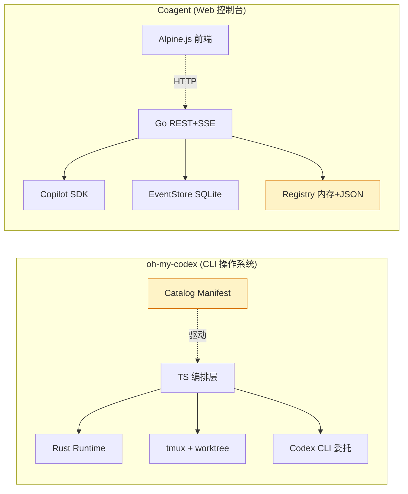
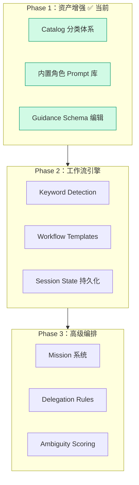

# oh-my-codex 集成设计文档

> 参考项目: [oh-my-codex](https://github.com/Yeachan-Heo/oh-my-codex) (`.local/oh-my-codex`)

## 1. 项目调研摘要

### 1.1 oh-my-codex 是什么

omx 是一个 **围绕 Codex CLI 的工作流操作系统**，核心能力：

- **统一 CLI 入口**：`omx setup/team/ralph/explore/autoresearch` 等子命令
- **链式工作流**：`$deep-interview` → `$ralplan` → `$team/$ralph`
- **30+ 专业角色 Prompt**：executor, architect, debugger, verifier, explorer, code-reviewer, security-reviewer, test-engineer 等
- **Catalog Manifest**：结构化管理 skills/agents 的分类、状态、别名
- **Team Mode**：tmux + worktree + mailbox 多 agent 并行执行
- **状态持久化与恢复**：`.omx/state/` 快照、ledger、replay

### 1.2 架构对比



### 1.3 核心差异

| 维度       | omx                    | coagent              |
| ---------- | ---------------------- | -------------------- |
| 交互方式   | CLI + tmux             | Web UI + REST API    |
| 模型调用   | 委托 Codex CLI         | 直连 Copilot SDK     |
| 并行执行   | tmux + git worktree    | Teams (SDK sessions) |
| 状态持久化 | 文件系统 `.omx/state/` | SQLite (EventStore)  |
| 知识资产   | catalog-manifest.json  | Registry map + JSON  |

## 2. 可借鉴的核心模式

### 2.1 Catalog Manifest — 结构化分类

omx 用 `catalog-manifest.json` 管理所有 skills/agents：

```json
{
  "name": "ralph",
  "category": "execution",     // execution | planning | shortcut | review
  "status": "active",          // active | alias | merged | deprecated
  "core": true,
  "canonical": null             // alias/merged → 指向的主体
}
```

**集成方案**：给 PromptTemplate、AgentConfig 增加 `Category` + `Status` 字段，支持前端按类别分组、按状态过滤。

### 2.2 角色 Prompt 库 — 30+ 专业角色

| 类别     | 角色                                                                                                   |
| -------- | ------------------------------------------------------------------------------------------------------ |
| **执行** | executor, build-fixer, code-simplifier                                                                 |
| **分析** | architect, debugger, analyst, verifier                                                                 |
| **规划** | planner, product-manager, product-analyst                                                              |
| **审查** | code-reviewer, security-reviewer, quality-reviewer, style-reviewer, performance-reviewer, api-reviewer |
| **协作** | team-orchestrator, team-executor, critic, quality-strategist                                           |
| **探索** | explore, researcher, dependency-expert                                                                 |
| **创意** | designer, writer, ux-researcher, vision                                                                |
| **运维** | git-master, qa-tester, test-engineer                                                                   |

每个角色有标准化结构：

```xml
<identity>角色定义</identity>
<constraints>行为约束</constraints>
<execution_loop>执行循环</execution_loop>
<tools>工具使用</tools>
<style>输出格式</style>
```

**集成方案**：seedDefaults 中批量注入 30+ built-in PromptTemplate，前端 Prompts 页按 category 分组展示。

### 2.3 Guidance Schema — 标准化 Prompt 结构

omx 定义了六段式 prompt 规范：

| Section                   | 作用           |
| ------------------------- | -------------- |
| Role & Intent             | 角色身份和目标 |
| Operating Principles      | 行为准则       |
| Execution Protocol        | 执行流程       |
| Constraints & Safety      | 限制和安全规则 |
| Verification & Completion | 完成标准       |
| Recovery & Lifecycle      | 异常恢复       |

**集成方案**：PromptTemplate 增加 Schema 字段，前端提供"分段编辑"模式（对比自由文本模式）。

### 2.4 Keyword Detection — 智能路由

omx 根据用户消息中的关键词自动触发对应技能：

| 关键词                  | 技能          |
| ----------------------- | ------------- |
| "plan", "plan this"     | $plan         |
| "review", "code review" | code-reviewer |
| "debug", "fix"          | debugger      |
| "analyze"               | analyst       |
| "explore", "find"       | explore       |
| "test", "tdd"           | test-engineer |

**集成方案（Phase 2）**：在 Chat 消息发送前做关键词匹配，自动建议或切换角色。

## 3. Phase 1 实施计划

### 3.1 P1A: Catalog 分类体系

**改动文件**：
- `internal/copilot/config.go` — PromptTemplate + AgentConfig 增加 `Category`、`Status` 字段
- `internal/copilot/registry.go` — seedDefaults 使用新字段
- `web/partials/prompts.html` — 按 category 分组展示
- `web/partials/agents.html` — 按 category 分组展示

### 3.2 P1B: 内置角色 Prompt 库

**改动文件**：
- `internal/copilot/registry.go` — `seedDefaults()` 新增 30+ builtin prompts
- `web/assets/app.js` — filteredPrompts 按 category 分组
- `web/partials/prompts.html` — 角色 badge + category 分组

### 3.3 P1C: Guidance Schema 结构化编辑

**改动文件**：
- `internal/copilot/config.go` — PromptTemplate 增加 `Schema` 字段
- `web/partials/prompts.html` — 新增分段编辑 UI
- `web/assets/app.js` — schema 段落解析与合成

## 4. 集成路线图



## 5. omx 角色 Prompt 对照表

以下是从 omx `prompts/` 目录提取的完整角色清单，用于 coagent built-in 注入：

| 文件名                   | 描述                                                            | 类别          | 适用度   |
| ------------------------ | --------------------------------------------------------------- | ------------- | -------- |
| executor.md              | Autonomous deep executor for goal-oriented implementation       | execution     | ★★★ 核心 |
| architect.md             | Strategic Architecture & Debugging Advisor (READ-ONLY)          | analysis      | ★★★ 核心 |
| debugger.md              | Root-cause analysis, regression isolation, stack trace analysis | analysis      | ★★★ 核心 |
| explore.md               | Codebase search specialist for finding files and code patterns  | exploration   | ★★★ 核心 |
| planner.md               | Strategic planning consultant with interview workflow           | planning      | ★★★ 核心 |
| verifier.md              | Completion evidence and verification specialist                 | analysis      | ★★★ 核心 |
| code-reviewer.md         | Expert code review specialist with severity-rated feedback      | review        | ★★★ 核心 |
| test-engineer.md         | Test strategy, integration/e2e coverage, TDD workflows          | execution     | ★★★ 核心 |
| security-reviewer.md     | Security vulnerability detection (OWASP Top 10)                 | review        | ★★☆      |
| quality-reviewer.md      | Logic defects, maintainability, anti-patterns, SOLID            | review        | ★★☆      |
| style-reviewer.md        | Formatting, naming conventions, idioms                          | review        | ★★☆      |
| performance-reviewer.md  | Hotspots, algorithmic complexity, memory/latency                | review        | ★★☆      |
| api-reviewer.md          | API contracts, backward compatibility, versioning               | review        | ★★☆      |
| build-fixer.md           | Build and compilation error resolution specialist               | execution     | ★★☆      |
| analyst.md               | Pre-planning consultant for requirements analysis               | planning      | ★★☆      |
| critic.md                | Work plan review expert and critic                              | review        | ★★☆      |
| researcher.md            | External Documentation & Reference Researcher                   | exploration   | ★★☆      |
| writer.md                | Technical documentation writer                                  | creative      | ★★☆      |
| designer.md              | UI/UX Designer-Developer for stunning interfaces                | creative      | ★★☆      |
| git-master.md            | Git expert for atomic commits, rebasing, history                | execution     | ★★☆      |
| product-manager.md       | Problem framing, value hypothesis, PRD generation               | planning      | ★☆☆      |
| product-analyst.md       | Product metrics, event schemas, funnel analysis                 | planning      | ★☆☆      |
| dependency-expert.md     | External SDK/API/Package evaluator                              | exploration   | ★☆☆      |
| quality-strategist.md    | Quality strategy, release readiness, risk assessment            | review        | ★☆☆      |
| ux-researcher.md         | Usability research, heuristic audits                            | creative      | ★☆☆      |
| code-simplifier.md       | Simplifies and refines code for clarity                         | execution     | ★☆☆      |
| information-architect.md | Information hierarchy, taxonomy, navigation                     | planning      | ★☆☆      |
| vision.md                | Visual/media file analyzer                                      | exploration   | ★☆☆      |
| qa-tester.md             | Interactive CLI testing specialist                              | execution     | ★☆☆      |
| team-orchestrator.md     | Team orchestration mode brain                                   | collaboration | ★☆☆      |
| team-executor.md         | Team execution specialist for supervised delivery               | collaboration | ★☆☆      |
