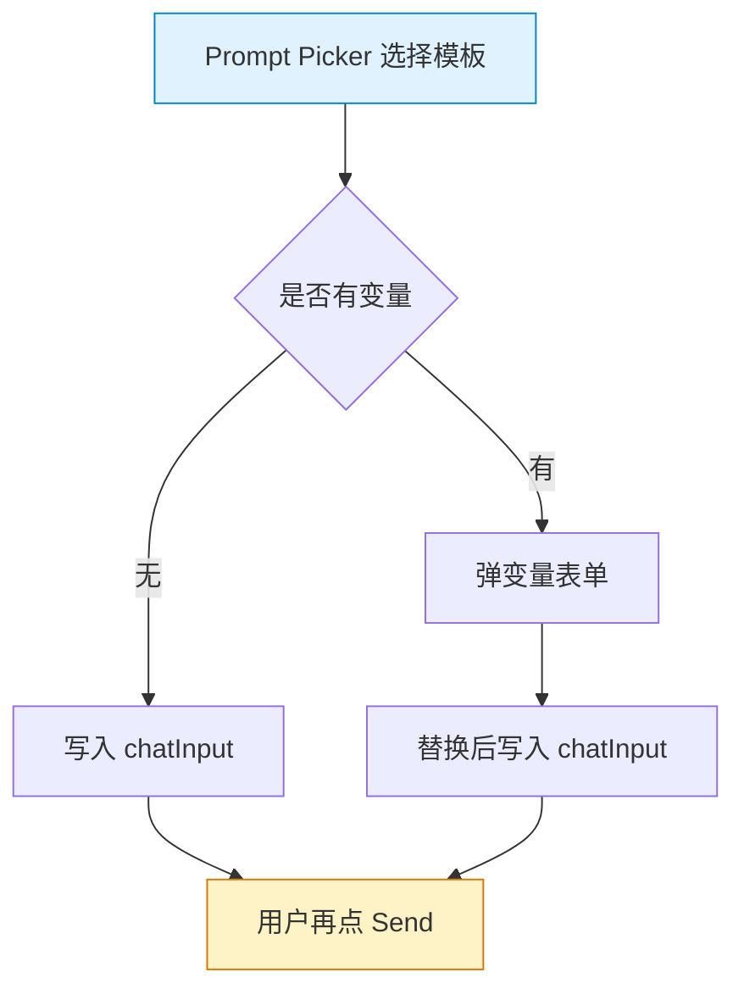
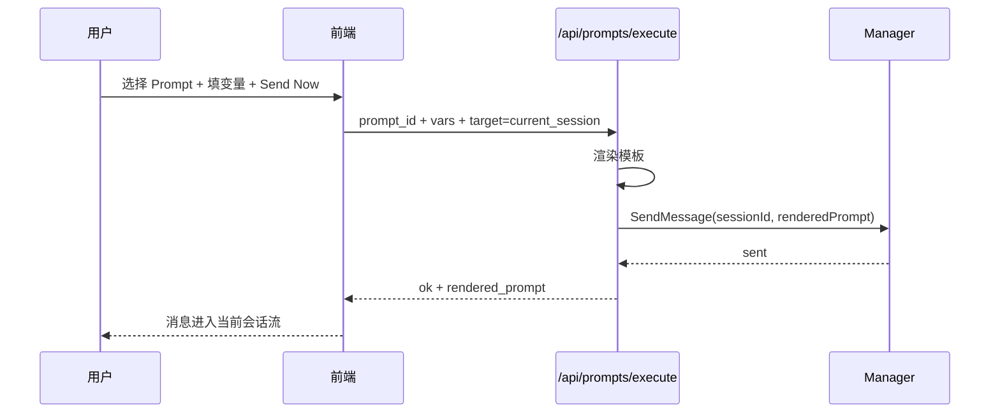
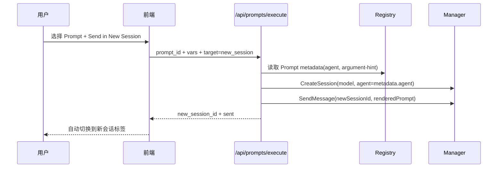

# Prompt 直聊（Prompt → Chat）设计文档

> 版本：v1.0  
> 日期：2026-04-13

## 1. 目标与约束

### 目标

让用户在 Prompt 列表或 Prompt Picker 中，能够**直接触发聊天**，而不是仅把模板内容塞进输入框。

支持三类能力：

1. **Insert**：保持现有行为（仅插入，不发送）
2. **Direct Chat (Current Session)**：渲染变量后直接发送到当前会话
3. **Direct Chat (New Session)**：根据 Prompt frontmatter 规则（如 `agent`）自动建会话并发送

### 约束

- 必须兼容现有 Prompt 数据模型：`PromptTemplate{Content, Variables, Metadata}`
- 必须兼容扫描来的 `*.prompt.md` frontmatter（当前已解析）：
  - `name`
  - `description`
  - `argument-hint`
  - `agent`
  - `tools`（先保留，不在本期强绑定）
- 不破坏当前聊天流程和多标签页（`chatPanes`）

## 2. 现状分析



当前缺口：

- 没有“直接发送”动作
- `metadata.agent` 未接入会话创建/切换
- `argument-hint` 未用于提示输入

## 3. 方案总览

```mermaid
graph TD
    subgraph UI
        U1[Prompts 页面按钮: Chat]
        U2[Prompt Picker: Send Now]
    end

    subgraph Frontend
        F1[变量渲染器]
        F2[Prompt执行器 runPromptAction]
        F3[会话选择器/创建器]
    end

    subgraph Backend
        B1[/api/prompts/execute]
        B2[Registry: Prompt metadata]
        B3[Manager: CreateSession/SendMessage]
    end

    U1 --> F2
    U2 --> F2
    F2 --> F1
    F2 --> B1
    B1 --> B2
    B1 --> B3

    style U1 fill:#dcfce7,stroke:#16a34a
    style U2 fill:#dcfce7,stroke:#16a34a
    style B1 fill:#fef3c7,stroke:#d97706
```

## 4. 交互流程

### 4.1 当前会话直聊



### 4.2 新会话直聊（含 agent 绑定）



## 5. Prompt 规则映射（Copilot 语义）

| Frontmatter / Metadata | 本期处理策略 | 说明                                                               |
| ---------------------- | ------------ | ------------------------------------------------------------------ |
| `agent`                | ✅ 生效       | 新建会话时作为 `SessionConfig.Agent`                               |
| `argument-hint`        | ✅ 生效       | 变量表单占位提示 + 快速输入提示                                    |
| `description`          | ✅ 生效       | UI 展示描述                                                        |
| `tools`                | ⏸ 预留       | 本期不强行绑定（避免误改工具集），后续可扩展为 session tool 白名单 |
| `model`                | ⏸ 预留       | 当前前端未解析该字段，后续可扩展 metadata.model                    |

## 6. API 设计

### 新增接口

`POST /api/prompts/execute`

请求：

- `prompt_id`：模板 ID（必填）
- `variables`：键值对（可选）
- `target`：`current_session` \| `new_session`（必填）
- `session_id`：当 target=current_session 时必填
- `model`：new_session 时可选，默认 `gpt-5.3-codex`

响应：

- `session_id`
- `rendered_prompt`
- `agent_applied`（若绑定到 agent）
- `created_new_session`（bool）

## 7. 前端改造点

1. `Prompts` 页：每个 Prompt 增加 `Chat` 下拉动作
   - `Insert`（保留）
   - `Send to Current Session`
   - `Send in New Session`
2. `Prompt Picker`：变量表单增加 `Insert` / `Send Now` 两个按钮
3. 新增统一执行函数：`runPromptAction(prompt, mode)`
4. 若返回 `created_new_session=true`，自动切换到该会话并连接 SSE

## 8. 边界与失败场景

- 变量缺失：返回 `400` + 缺失变量列表
- 当前会话不存在：返回 `404`
- metadata.agent 找不到对应 agent：
  - 默认降级：仍创建会话但不绑定 agent，并返回 warning
- Prompt 内容为空：返回 `400`

## 9. 验证方案

### 后端

- `execute + current_session`：发送成功
- `execute + new_session + agent`：创建会话且 agent 生效
- 变量缺失/无效目标值：返回正确错误码

### 前端

- Prompt 列表 Chat 动作可直接发起会话消息
- 新会话模式自动切 pane + 可见消息流
- Insert 行为与现有体验一致（无回归）

---

## 10. 实施顺序

1. 后端新增 `/api/prompts/execute`
2. 前端新增 Prompt Chat 动作与执行器
3. 接入 metadata `agent` / `argument-hint`
4. 增加测试（handler + 前端关键流程）
5. 回归：`go test ./...` + `go build ./cmd/coagent`
