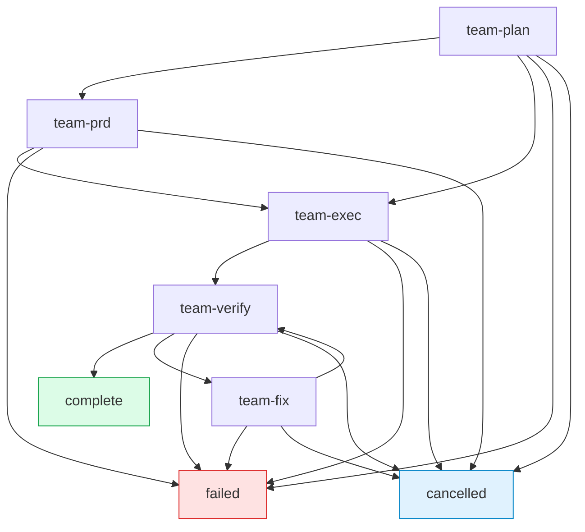
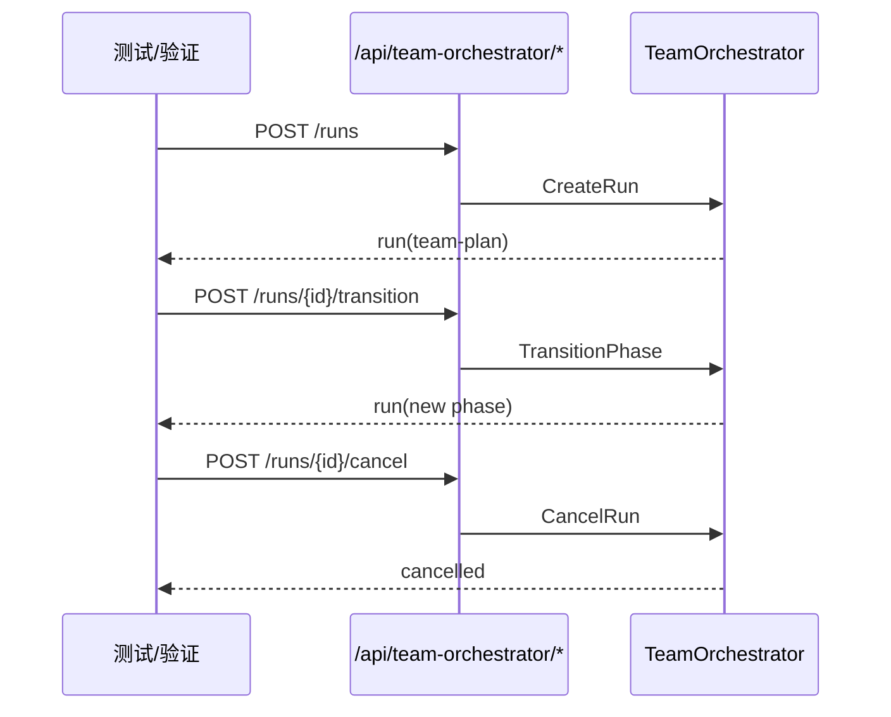

# Team Orchestrator — 阶段状态机编排系统

> 设计文档 v1.0 | 2026-04-13

## 1. 目标

`TeamOrchestrator` 提供轻量的阶段状态机编排能力，用于管理一个编排 Run 的生命周期（`team-plan → team-prd → team-exec → team-verify → team-fix`）。

它与 `TeamManager`（多角色会话协作）完全解耦，拥有独立 API、独立前端入口和独立验证路径。

## 2. 系统边界

```mermaid
graph TD
    subgraph Frontend
        U1[Team Orchestrator 页面]
        U2[Teams 页面]
    end

    subgraph API
        A1[/api/team-orchestrator/*]
        A2[/api/teams/*]
    end

    subgraph Core
        O[TeamOrchestrator\nphase state machine]
        M[TeamManager\nmulti-role sessions]
    end

    U1 --> A1 --> O
    U2 --> A2 --> M

    style U1 fill:#e0f2fe,stroke:#0284c7
    style U2 fill:#dcfce7,stroke:#16a34a
    style O fill:#fef3c7,stroke:#d97706
    style M fill:#fce7f3,stroke:#db2777
```

上图强调：两套功能共享同一服务进程，但在“路由命名空间、页面入口、验证路径”上独立。

## 3. 核心模型与阶段

- 核心状态：`TeamState`
- 关键字段：`id / phase / task_description / max_fix_attempts / fix_attempts / worker_count`
- 终态：`complete / failed / cancelled`

### 状态机



## 4. API 设计

| Method | Path                                          | 说明              |
| ------ | --------------------------------------------- | ----------------- |
| POST   | `/api/team-orchestrator/runs`                 | 创建编排 Run      |
| GET    | `/api/team-orchestrator/runs`                 | 列出所有 Run      |
| GET    | `/api/team-orchestrator/runs/{id}`            | 获取 Run 详情     |
| POST   | `/api/team-orchestrator/runs/{id}/transition` | 执行阶段迁移      |
| POST   | `/api/team-orchestrator/runs/{id}/cancel`     | 取消 Run          |
| POST   | `/api/team-orchestrator/route`                | 任务→角色路由建议 |

### 响应增强字段

关键读写接口返回：

- `run`: 当前 `TeamState`
- `phase_role`: 当前阶段推荐角色
- `phase_instructions`: 当前阶段建议指令

## 5. 前端入口

- 侧边栏独立入口：`Team Orchestrator`
- 独立 partial：`web/partials/team-orchestrator.html`
- 独立状态与动作：`web/assets/app.js` 中 `teamOrchestrator*` 变量族

## 6. 独立验证策略



建议最小验收集：

1. `CreateRun` 成功创建且初始 phase 正确
2. 合法 transition 成功
3. 非法 transition 返回错误
4. cancel 生效并进入终态
5. `/api/teams/*` 与本模块互不影响
