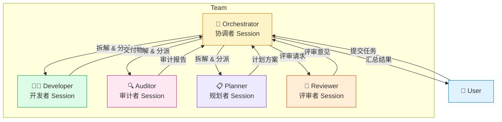
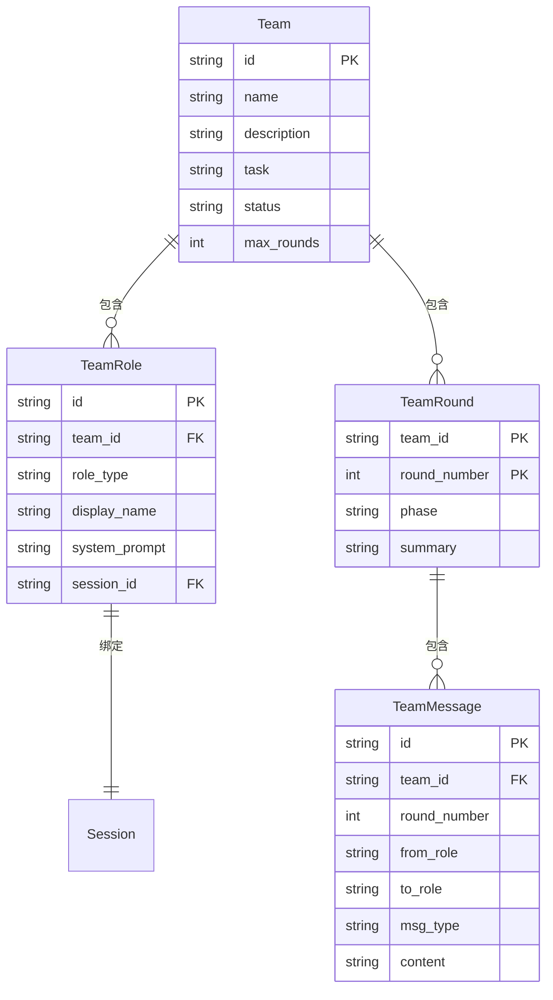
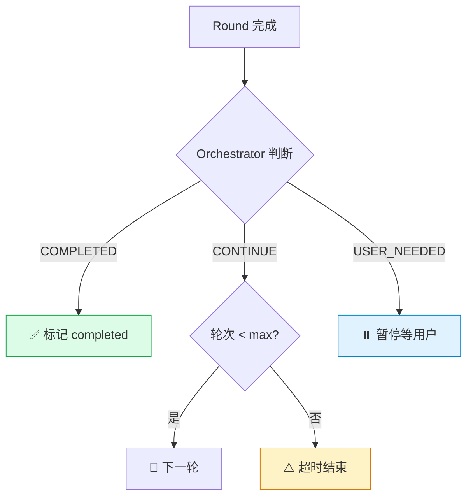
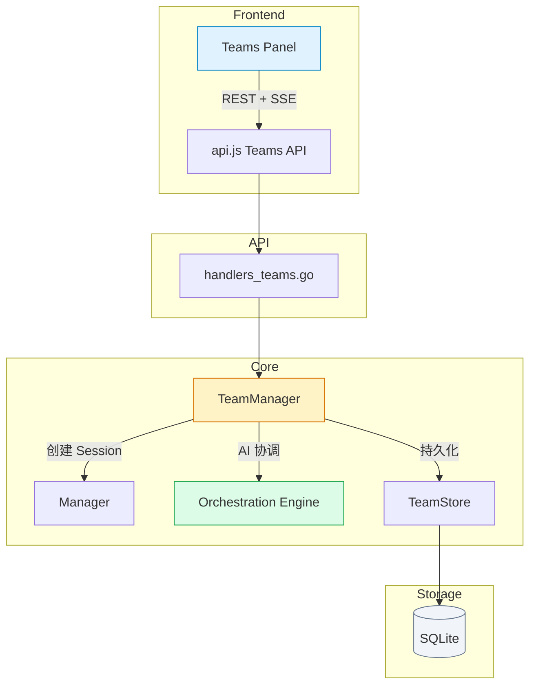

# Teams（TeamManager）— 多会话协作开发系统

> 设计文档 v1.1 | 2026-04-13

## 0. 模块边界（拆分后）

本文件只描述 `TeamManager`（`/api/teams/*`）能力。

`TeamOrchestrator` 已独立为另一套 API 与前端入口：

- API：`/api/team-orchestrator/*`
- 前端入口：`Team Orchestrator` 独立侧边栏菜单
- 独立文档：`docs/design-team-orchestrator.md`

```mermaid
graph TD
    subgraph TeamManager Domain
        A[Teams UI] --> B[/api/teams/*]
        B --> C[TeamManager]
    end

    subgraph TeamOrchestrator Domain
        D[Team Orchestrator UI] --> E[/api/team-orchestrator/*]
        E --> F[TeamOrchestrator]
    end

    style A fill:#e0f2fe,stroke:#0284c7
    style D fill:#dcfce7,stroke:#16a34a
    style C fill:#fef3c7,stroke:#d97706
    style F fill:#fce7f3,stroke:#db2777
```

## 1. 目标

在 Coagent 中引入 "Team" 概念，允许用户创建一组具有不同角色（开发者、审计者、规划者等）的 Copilot 会话，通过 AI 协调者（Orchestrator）让这些角色进行多轮对话，协作完成复杂任务。

## 2. 设计决策

| 决策点                | 选项                       | 选择  | 理由                                                   |
| --------------------- | -------------------------- | ----- | ------------------------------------------------------ |
| Orchestrator 实现方式 | A) SDK Session / B) 硬编码 | **A** | AI 可根据上下文动态调整分派策略                        |
| 消息粒度              | A) 全文转发 / B) 摘要转发  | **B** | Orchestrator 提炼要点后转发，兼顾信息完整和 Token 效率 |
| 并发策略              | A) 串行 / B) 并行          | **B** | Orchestrator 分析依赖后，无依赖角色并行执行            |

## 3. 核心概念



- **角色（Role）**：带有特定系统提示和 Agent 配置的 Session 封装
- **协调者（Orchestrator）**：AI Session，负责任务拆解、分派、汇总、终止判断
- **轮次（Round）**：协作基本单位，经历 Plan → Execute → Review → Resolve 四阶段

## 4. 数据模型



持久化使用 GORM + SQLite（复用 EventStore 的 DB 连接），对应文件：
- `internal/copilot/teamstore.go` — GORM models + CRUD

## 5. 协作流程

```mermaid
sequenceDiagram
    participant U as 👤 User
    participant API as 🌐 API
    participant TM as 📦 TeamManager
    participant Orc as 🎯 Orchestrator
    participant Dev as 👨‍💻 Developer
    participant Aud as 🔍 Auditor

    U->>API: POST /api/teams
    API->>TM: CreateTeam(cfg)
    TM-->>API: Team{id, roles}
    API-->>U: 201 JSON

    U->>API: POST /api/teams/{id}/start
    API->>TM: StartTeam(id)
    TM->>TM: 创建 SDK Sessions
    TM->>Orc: Send(plan prompt)

    rect rgb(40, 40, 60)
        Note over Orc,Aud: Round 1
        Orc->>Dev: DISPATCH @developer task
        Orc->>Aud: DISPATCH @auditor task
        Dev-->>Orc: response
        Aud-->>Orc: response
    end

    Orc-->>TM: COMPLETED / CONTINUE / USER_NEEDED
    TM-->>API: SSE events
    API-->>U: SSE stream
```



### 轮次阶段

| 阶段        | 协调者行为                                    |
| ----------- | --------------------------------------------- |
| **Plan**    | 分析状态，输出 `DISPATCH: @role: task`        |
| **Execute** | 并行发送任务给角色，收集响应                  |
| **Review**  | 将结果发给 auditor/reviewer                   |
| **Resolve** | 输出 `COMPLETED` / `CONTINUE` / `USER_NEEDED` |

### 终止条件



## 6. 系统架构



### 模块清单

| 模块         | 文件                                            | 职责                             |
| ------------ | ----------------------------------------------- | -------------------------------- |
| TeamManager  | `internal/copilot/teams.go`                     | Team CRUD、生命周期、AI 协调引擎 |
| TeamStore    | `internal/copilot/teamstore.go`                 | GORM 持久化                      |
| API Handlers | `internal/api/handlers_teams.go`                | REST + SSE 端点                  |
| Frontend     | `web/partials/teams.html` + `web/assets/api.js` | Teams UI                         |

## 7. API 端点

| Method | Path                          | 说明           |
| ------ | ----------------------------- | -------------- |
| POST   | `/api/teams`                  | 创建 Team      |
| GET    | `/api/teams`                  | 列出所有 Teams |
| GET    | `/api/teams/{id}`             | Team 详情      |
| DELETE | `/api/teams/{id}`             | 删除 Team      |
| POST   | `/api/teams/{id}/start`       | 启动协作       |
| POST   | `/api/teams/{id}/pause`       | 暂停           |
| POST   | `/api/teams/{id}/resume`      | 恢复           |
| POST   | `/api/teams/{id}/message`     | 用户消息注入   |
| GET    | `/api/teams/{id}/stream`      | SSE 实时流     |
| GET    | `/api/teams/{id}/history`     | 完整对话历史   |
| POST   | `/api/teams/{id}/roles`       | 添加角色       |
| DELETE | `/api/teams/{id}/roles/{rid}` | 移除角色       |

### SSE 事件类型

| event          | 说明                                 |
| -------------- | ------------------------------------ |
| `team_status`  | 状态变化                             |
| `round_start`  | 轮次开始 `{round, phase}`            |
| `round_end`    | 轮次结束 `{round, summary}`          |
| `role_message` | 角色消息 `{from, to, content, type}` |
| `role_status`  | 角色状态 `{role_id, status}`         |
| `user_needed`  | 需要用户决策 `{reason}`              |

## 8. 预置角色

| 角色         | 系统提示要点                     | 图标 |
| ------------ | -------------------------------- | ---- |
| orchestrator | 协调者，只做拆解/分派/汇总       | 🎯    |
| developer    | 资深开发者，编写高质量代码       | 👨‍💻    |
| auditor      | 安全审计师，检查漏洞/并发/泄露   | 🔍    |
| planner      | 架构规划师，方案设计/技术选型    | 📋    |
| reviewer     | 代码评审员，关注可读性/测试/命名 | 📝    |
| custom       | 用户自定义                       | 🧑    |
