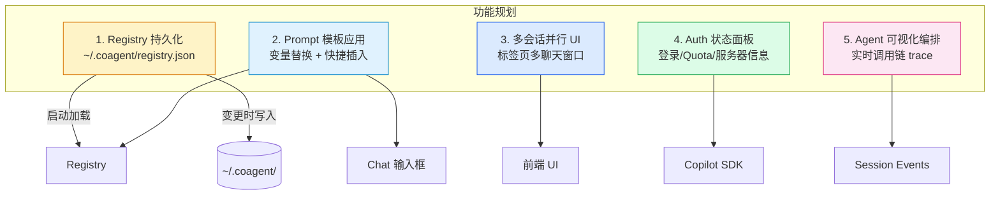
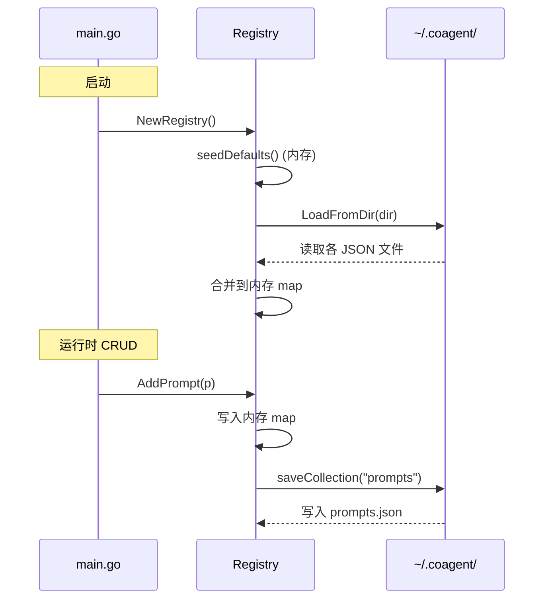
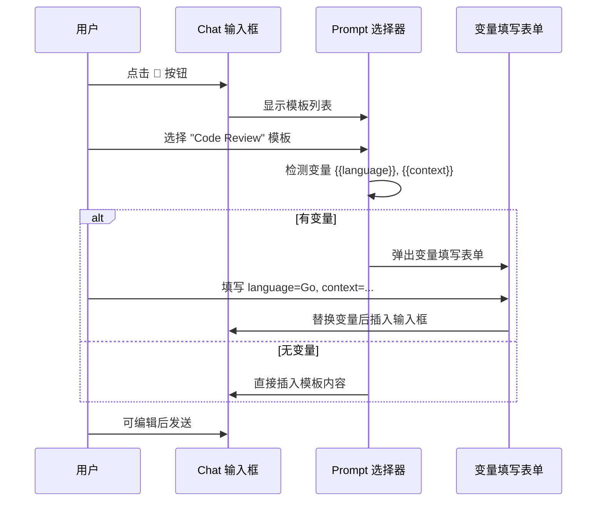
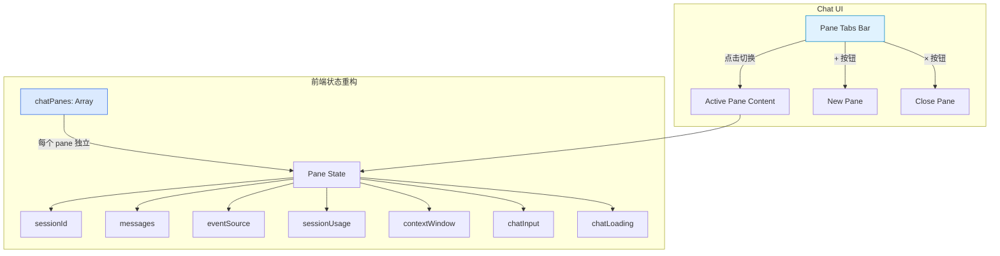
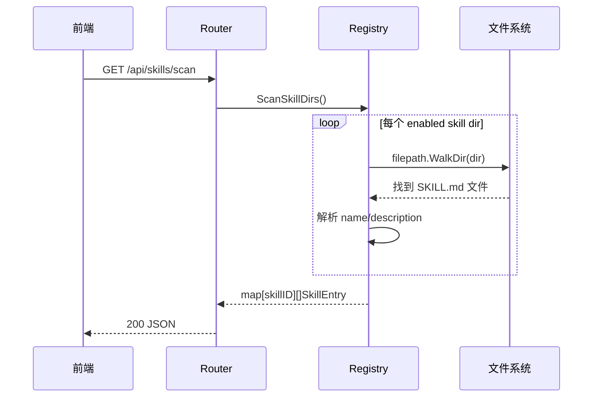
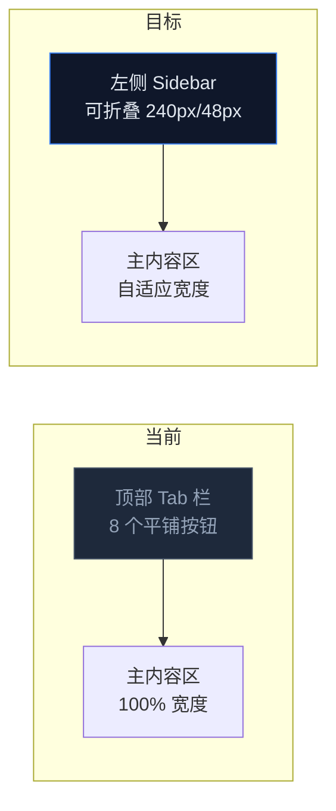

# CoAgent v2 功能设计文档

## 总览



---

## 1. Registry 持久化

### 目标

Registry 数据（prompts、MCP servers、tools、agents、providers）在 `~/.coagent/` 目录以 JSON 文件持久化，重启后自动恢复。内置默认数据（models、builtin skills）不持久化。

### 存储结构

```
~/.coagent/
├── prompts.json        # []PromptTemplate
├── mcp_servers.json    # []MCPServerConfig
├── tools.json          # []ToolConfig
├── agents.json         # []AgentConfig
├── providers.json      # []ProviderInfo
└── skills.json         # []SkillInfo (仅用户自定义的)
```

### 数据流



### 关键设计

- **Registry 新增方法**：`LoadFromDir(dir string) error` 和 `SaveToDir(dir string) error`
- **写入时机**：每次 Add/Update/Delete 操作后，异步写入对应 JSON 文件（防止阻塞 mutex）
- **启动时机**：`main.go` 在 `NewRegistry()` 后调用 `reg.LoadFromDir(configDir)`
- **配置目录**：新增 CLI flag `-config-dir`，默认 `~/.coagent`
- **Builtin 跳过**：skills 只持久化 `Builtin == false` 的；models 不持久化
- **文件格式**：缩进的 JSON（`json.MarshalIndent`），便于手工编辑
- **数据安全**：ProviderInfo 含 APIKey/BearerToken，文件权限设为 `0600`

---

## 2. Prompt 模板应用

### 目标

用户在 Prompts tab 创建的模板，可以在聊天时快捷选取并自动替换变量后插入到输入框。

### 交互流程



### UI 设计

- **触发方式**：聊天输入栏旁新增 📝 按钮，点击弹出 Prompt Picker 弹窗
- **Prompt Picker**：列表展示所有模板，支持搜索过滤，点击选择
- **变量表单**：根据模板中 `{{varName}}` 模式动态生成 input 字段
- **插入行为**：替换后的文本插入到 `chatInput`（不自动发送，用户可修改）

### 变量规则

- 变量格式：`{{name}}`（双花括号）
- 模板的 `variables` 字段列出所有变量名
- 自动检测：从 `content` 中正则提取 `\{\{(\w+)\}\}`，与 `variables` 对账
- 替换：简单字符串 `replaceAll`

### 后端变更

无——Prompt CRUD 已有完整 API，变量替换纯前端完成。

---

## 3. 多会话并行 UI

### 目标

支持同时打开多个会话，以标签页形式在 Chat 区域并排显示，每个标签独立维护消息、SSE 流、Usage 状态。

### 架构设计



### 数据结构

```javascript
{
  id: "pane-uuid",
  sessionId: "session-xxx",
  label: "Session A",
  messages: [],
  chatInput: "",
  chatLoading: false,
  chatProgressText: "",
  chatAttachments: [],
  eventSource: null,
  sessionUsage: { ... },
  contextWindow: { ... },
  sessionEvents: [],
  showEvents: false,
}
```

### 关键设计

- **状态隔离**：每个 pane 完全独立的 messages、eventSource、usage 等
- **SSE 连接**：切换 tab 不断开其他 pane 的 SSE（后台持续接收）
- **Session List 操作**：点击 session 时，如果已有 pane 打开此 session 则切换到它，否则新建 pane
- **最大 pane 数**：限制 8 个
- **关闭 pane**：关闭 SSE 连接，清除状态

---

## 4. Auth 状态面板

### 目标

在页面顶部 Header 展示 Copilot 认证状态、用户信息、Quota 用量、服务器版本。

### SDK 数据源

- `GetAuthStatus()` → `{ isAuthenticated, authType, host, login, statusMessage }`
- `GetServerStatus()` → `{ version, protocolVersion }`
- Session 事件 `session.shutdown → quotaSnapshots` → 各模型 Quota 快照

### UI 设计

- **Header 增强**：在 "Copilot Running/Stopped" 旁增加用户名和 Quota 进度条
- **展开详情**：点击后下拉展示完整 Auth 面板
- **数据刷新**：初始化时调一次，每 60 秒轮询
- **Quota 来源**：从 `session.shutdown` 事件的 `quotaSnapshots` 提取缓存

### 后端变更

无——`/api/copilot/auth` 和 `/api/copilot/status` 已有。

---

## 5. Agent 可视化编排

### 目标

在 Events 面板以树状/流程图实时展示 agent → sub-agent → tool-call 调用链，支持节点详情。

### 增强内容

1. **实时模式**：SSE 事件实时追加到树
2. **Agent 节点高亮**：不同 agent 不同颜色
3. **状态指示**：running 动画、completed ✓、failed ✗
4. **耗时标注**：start → complete 时间差
5. **展开/折叠**：Turn/SubAgent 节点可折叠
6. **节点详情**：点击显示完整事件 JSON

### 后端变更

无——events 数据已通过 SSE 和历史 API 完整返回。

---

## 实施顺序

1. Registry 持久化 → 2. Prompt 模板应用 → 3. Auth 状态面板 → 4. 多会话并行 UI → 5. Agent 可视化编排

---

## 6. Skills 目录扫描

### 目标

后端扫描已配置的 skill 目录，列出实际存在的 SKILL.md 文件；前端在每个 skill 目录下展示子文件树。

### 数据模型

```go
type SkillEntry struct {
    Name        string `json:"name"`        // 从 SKILL.md frontmatter 或目录名提取
    Description string `json:"description"` // frontmatter description（如有）
    RelPath     string `json:"relPath"`     // 相对于 skill dir 的路径
    AbsPath     string `json:"absPath"`     // 绝对路径
}
```

### 后端流程



### 前端展示

每个 skill 行可展开（accordion），展示目录下发现的 SKILL.md 文件列表。

---

## 7. 左侧菜单重构

### 目标

将顶部 8 个 tab 改为左侧可折叠侧边栏，分组管理，提升导航效率。

### 布局方案



### 菜单结构

```
📋 会话
   Chat
⚙️ 配置
   Models
   Skills
   Prompts
   MCP Servers
   Tools
🤖 Agent
   Agents
   Providers
```

### 关键设计

| 决策点 | 方案 |
|---|---|
| 折叠模式 | 点击 ☰，sidebar 收缩为 48px 图标栏 |
| Chat session 列表 | Chat tab 时显示在 sidebar 下方 |
| Header | Auth/状态信息保留在顶部紧凑条 |
| 分组 | 可折叠分组，点击标题切换 |
| 状态保持 | sidebarOpen + localStorage 记忆 |

### 实施顺序

1. 后端 Skills Scan API → 2. 前端 Sidebar 布局 → 3. Skills 增强 UI
