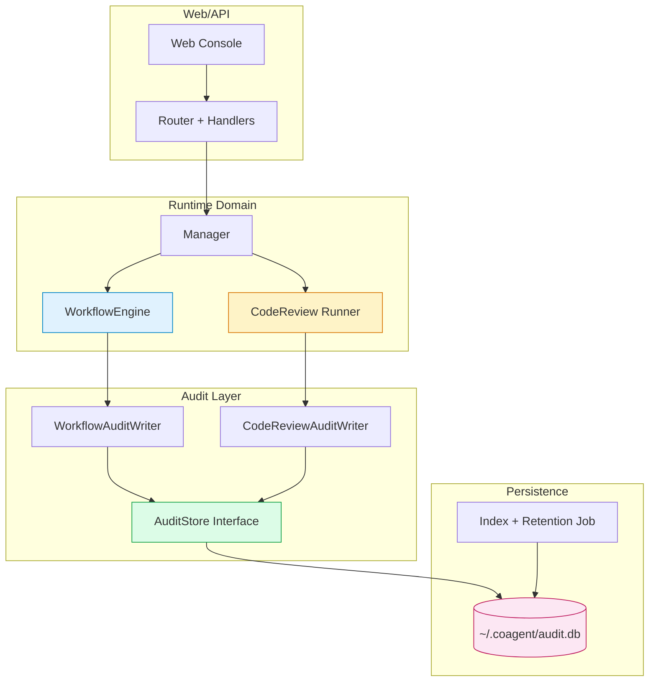
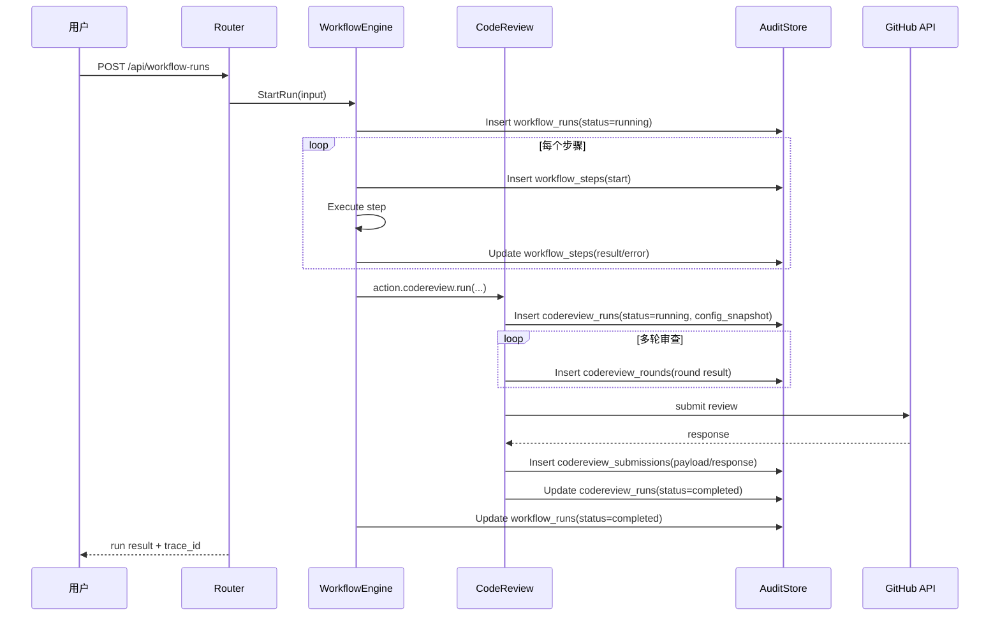

# Workflow / CodeReview 审计存储设计

## 背景与目标

当前 `workflow` 与 `codereview` 的运行信息分散在内存状态、日志与外部系统（如 GitHub Review）中，缺少统一的可追溯审计面。随着多轮审查、目录级执行、跨会话协作增多，以下问题会越来越明显：

- 复盘困难：难以快速回答“当时用了什么参数/提示词/MCP 配置”。
- 排障困难：失败发生时缺少完整链路（输入、步骤、输出、错误）。
- 合规与治理困难：无法稳定导出“谁在何时做了什么”。

本设计目标：

1. 为 `workflow` 与 `codereview` 提供统一的持久化审计存储。
2. 支持按 `trace_id / session_id / run_id / repo / branch / pr` 回溯。
3. 保留跨域关联能力（如 workflow 触发 codereview）。
4. 不改变现有功能语义，优先增量接入。

---

## 约束与设计原则

- **先追溯，后分析**：第一期先保证“完整可还原”，复杂分析报表后置。
- **低侵入**：尽量在已有执行路径埋点，不重构核心业务逻辑。
- **单存储多域模型**：一个数据库文件，按域拆表，便于独立演进和联查。
- **快照优先**：关键配置与参数按 JSON 快照落盘，避免“后来改配置导致历史失真”。
- **可裁剪保留**：支持按时间窗口清理历史审计数据。

---

## 方案选型与理由

### 方案对比

1. 分两个数据库（workflow.db + codereview.db）
2. 单数据库多表（audit.db，逻辑分域）
3. 全量写日志文件（JSONL）

结论：**选 2（单数据库多表）**。

原因：

- 对你“后续追溯”诉求最直接：支持跨域 join 或关联查询。
- 运维成本低：单文件备份、迁移、清理更简单。
- 与现有项目一致性好：项目已有 SQLite 使用经验（`eventstore`）。

---

## 系统架构

下面的图展示了新增审计存储与现有组件的关系边界。

架构要点：

- 业务层不直接依赖 SQL 细节，仅依赖 `AuditStore` 接口。
- `workflow` 与 `codereview` 分别通过独立 writer 记录，职责清晰。
- 存储层统一放在 `~/.coagent/audit.db`，支持统一备份与查询。

---

## 数据模型（第一期）

### Workflow 相关

- `workflow_runs`
	- `run_id`（PK）
	- `trace_id`
	- `workflow_id`
	- `session_id`
	- `status`（running/completed/failed/canceled）
	- `input_snapshot`（JSON）
	- `started_at` / `ended_at`

- `workflow_steps`
	- `id`（PK）
	- `run_id`（FK）
	- `step_name`
	- `step_index`
	- `attempt`
	- `action_name`
	- `params_snapshot`（JSON）
	- `result_snapshot`（JSON）
	- `error_text`
	- `started_at` / `ended_at`

### CodeReview 相关

- `codereview_runs`
	- `run_id`（PK）
	- `trace_id`
	- `session_id`
	- `repo`
	- `branch`
	- `pr_number`
	- `working_directory`
	- `model`
	- `config_snapshot`（JSON，含 tools/excludedTools/mcpServers）
	- `status`
	- `started_at` / `ended_at`

- `codereview_rounds`
	- `id`（PK）
	- `run_id`（FK）
	- `round_no`
	- `prompt_snapshot`（JSON/文本，按开关决定是否脱敏）
	- `summary_text`
	- `new_comments_count`
	- `comments_snapshot`（JSON）
	- `raw_response`
	- `duration_ms`
	- `created_at`

- `codereview_submissions`
	- `id`（PK）
	- `run_id`（FK）
	- `event_type`（COMMENT/APPROVE/REQUEST_CHANGES）
	- `payload_json`
	- `response_json`
	- `submitted_at`
	- `success`

### 通用索引建议

- `idx_workflow_runs_trace_id`
- `idx_workflow_runs_started_at`
- `idx_codereview_runs_repo_branch_pr`
- `idx_codereview_runs_trace_id`
- `idx_codereview_rounds_run_round`

---

## 功能描述（输入 / 输出 / 状态变化 / 边界条件）

### 1) Workflow 审计写入

- 输入：workflow 创建参数、步骤执行参数、每步结果/错误。
- 输出：`workflow_runs` + `workflow_steps` 记录。
- 状态变化：
	- 启动时 `workflow_runs.status=running`
	- 结束时更新为 `completed/failed/canceled`
- 边界条件：
	- 中途崩溃：未结束记录保留为 `running`，启动恢复任务可标记为 `aborted`。
	- 大对象参数：超过阈值（如 256KB）仅保留摘要并标记 truncation。

### 2) CodeReview 审计写入

- 输入：run 级配置（model、working_directory、MCP/tools）、每轮审查输出、提交响应。
- 输出：`codereview_runs` + `codereview_rounds` + `codereview_submissions`。
- 状态变化：
	- run 启动时 `running`
	- 成功提交后 `completed`
	- 失败则 `failed` 并保留错误摘要
- 边界条件：
	- 无 PR 上下文：允许 run 完成，但 submission 记录可为空。
	- `working_directory` 非法：run 创建失败也要落一条失败记录（含错误）。

### 3) 追溯查询（后续 API）

- 输入：过滤条件（时间、repo、branch、pr、status、trace_id）。
- 输出：运行列表、详情、步骤/轮次明细、提交明细。
- 边界条件：
	- 历史版本 schema 差异：通过 `schema_version` 迁移兼容。

---

## 关键交互流程

下图展示“一次 workflow 触发 codereview 并提交”的端到端链路。

该流程确保每个关键节点都有落盘记录：启动、步骤执行、轮次输出、提交流水、最终状态。

---

## 与现有模块的集成点

- `internal/copilot/workflow.go`
	- 在 run start / step start / step end / run end 增加审计写入。
- `internal/copilot/codereview.go`
	- 在 run、round、submit 三个阶段增加审计写入。
- `internal/copilot/eventstore.go`
	- 建议复用 SQLite 初始化与迁移风格，但数据表分开管理。
- `internal/api/*`
	- 第二期新增审计查询 API（列表、详情、检索）。

---

## 安全与隐私

- `config_snapshot` 需对敏感字段脱敏（如 token、authorization）。
- `prompt_snapshot/raw_response` 提供开关：默认保留，支持关闭或只保留摘要。
- 本地数据库文件权限建议 `0600`。

---

## 实施计划（分期）

### Phase 1（本次）

1. 新增 `AuditStore` 接口与 SQLite 实现。
2. 新建表与索引（workflow + codereview）。
3. 在 workflow/codereview 关键路径落盘。
4. 返回 `trace_id` 并写入日志。

### Phase 2

1. 新增审计查询 API（按条件检索）。
2. 前端新增“审计追溯”视图（run 列表 + 详情页）。
3. 增加导出（JSON/Markdown）。

### Phase 3

1. Retention 策略（如保留 90 天）。
2. 异常恢复任务（补偿 running 状态）。
3. 聚合报表（失败率、平均耗时、问题分类分布）。

---

## 验收标准（第一期）

1. 任意 workflow 运行均可查询到 run 与 step 记录。
2. 任意 codereview 运行均可查询到 run、round、submission 记录。
3. 在失败场景下（参数错误、提交失败）仍可追溯到错误上下文。
4. `trace_id` 能关联 workflow 与 codereview 记录。

---

## 风险与缓解

- 风险：写入路径阻塞主流程。
	- 缓解：写入失败不阻断主功能，采用“主流程成功优先 + 审计告警”。
- 风险：审计数据膨胀。
	- 缓解：字段截断、摘要化与 retention。
- 风险：敏感信息泄露。
	- 缓解：统一脱敏器 + 落盘前过滤。

---

## 结论

建议立即推进“**单数据库、多域模型**”审计存储方案。该方案能最小成本补齐追溯能力，并为后续可视化、治理和稳定性优化打基础。

