# Workflow Engine — 声明式步骤工作流引擎

> 设计文档 v1.3 | 2026-04-20

## 1. 目标

`WorkflowEngine` 提供声明式的步骤工作流能力，用于监督和编排 Agent 的执行。用户通过定义步骤流程、绑定 Prompt 角色、设置条件分支，驱动一个独立 Copilot Session 按步骤自动执行。

**核心价值：**
- 将复杂的多步骤 Agent 任务抽象为可视化、可复用的 Workflow 定义
- 通过条件表达式实现动态分支（goto / exit / retry）
- 每次运行创建独立 Session，具备完整的上下文和可审计的执行历史

## 2. 系统边界

```mermaid
graph TD
    subgraph 前端
        WP[Workflows 页面]
        WP -->|CRUD| API1[/api/workflow-defs/*]
        WP -->|启动/查看/取消| API2[/api/workflow-runs/*]
    end

    subgraph 后端
        API1 --> REG[Registry]
        API2 --> WE[WorkflowEngine]
        WE --> MGR[Manager]
        MGR --> SDK[Copilot SDK Session]
        WE --> REG
    end

    subgraph 持久化
        REG -->|workflow_defs.json| DISK[(~/.coagent/)]
    end

    style WP fill:#e0f2fe,stroke:#0284c7
    style WE fill:#fef3c7,stroke:#d97706
    style SDK fill:#dcfce7,stroke:#16a34a
    style DISK fill:#f3e8ff,stroke:#9333ea
```

- **Workflow 定义** 归 Registry 管理，CRUD + 持久化到 `~/.coagent/workflow_defs.json`
- **Workflow 运行** 归 WorkflowEngine 管理，内存态，不持久化
- **Session** 由 Manager 创建，WorkflowEngine 通过 Manager 发送消息和订阅事件

## 3. 数据模型

### 3.1 Workflow 定义

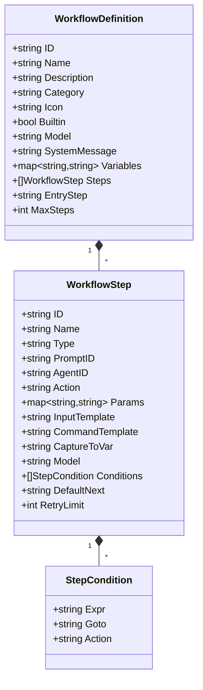

| 字段              | 说明                                             |
| ----------------- | ------------------------------------------------ |
| `SystemMessage`   | 用户自定义系统提示词，支持 `{{变量}}` 模板       |
| `Variables`       | 默认变量值，启动时可被覆盖                       |
| `EntryStep`       | 入口步骤 ID，空则使用第一个                      |
| `MaxSteps`        | 安全上限，默认 50，防止无限循环                  |
| `PromptID`        | 绑定的 Prompt 角色，执行时注入 `<role>` 内容     |
| `Type`            | 步骤类型：`ai`（默认）/ `shell` / `action`       |
| `Action`          | `action` 类型步骤的动作名（如 `codereview.run`） |
| `Params`          | `action` 类型参数，支持 `{{var}}` 模板           |
| `InputTemplate`   | AI 消息模板；shell/action 下可作为说明文本       |
| `CommandTemplate` | shell 命令模板，支持 `{{var}}` 变量替换          |
| `CaptureToVar`    | 将步骤输出写回运行变量，如 `vars["result"]`      |
| `Conditions`      | 条件分支列表，按顺序评估                         |
| `DefaultNext`     | 无条件匹配时的下一步，`$exit` 表示结束           |

### 3.2 Workflow 运行

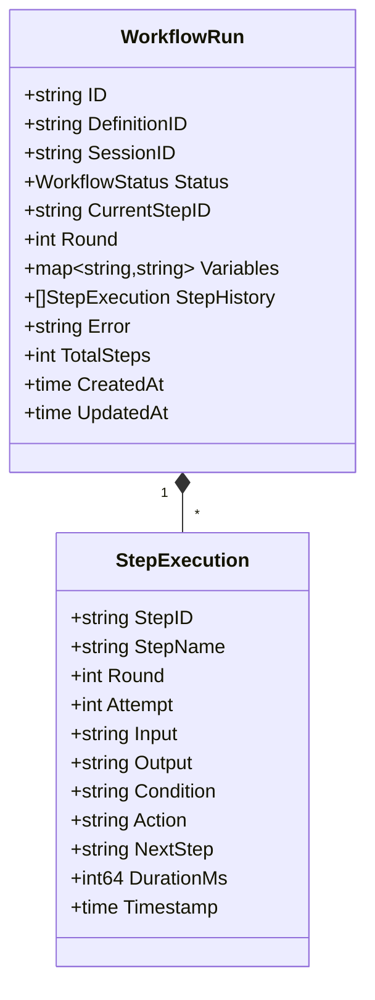

### 3.3 状态机

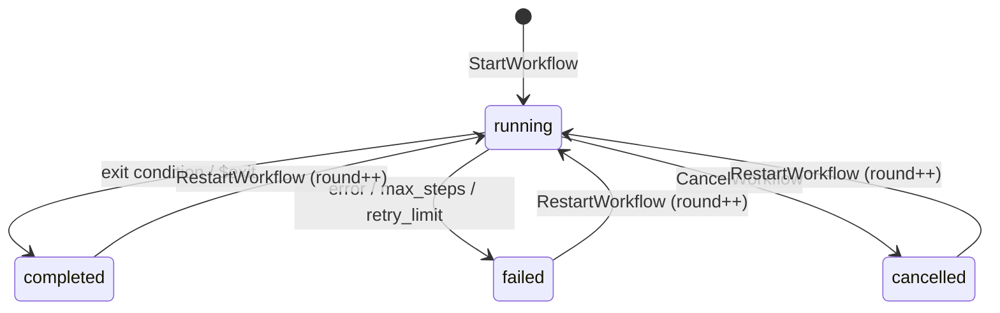

## 4. 系统提示词组合

创建 Session 时，`buildSystemPrompt` 自动组合三部分：

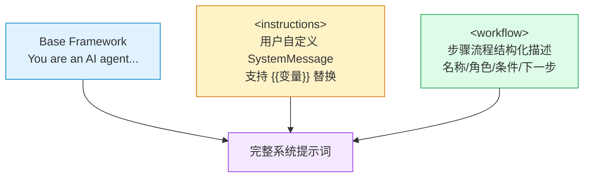

**最终格式：**

```
You are an AI agent executing a structured workflow. Each step will be given 
to you as a user message. Follow the instructions for each step precisely 
and produce clear, actionable output.

<instructions>
{用户自定义的 system_message，已替换变量}
</instructions>

<workflow>
Workflow: Team Pipeline
Description: 完整团队流水线
Entry Step: plan
Max Steps: 20

Steps:
  1. [plan] 规划 (role: builtin-planner)
     Input: 请为以下任务制定实施计划：{{task_description}}
     Next: prd
  2. [verify] 验证 (role: builtin-verifier)
     Condition: IF output.contains("PASS") THEN exit
     Condition: IF output.contains("FAIL") THEN goto → fix
  ...
</workflow>
```

## 5. 执行流程

### 5.1 启动 Workflow

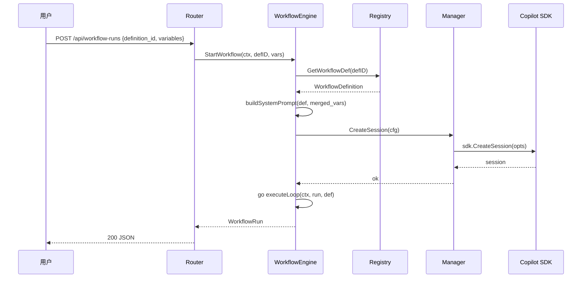

### 5.2 步骤执行循环

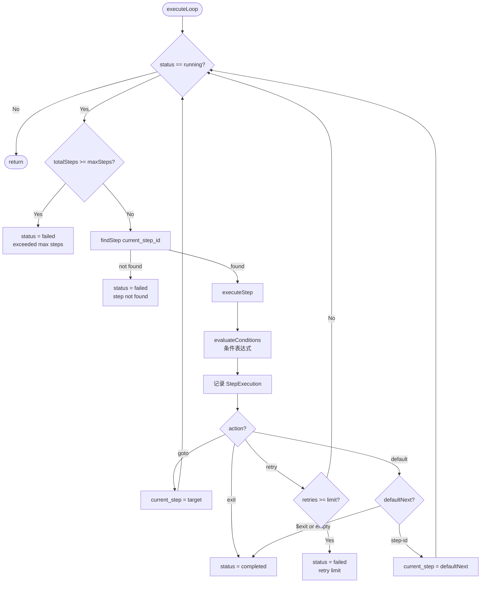

### 5.3 单步执行（AI / Shell）

每个步骤由 `step.type` 决定执行分支：

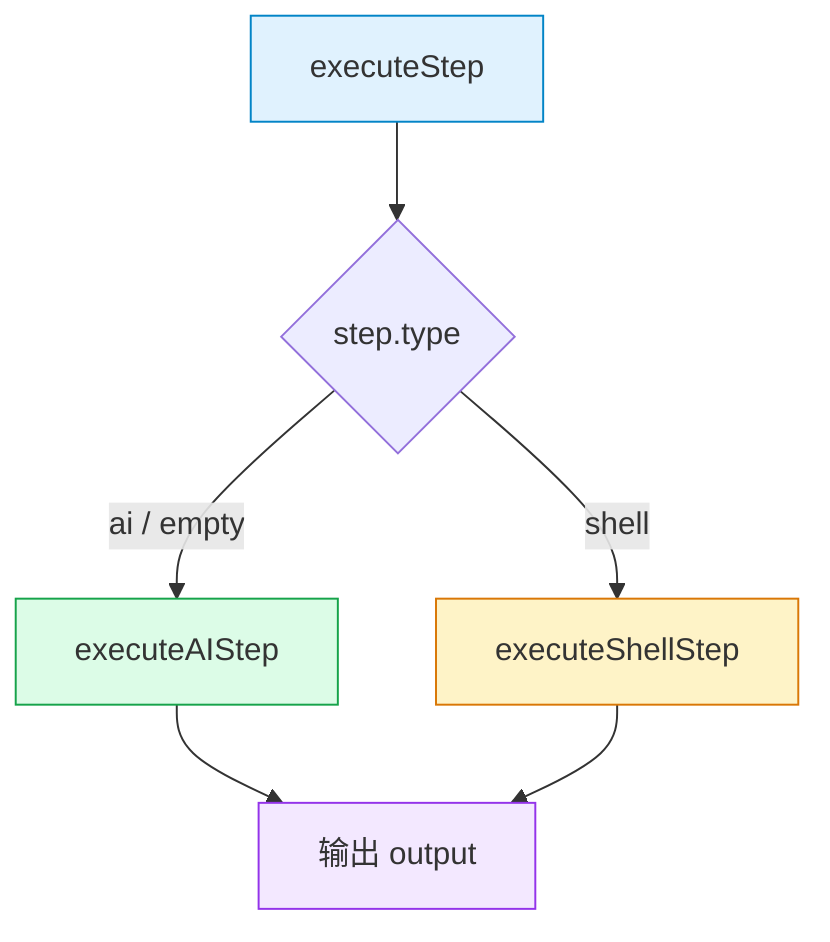

AI 步骤沿用会话消息执行；shell 步骤直接在服务端执行命令并采集 stdout/stderr。

#### 5.3.1 AI 步骤

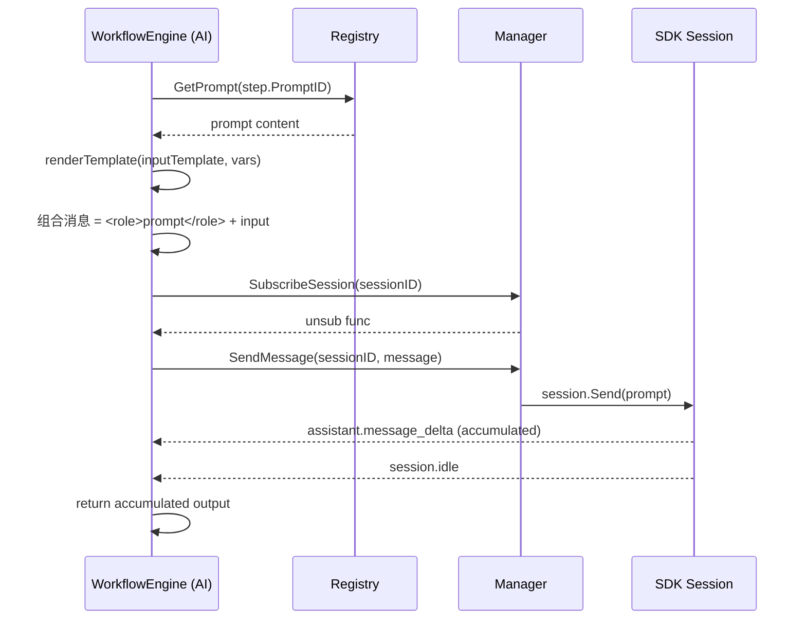

#### 5.3.2 Shell 步骤

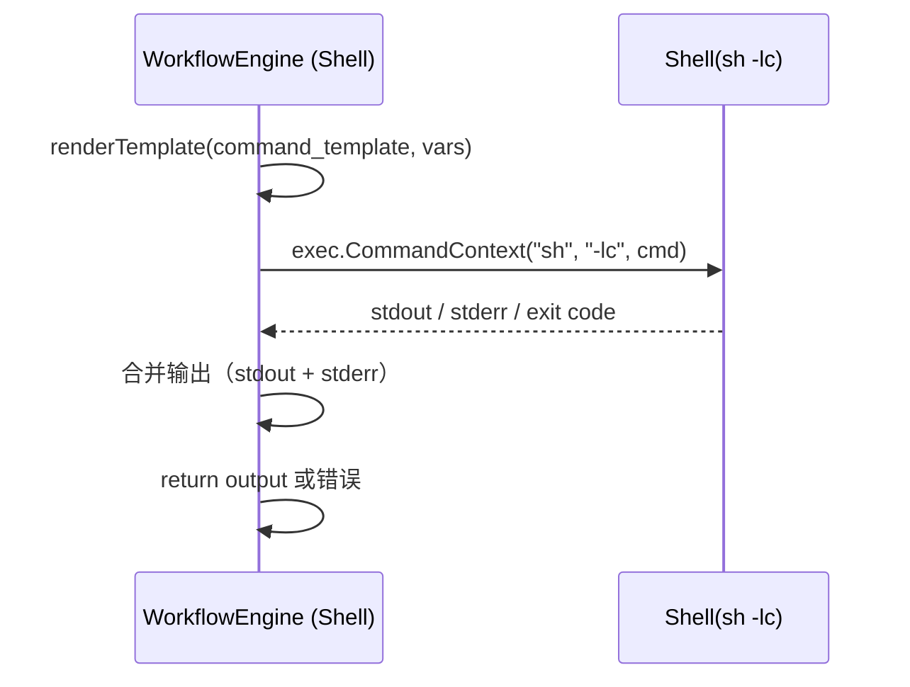

执行规则：
- `command_template` 为空时，回退到 `input_template`
- 执行目录优先使用 `Manager` 的 `cwd`
- 非 0 退出码视为步骤失败（Run 进入 `failed`）
- 若配置 `capture_to_var`，步骤成功后会写回 `run.variables`

每步消息结构：
- `<role>` 标签包裹 Prompt 角色内容（如果绑定了 PromptID）
- AI：后接渲染后的 `input_template`
- Shell：后接渲染后的 `command_template`（或 `input_template` 回退）

#### 5.3.3 原生 CodeReview Workflow（shell + AI 编排）

CodeReview 功能通过原生 `shell` + `ai` 步骤编排实现，无需额外抽象层。

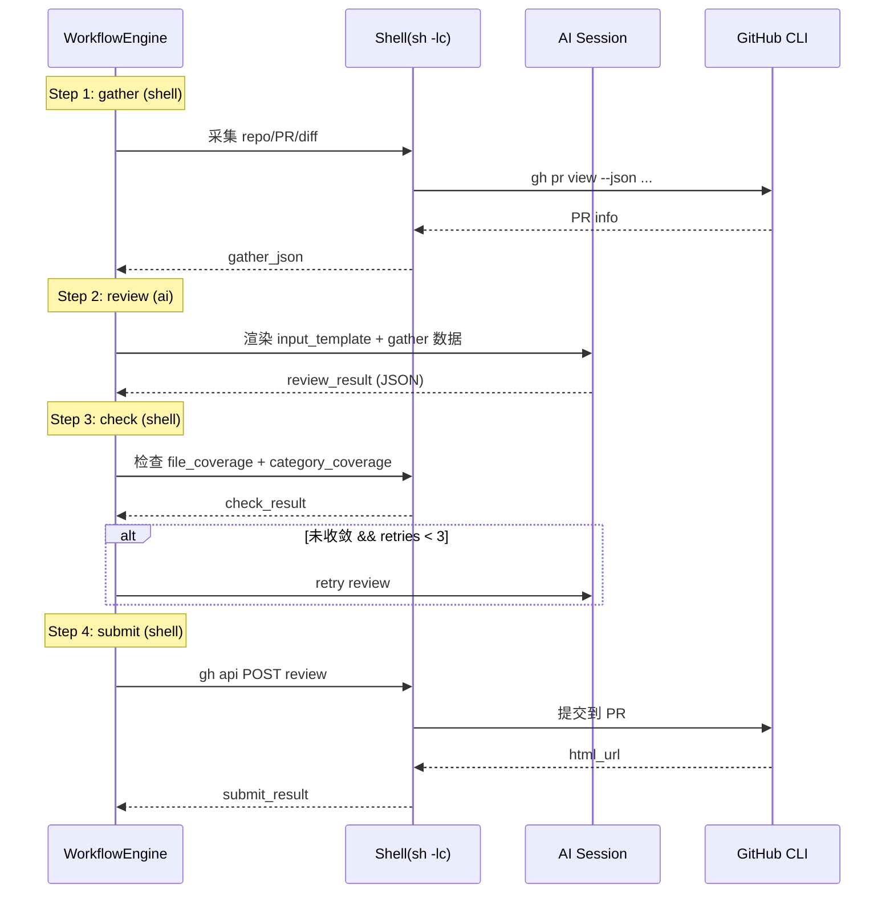

内置 Workflow 定义 `wf-codereview-business` 包含 4 个步骤：

| 步骤 ID | 类型  | 说明                          | capture_to_var |
| ------- | ----- | ----------------------------- | -------------- |
| gather  | shell | 采集 repo/branch/PR/diff 信息 | gather_json    |
| review  | ai    | AI 审查并输出结构化 JSON      | review_result  |
| check   | shell | 检查覆盖收敛                  | check_result   |
| submit  | shell | 通过 gh api 提交 review       | submit_result  |

模板常量定义在 `internal/copilot/workflow_codereview_defs.go`。

独立 `RunCodeReview` API 保留为单独入口（`internal/copilot/codereview.go`），适用于非 Workflow 场景的直接调用。

## 6. 条件表达式引擎

使用 `expr-lang/expr` 评估步骤完成后的条件分支。

### 可用变量

| 变量            | 类型                 | 说明                                                                      |
| --------------- | -------------------- | ------------------------------------------------------------------------- |
| `output`        | `string`             | 当前步骤的 Agent 输出（截断至 2000 字符）                                 |
| `output_length` | `int`                | 输出长度                                                                  |
| `result`        | `any`                | `tryParseJSON(output)` 的结果：若输出是合法 JSON 则为对应类型，否则 `nil` |
| `step_retries`  | `int`                | 当前步骤已重试次数                                                        |
| `round`         | `int`                | 当前执行轮次                                                              |
| `total_steps`   | `int`                | 累计步骤数（跨轮次）                                                      |
| `vars`          | `map<string,string>` | 运行变量（支持点语法 `vars.key`）                                         |

`result` 变量由 `tryParseJSON()` 自动注入：引擎会尝试把步骤输出解析为 JSON，成功时 `result` 为 `map`/`[]any`/基础类型，失败时为 `nil`。这使条件表达式可以直接按字段访问结构化输出，而不必在字符串层面做模式匹配。

### 条件动作

| Action  | 说明                               |
| ------- | ---------------------------------- |
| `goto`  | 跳转到 `Goto` 指定的步骤           |
| `exit`  | 工作流完成（status = completed）   |
| `retry` | 重试当前步骤（受 RetryLimit 限制） |

### 示例条件

```cel
output contains "PASS"                      // 输出包含 PASS
output contains "FAIL"                      // 输出包含 FAIL
result.file_count == 0                      // JSON 输出中 file_count 为 0
result.status == "INCOMPLETE"               // JSON 输出中 status 字段匹配
step_retries >= 3                           // 重试超过 3 次
output_length > 1000                        // 输出超过 1000 字符
vars.priority == "high"                     // 变量检查（点语法）
vars.auto_submit == "false"                 // 变量值比较
round > 2 && total_steps > 30              // 多条件组合
```

条件按定义顺序评估，**第一个匹配的条件生效**。无匹配则走 `default_next`。

## 7. 内置 Workflow 定义

builtin 定义不可删除，启动时种子到 Registry：

### wf-team-pipeline

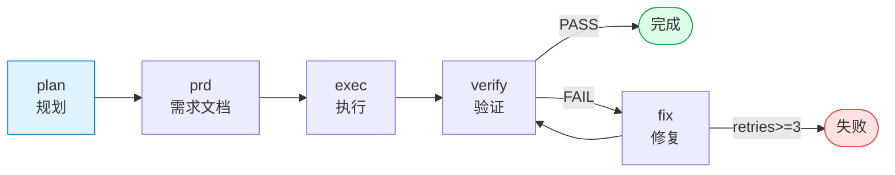

### wf-tdd-cycle

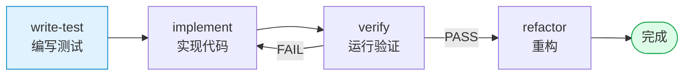

### wf-codereview-business

该定义演示"Workflow 作为业务基座"：shell 采集上下文 → AI 多轮审查（带覆盖收敛门禁）→ shell 提交到 GitHub。

**五步流程：**

1. **gather** (shell)：调用 `gh api` / `git diff` 采集 repo、PR、diff 等上下文，输出 JSON 并展开到变量
2. **review** (AI)：基于 diff 进行全量代码审查，输出结构化 JSON（summary + comments + coverage）
3. **check_coverage** (AI)：自检审查覆盖率（文件覆盖 + 分类覆盖），若有遗漏输出 `INCOMPLETE`
4. **review_gaps** (AI)：仅针对遗漏区域补充审查，与已有结果合并，回到 check_coverage 收敛
5. **submit** (shell)：通过 `gh api` 提交 Review 到 GitHub PR

默认变量：`working_directory=.`、`auto_submit=false`。

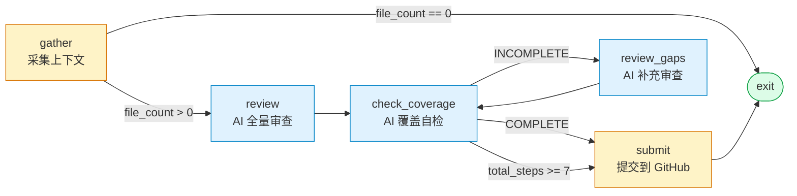

**收敛机制：** check_coverage ↔ review_gaps 形成收敛循环；当 `total_steps >= 7` 时强制跳出，防止无限迭代。

**条件表达式要点：**
- `result.file_count == 0`：gather 输出 JSON 自动解析为 `result`，直接按字段访问
- `result.status == "INCOMPLETE"`：check_coverage 输出 JSON 的 status 字段
- `vars.auto_submit == "false"`：点语法访问运行变量

## 8. API 端点

### Workflow Definitions（Registry CRUD）

| Method   | Path                      | 说明                          |
| -------- | ------------------------- | ----------------------------- |
| `GET`    | `/api/workflow-defs`      | 列出所有定义                  |
| `POST`   | `/api/workflow-defs`      | 创建定义（name + steps 必填） |
| `GET`    | `/api/workflow-defs/{id}` | 获取单个定义                  |
| `PUT`    | `/api/workflow-defs/{id}` | 更新定义                      |
| `DELETE` | `/api/workflow-defs/{id}` | 删除定义（builtin 不可删）    |

### Workflow Runs（Engine 控制）

| Method | Path                              | 说明                                  |
| ------ | --------------------------------- | ------------------------------------- |
| `POST` | `/api/workflow-runs`              | 启动运行 `{definition_id, variables}` |
| `GET`  | `/api/workflow-runs`              | 列出所有运行                          |
| `GET`  | `/api/workflow-runs/{id}`         | 获取运行详情（含 step_history）       |
| `POST` | `/api/workflow-runs/{id}/restart` | 重新执行（round++，从 entry 开始）    |
| `POST` | `/api/workflow-runs/{id}/resume`  | 恢复执行（从失败步骤或指定步骤继续）  |
| `POST` | `/api/workflow-runs/{id}/cancel`  | 取消运行                              |

## 9. 前端交互

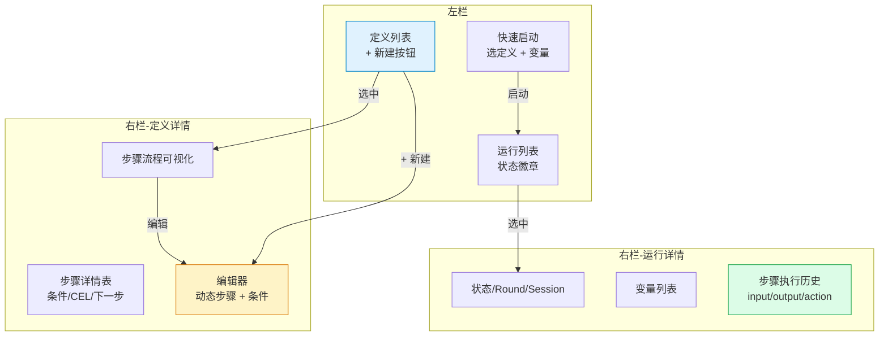

- **编辑器**：Prompt 和 Agent 为下拉选择器（从 Registry 加载），支持动态增删步骤和条件
- **运行详情**：running 状态时自动 3 秒轮询刷新
- **状态变量**：以 `workflow` 前缀命名（`workflowDefs`, `workflowRuns`, `workflowActiveDef` 等）

## 10. 关键设计决策

| 决策         | 选项                   | 选择                      | 理由                                         |
| ------------ | ---------------------- | ------------------------- | -------------------------------------------- |
| 条件引擎     | 自定义白名单 vs expr   | **expr** (expr-lang/expr) | 表达力强、零依赖、API 简洁、Go 原生          |
| Session 策略 | 复用 vs 独立           | **独立** (workflow- 前缀) | 隔离上下文、可审计、不干扰其他会话           |
| 执行模式     | 同步 vs 异步           | **异步** (后台 goroutine) | 不阻塞 API 响应，支持取消                    |
| 系统提示词   | 仅用户输入 vs 自动组合 | **自动组合三段**          | Agent 需要全局流程上下文才能准确执行每步     |
| 运行持久化   | SQLite vs 内存         | **内存**                  | 运行是临时态，重启后不需恢复；定义持久化即可 |
| 重启策略     | 新建 run vs 复用 run   | **复用 run** (round++)    | 保留历史记录，Session 复用避免重建开销       |

## 11. 安全约束

- `MaxSteps` 默认 50，防止条件错误导致无限循环
- `RetryLimit` 限制单步重试，超过则标记 failed
- 步骤超时 10 分钟（`time.After(10 * time.Minute)`）
- `context.Cancel` 支持外部取消
- `recover()` 捕获 panic，确保 goroutine 不泄漏
- 输出截断至 2000 字符存入 StepExecution，防止内存膨胀
- shell 步骤使用 `sh -lc`，需控制定义来源并避免不可信命令输入

## 12. Shell 步骤变量传递（WF_VAR_DIR）

shell 步骤需要读取前置步骤的输出（如 `review_result`、`gather_json`），但这些输出往往是大段 JSON，直接通过 `{{var}}` 模板注入到 shell 命令会导致引号嵌套、转义失败、命令截断等问题。

**解决方案：** 引擎在执行每个 shell 步骤前，自动创建临时目录并将所有运行变量写入独立文件，通过 `WF_VAR_DIR` 环境变量传递目录路径。

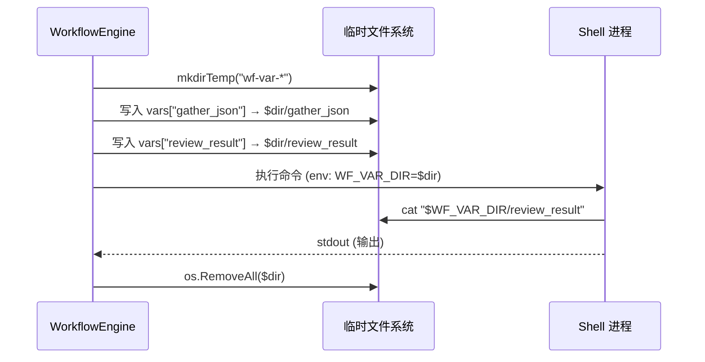

**使用方式（shell 脚本内）：**
```bash
# 读取前置步骤的 JSON 输出
cat "$WF_VAR_DIR/review_result" > result.json
cat "$WF_VAR_DIR/gather_json" > gather.json

# 用 jq 处理（避免 shell 变量展开）
jq -n --slurpfile result result.json '{body: $result[0].summary}'
```

**设计要点：**
- 引擎在 `executeShellStep` 中创建临时目录，命令结束后 `defer os.RemoveAll` 清理
- 每个变量写入独立文件，文件名即变量名
- 脚本通过 `cat "$WF_VAR_DIR/varname"` 读取，完全绕过 shell 引号/转义问题
- 配合 `jq --slurpfile` 可在 jq 内部安全处理 JSON，无需经过 shell 变量

## 13. 已知问题

### GitHub PR Review API `line` 字段校验（HTTP 422）

**问题描述：**

通过 `POST repos/{owner}/{repo}/pulls/{pr}/reviews` 提交 Review 时，`comments[].line` 必须落在该文件的 diff hunk 范围内。如果 `line` 指向的行不在 diff 中，GitHub 会返回 HTTP 422：

```
Unprocessable Entity: "pull_request_review_thread.line" must be part of the diff
```

**根因：**

AI 在审查阶段看到的是完整 diff 上下文（可能包含 diff 周围的行号），生成的 `comments[].line` 基于完整文件视角。但 GitHub API 严格要求 `line` 属于 PR diff 的有效 hunk 行。当 AI 生成的行号落在 diff hunk 之外时，整个 Review 提交失败（单条无效 comment 导致整批被拒）。

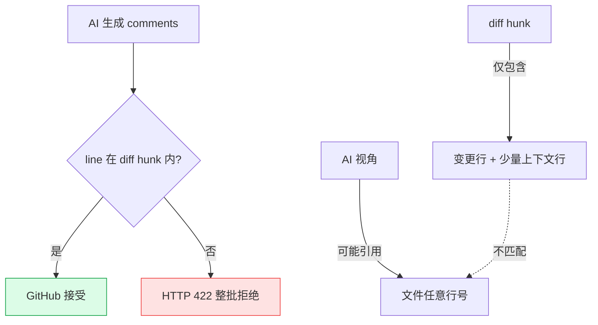

**影响：**
- 单条 comment 的 `line` 无效就会导致整个 Review（含所有合法 comments）提交失败
- 失败后 Workflow 标记为 failed，需手工 resume

**计划方案：**

1. **Diff hunk 解析 + 预过滤**：提交前解析 diff，提取每个文件的有效行号集合，丢弃无效 `line` 的 comments
2. **降级提交**：捕获 422 后自动回退为仅 `summary`（无行内 comments）的 Review
3. **两者结合**：先过滤，仍失败则降级

**当前状态：** 未修复，作为已知缺陷记录。触发时可通过前端 **▶ 继续执行** 按钮 resume。

## 14. Shell Workflow 快速验证示例

下面给出一个可直接创建并运行的 shell Workflow。它做三件事：
1) 读取仓库当前分支；2) 读取最近提交；3) 根据输出长度决定直接结束或进入补充步骤。

```mermaid
graph TD
        A[detect-branch\n(shell)] --> B[last-commit\n(shell)]
        B -->|output_length > 20| C([exit])
        B -->|否则| D[echo-fallback\n(shell)]
        D --> C

        style A fill:#fef3c7,stroke:#d97706
        style B fill:#fef3c7,stroke:#d97706
        style D fill:#fef3c7,stroke:#d97706
        style C fill:#dcfce7,stroke:#16a34a
```

该示例会把每一步输出写入变量，供后续步骤模板与 CEL 使用。

```json
{
    "name": "Shell Verify Demo",
    "description": "验证 shell step + capture_to_var + CEL 分支",
    "category": "demo",
    "icon": "🧪",
    "entry_step": "detect-branch",
    "max_steps": 10,
    "steps": [
        {
            "id": "detect-branch",
            "name": "读取当前分支",
            "type": "shell",
            "command_template": "git branch --show-current",
            "capture_to_var": "branch",
            "default_next": "last-commit"
        },
        {
            "id": "last-commit",
            "name": "读取最近提交",
            "type": "shell",
            "command_template": "git log -1 --pretty=format:'%h %s [%an]'",
            "capture_to_var": "last_commit",
            "conditions": [
                {
                    "expr": "output_length > 20",
                    "action": "exit"
                }
            ],
            "default_next": "echo-fallback"
        },
        {
            "id": "echo-fallback",
            "name": "补充分支信息",
            "type": "shell",
            "command_template": "echo branch={{branch}} commit={{last_commit}}",
            "capture_to_var": "summary",
            "default_next": "$exit"
        }
    ]
}
```

### 验证要点

- `StepHistory` 中每步 `input/output/action` 应完整可见
- `Run variables` 中应包含：`branch`、`last_commit`、`summary`（视分支而定）
- `last-commit` 步骤的条件命中时，`action=exit`，流程直接完成
