# Workflow Expr OS 能力集成 — 用 expr 替代 Shell 脚本

> 设计文档 v0.5 | 2026-04-23 | 状态：Phase 1-3 已实现 / Phase 4 RFC

## 1. 背景与动机

当前 Workflow 的 `shell` 步骤通过 `sh -l` 执行脚本，存在以下痛点：

| 痛点               | 说明                                                                  |
| ------------------ | --------------------------------------------------------------------- |
| **数据传递不可靠** | 大段 JSON 变量必须通过 `WF_VAR_DIR` 文件中转，无法直接在 shell 中引用 |
| **引号/转义脆弱**  | shell 变量展开 + JSON 引号 + 特殊字符组合频繁导致 `jq parse error`    |
| **安全风险**       | 命令注入面大，`{{var}}` 模板直接拼入 shell 命令                       |
| **跨平台受限**     | 依赖 `sh`、`jq`、`gh`、`git` 等 CLI 工具                              |
| **调试困难**       | stdout/stderr 分离，错误定位需翻日志                                  |

**核心想法：** 项目已使用 `expr-lang/expr` 作为统一模板 + 条件引擎。如果向 expr 注入一组 OS/进程操作函数，就可以用 expr 表达式替代 shell 脚本，同时获得类型安全、结构化数据传递和 Go 原生错误处理。

## 2. 技术可行性

### 2.1 expr-lang/expr 自定义函数 API

expr v1.17.8 提供 `expr.Function()` 选项，可注入任意 Go 函数：

```go
expr.Function(
    "git",                                          // 函数名
    func(params ...any) (any, error) { ... },       // Go 实现
    new(func(...string) string),                    // 类型签名
)
```

函数在 `expr.Compile()` 时注册，表达式中直接调用。支持：
- 可变参数（`...any`）
- 任意返回类型（`string`、`map`、`[]any`、`error`）
- 多个类型签名重载

### 2.2 现有 expr 集成点

`expr-lang/expr` 在项目中的使用范围：

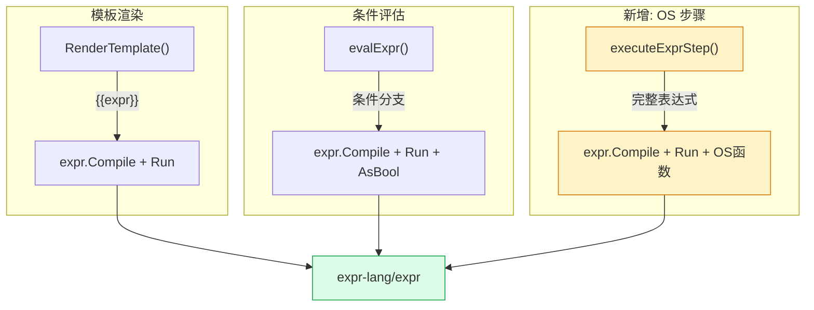

新增 `expr` 步骤类型是第三个集成点，与模板渲染和条件评估共享同一引擎。

### 2.3 可行性结论

| 维度                        | 结论                                                     |
| --------------------------- | -------------------------------------------------------- |
| expr 是否支持注入自定义函数 | ✅ `expr.Function()` 完全支持                             |
| 能否返回结构化数据          | ✅ 函数可返回 `map[string]any`、`[]any` 等                |
| 能否处理错误                | ✅ 函数返回 `error` 时 expr.Run 传播错误                  |
| 内置函数是否够用            | ✅ 已有 `toJSON`、`fromJSON`、`split`、`filter`、`len` 等 |
| 性能                        | ✅ expr 编译 + 运行开销远低于 fork shell 进程             |

## 3. 方案设计

### 3.1 新步骤类型：`expr`

在 `WorkflowStep.Type` 中新增 `"expr"` 类型。执行时不 fork shell 进程，而是在 Go 进程内用 expr 引擎直接执行表达式。

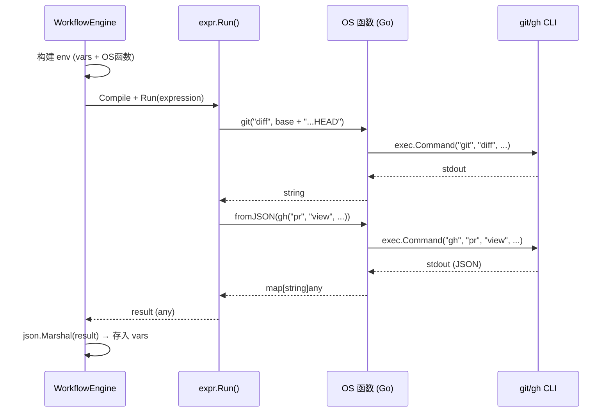

与 shell 步骤对比：

```
shell 步骤：                               expr 步骤：
━━━━━━━━━━━━━━━━━━━━                       ━━━━━━━━━━━━━━━━━━
1. RenderTemplate(cmd)                      1. 构建 env (vars + OS函数)
2. 写脚本到临时文件                         2. expr.Compile(expression, opts...)
3. 写 vars 到 WF_VAR_DIR                   3. expr.Run(program, env)
4. exec.Command("sh", "-l", file)           4. 直接拿到 Go 值（map/string/...）
5. 解析 stdout 字符串                       5. json.Marshal → 存入 vars
```

### 3.2 OS 函数集

注入的函数分为四层：基础 OS → CLI 封装 → 高阶语义 → 候选储备。

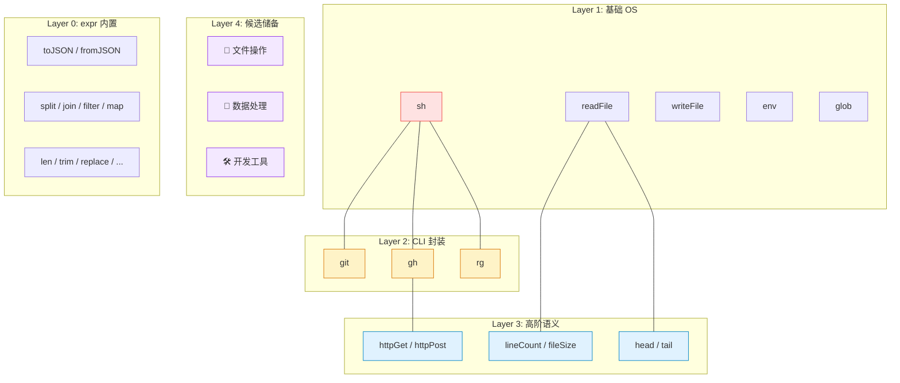

#### 函数清单

| 函数                    | 签名                             | 说明                                                    | 安全等级 |
| ----------------------- | -------------------------------- | ------------------------------------------------------- | -------- |
| `sh(script)`            | `string → string`                | 执行 shell 脚本（`sh -c`），返回 stdout                 | ⚠️ 高风险 |
| `readFile(path)`        | `string → string`                | 全读文件内容（截断到 `maxOutput`，如 512KB）            | 中风险   |
| `readFile(path, s, e)`  | `(string, int, int) → string`    | 读取第 s 到 e 行（1-based，含两端），按行扫描不全量加载 | 中风险   |
| `writeFile(path, data)` | `(string, string) → string`      | 写文件，返回路径                                        | 中风险   |
| `env(name)`             | `string → string`                | 读环境变量                                              | 低风险   |
| `glob(pattern)`         | `string → []string`              | 文件匹配                                                | 低风险   |
| `git(args...)`          | `...string → string`             | 执行 `git` 子命令                                       | 中风险   |
| `gh(args...)`           | `...string → string`             | 执行 `gh` CLI                                           | 中风险   |
| `httpGet(url)`          | `string → string`                | HTTP GET，返回 body                                     | 中风险   |
| `httpPost(url, body)`   | `(string, string) → string`      | HTTP POST，返回 body                                    | 中风险   |
| `tempDir()`             | `→ string`                       | 创建临时目录，步骤结束自动清理                          | 低风险   |
| `lineCount(path)`       | `string → int`                   | 统计文件行数（逐行扫描，不全量加载）                    | 低风险   |
| `fileSize(path)`        | `string → int`                   | 文件字节数（`os.Stat`）                                 | 低风险   |
| `rg(pattern, path)`     | `(string, string) → []string`    | 单文件搜索，返回 `行号:内容` 列表（封装 `rg`）          | 低风险   |
| `rg(pattern, args...)`  | `(string, ...string) → []string` | 递归搜索目录/多选项（`rg pattern -g '*.go'` 等）        | 中风险   |
| `head(path, n)`         | `(string, int) → string`         | 读前 n 行，等价于 `readFile(path, 1, n)`                | 低风险   |
| `tail(path, n)`         | `(string, int) → string`         | 读末尾 n 行                                             | 低风险   |

#### 候选储备函数（Phase 3 考虑纳入）

以下函数按场景分类，根据实际使用反馈决定是否纳入。标记 `★` 的为高优先级候选。

**文件与路径操作：**

| 函数               | 签名                        | 说明                                          | 实现    |
| ------------------ | --------------------------- | --------------------------------------------- | ------- |
| `★ basename(path)` | `string → string`           | 提取文件名（`filepath.Base`）                 | Go 原生 |
| `★ dirname(path)`  | `string → string`           | 提取目录路径（`filepath.Dir`）                | Go 原生 |
| `★ extname(path)`  | `string → string`           | 提取扩展名（`filepath.Ext`）                  | Go 原生 |
| `★ exists(path)`   | `string → bool`             | 文件/目录是否存在                             | Go 原生 |
| `★ isDir(path)`    | `string → bool`             | 是否为目录                                    | Go 原生 |
| `realpath(path)`   | `string → string`           | 解析绝对路径 + 符号链接                       | Go 原生 |
| `mkdir(path)`      | `string → string`           | 创建目录（含父目录），返回路径                | Go 原生 |
| `cp(src, dst)`     | `(string, string) → string` | 复制文件，返回目标路径                        | Go 原生 |
| `mv(src, dst)`     | `(string, string) → string` | 移动/重命名文件                               | Go 原生 |
| `rm(path)`         | `string → bool`             | 删除文件（仅文件，不递归删目录）              | Go 原生 |
| `ls(path)`         | `string → []map`            | 列目录，返回 `[{name, size, isDir, modTime}]` | Go 原生 |

**数据处理与编码：**

| 函数                         | 签名                                | 说明                              | 实现    |
| ---------------------------- | ----------------------------------- | --------------------------------- | ------- |
| `★ hash(data)`               | `string → string`                   | SHA-256 哈希（默认）              | Go 原生 |
| `★ hash(data, algo)`         | `(string, string) → string`         | 指定算法（`sha256`/`md5`/`sha1`） | Go 原生 |
| `★ base64Encode(data)`       | `string → string`                   | Base64 编码                       | Go 原生 |
| `★ base64Decode(data)`       | `string → string`                   | Base64 解码                       | Go 原生 |
| `urlEncode(data)`            | `string → string`                   | URL 编码（`url.QueryEscape`）     | Go 原生 |
| `urlDecode(data)`            | `string → string`                   | URL 解码                          | Go 原生 |
| `★ regexMatch(s, pat)`       | `(string, string) → bool`           | 正则匹配（Go `regexp`）           | Go 原生 |
| `regexFind(s, pat)`          | `(string, string) → []string`       | 正则提取所有匹配                  | Go 原生 |
| `regexReplace(s, pat, repl)` | `(string, string, string) → string` | 正则替换                          | Go 原生 |
| `parseYAML(s)`               | `string → map`                      | YAML 解析为 map/slice             | Go 原生 |
| `toYAML(v)`                  | `any → string`                      | 序列化为 YAML 字符串              | Go 原生 |
| `csv(s)`                     | `string → [][]string`               | 解析 CSV 字符串                   | Go 原生 |

**时间与计算：**

| 函数                     | 签名                     | 说明                            | 实现    |
| ------------------------ | ------------------------ | ------------------------------- | ------- |
| `★ timestamp()`          | `→ int`                  | 当前 Unix 时间戳（秒）          | Go 原生 |
| `formatTime(ts, layout)` | `(int, string) → string` | 时间戳格式化（Go layout）       | Go 原生 |
| `★ uuid()`               | `→ string`               | 生成 UUID v4                    | Go 原生 |
| `★ sleep(ms)`            | `int → bool`             | 等待指定毫秒（受 ctx 超时控制） | Go 原生 |

**CLI 工具封装：**

| 函数                 | 签名                        | 说明                                        | 实现 |
| -------------------- | --------------------------- | ------------------------------------------- | ---- |
| `★ jq(input, query)` | `(string, string) → string` | 封装 `jq` CLI，处理复杂 JSON 查询           | CLI  |
| `★ docker(args...)`  | `...string → string`        | 封装 `docker` CLI                           | CLI  |
| `make(args...)`      | `...string → string`        | 封装 `make` CLI                             | CLI  |
| `npm(args...)`       | `...string → string`        | 封装 `npm` CLI                              | CLI  |
| `go_(args...)`       | `...string → string`        | 封装 `go` CLI（`go_` 避开保留字）           | CLI  |
| `python(args...)`    | `...string → string`        | 封装 `python3` CLI                          | CLI  |
| `kubectl(args...)`   | `...string → string`        | 封装 `kubectl` CLI                          | CLI  |
| `curl(args...)`      | `...string → string`        | 封装 `curl` CLI（比 `httpGet/Post` 更灵活） | CLI  |
| `which(name)`        | `string → string`           | 检查命令是否存在，返回路径或空串            | CLI  |

**日志与调试：**

| 函数                  | 签名                    | 说明                                  | 实现    |
| --------------------- | ----------------------- | ------------------------------------- | ------- |
| `★ log(msg)`          | `string → string`       | 输出日志到步骤 stderr（不影响返回值） | Go 原生 |
| `★ assert(cond, msg)` | `(bool, string) → bool` | 断言失败时报错，用于步骤内校验        | Go 原生 |
| `debug(v)`            | `any → string`          | 输出值的 JSON 表示（调试用）          | Go 原生 |

> **候选函数逻辑：** 标记 `★` 的 20 个高优先级函数全部是 Go 原生实现或轻量 CLI 封装，实现成本极低（大多 3-5 行）。CLI 封装函数复用 `git()` / `gh()` 的模式（`exec.CommandContext` + cwd + ctx），批量添加几乎是模板化操作。

`readFile` 利用 expr 的多签名重载，一个函数覆盖全读和按行读两种场景：

```javascript
readFile("config.json")          // 全读（截断到 maxOutput）
readFile("main.go", 10, 20)      // 读第 10-20 行
readFile("data.csv", 1, 1)       // 只读第 1 行（表头）
```

按行读取时使用 `bufio.Scanner` 逐行扫描，跳到 `startLine` 后开始采集，到 `endLine` 即停——不会将整个大文件加载到内存。

> **`sh()` vs 旧的 `exec()`：** `sh(script)` 取代了之前设计中的 `exec(cmd, args...)`。核心区别是 shell 从「步骤执行环境」降级为「expr 可调用函数」——数据始终在 expr 值域内流动，shell 只负责执行命令，不再承担数据拼装和传递。

**关键优势对比：**

| 维度           | shell 步骤（旧）       | expr 中的 `sh()`（新）                           |
| -------------- | ---------------------- | ------------------------------------------------ |
| 数据传入       | `WF_VAR_DIR` 文件中转  | expr 变量直接可用                                |
| 数据返回       | stdout 字符串          | `sh()` 返回值 + `fromJSON` 即时解析              |
| 与其他操作组合 | 不行，整个步骤是 shell | 一个表达式中混用 `sh()` + `git()` + `fromJSON()` |
| 注入风险       | `{{var}}` 直接拼入命令 | 变量不经过 shell 展开                            |

**`sh()` 典型用法：**

```javascript
// 管道链：shell 执行，expr 结构化
let running = sh("docker ps --format json")
filter(fromJSON("[" + replace(running, "\n", ",") + "]"), .State == "running")

// 与 git() 混用
let diff = git("diff", "--stat", "main...HEAD")
let coverage = sh("go test -cover ./... 2>&1 | tail -1")
let lint = sh("golangci-lint run --out-format json 2>/dev/null") ?? "{}"
{diff_summary: diff, coverage: coverage, lint_issues: fromJSON(lint).Issues ?? []}

// 需要 shell 特性（重定向、子 shell）时
let result = sh("cd /tmp && tar xzf archive.tar.gz && ls -la")
```

> **expr 已内置**（无需注入）：`toJSON`、`fromJSON`、`split`、`join`、`filter`、`map`、`len`、`trim`、`replace`、`upper`、`lower`、`hasPrefix`、`hasSuffix`、`indexOf`、`now`、`duration` 等 50+ 函数。

### 3.3 实现示例

#### executeExprStep 核心逻辑

```go
func (e *WorkflowEngine) executeExprStep(ctx context.Context, run *WorkflowRun, step *WorkflowStep) (string, string, error) {
    // 1. 构建 env：运行变量 + OS 函数
    env := buildExprEnv(run.Variables)

    // 2. 模板渲染表达式中的 {{var}} 占位符
    expression := RenderTemplate(step.InputTemplate, run.Variables)

    // 3. 编译 + 执行
    opts := []expr.Option{
        expr.Env(env),
        expr.AllowUndefinedVariables(),
    }
    opts = append(opts, exprOSFunctions(ctx, run)...)

    program, err := expr.Compile(expression, opts...)
    if err != nil {
        return "", "", fmt.Errorf("expr step %q compile: %w", step.ID, err)
    }

    result, err := expr.Run(program, env)
    if err != nil {
        return "", "", fmt.Errorf("expr step %q exec: %w", step.ID, err)
    }

    // 4. 结果序列化
    output, _ := json.Marshal(result)
    return string(output), "", nil
}
```

#### OS 函数注入

```go
func exprOSFunctions(ctx context.Context, run *WorkflowRun) []expr.Option {
    cwd := run.Variables["working_directory"]

    return []expr.Option{
        expr.Function("exec", func(params ...any) (any, error) {
            if len(params) < 1 {
                return nil, fmt.Errorf("exec: requires command name")
            }
            name := fmt.Sprint(params[0])
            args := make([]string, len(params)-1)
            for i, p := range params[1:] {
                args[i] = fmt.Sprint(p)
            }
            cmd := exec.CommandContext(ctx, name, args...)
            if cwd != "" { cmd.Dir = cwd }
            out, err := cmd.Output()
            return strings.TrimSpace(string(out)), err
        }, new(func(string, ...string) string)),

        expr.Function("git", func(params ...any) (any, error) {
            args := make([]string, len(params))
            for i, p := range params { args[i] = fmt.Sprint(p) }
            cmd := exec.CommandContext(ctx, "git", args...)
            if cwd != "" { cmd.Dir = cwd }
            out, err := cmd.Output()
            return strings.TrimSpace(string(out)), err
        }, new(func(...string) string)),

        expr.Function("gh", func(params ...any) (any, error) {
            args := make([]string, len(params))
            for i, p := range params { args[i] = fmt.Sprint(p) }
            cmd := exec.CommandContext(ctx, "gh", args...)
            if cwd != "" { cmd.Dir = cwd }
            out, err := cmd.Output()
            return strings.TrimSpace(string(out)), err
        }, new(func(...string) string)),

        expr.Function("readFile", func(params ...any) (any, error) {
            path := fmt.Sprint(params[0])
            data, err := os.ReadFile(path)
            return string(data), err
        }, new(func(string) string)),

        expr.Function("env", func(params ...any) (any, error) {
            return os.Getenv(fmt.Sprint(params[0])), nil
        }, new(func(string) string)),
    }
}
```

### 3.4 Codereview Gather 步骤改写对比

#### 当前 shell 版本（约 50 行 bash）

```bash
set -e
cd "{{working_directory}}" 2>/dev/null || cd .
_tmpdir=$(mktemp -d)
trap 'rm -rf "$_tmpdir"' EXIT
REPO=$(gh repo view --json nameWithOwner --jq .nameWithOwner 2>/dev/null || ...)
BRANCH=$(git rev-parse --abbrev-ref HEAD)
PR_JSON=$(gh pr view --json number,baseRefName,... || echo "{}")
# ... 20+ 行解析 + 文件写入 + jq 组装 ...
jq -n --arg repo "$REPO" --rawfile diff "$_tmpdir/diff" '{...}'
```

#### expr 版本（约 15 行表达式）

```javascript
let branch = git("rev-parse", "--abbrev-ref", "HEAD")
let prRaw = gh("pr", "view", "--json", "number,baseRefName,headRefName,title,url,files") ?? "{}"
let pr = fromJSON(prRaw)
let base = pr.baseRefName ?? "main"
let diffText = git("diff", base + "...HEAD") ?? ""
let filesRaw = git("diff", "--name-only", base + "...HEAD") ?? ""
let fileList = split(filesRaw, "\n") | filter(# != "")

{
  "repo": trim(git("config", "--get", "remote.origin.url")),
  "branch": branch,
  "base_branch": base,
  "pr_number": pr.number ?? 0,
  "pr_title": pr.title ?? "",
  "changed_files": fileList,
  "file_count": len(fileList),
  "diff": diffText
}
```

**优势：**
- 无临时文件、无 `jq`、无引号转义
- `fromJSON()` 直接得到结构化 `map`，不再是字符串拼接
- `??` 空值合并替代 `|| echo "{}"`
- 最终返回的 `map` 自动 `json.Marshal` 存入 `vars`

### 3.5 Codereview Submit 步骤改写对比

#### 当前 shell 版本（WF_VAR_DIR + jq --slurpfile）

```bash
cat "$WF_VAR_DIR/review_result" > "$_tmpdir/result.json"
cat "$WF_VAR_DIR/gather_json" > "$_tmpdir/gather.json"
PR_NUMBER=$(jq -r '.pr_number // 0' "$_tmpdir/gather.json")
# ... jq --slurpfile 构建 payload ...
gh api --method POST --input "$_tmpdir/payload.json" "repos/$REPO/pulls/$PR_NUMBER/reviews"
```

#### expr 版本

```javascript
let gather = fromJSON(gather_json)
let review = fromJSON(review_result)

let payload = {
  "body": review.summary ?? "AI review completed",
  "event": review.event ?? "COMMENT",
  "comments": review.comments ?? []
}

let commitId = gh("pr", "view", string(gather.pr_number), "--json", "headRefOid", "--jq", ".headRefOid") ?? ""
if commitId != "" {
  payload = payload | merge({"commit_id": commitId})  
}

let response = gh("api", "--method", "POST",
  "--header", "Accept: application/vnd.github+json",
  "--input", "-",
  "repos/" + gather.repo + "/pulls/" + string(gather.pr_number) + "/reviews",
  "--input-json", toJSON(payload))

let url = fromJSON(response).html_url ?? ""
url != "" ? {"status": "submitted", "html_url": url} : {"status": "failed", "error": response}
```

**优势：**
- 无 `WF_VAR_DIR` 文件中转：`gather_json` 和 `review_result` 直接作为 env 变量（字符串），用 `fromJSON()` 原地解析
- payload 就是一个 map 字面量，无 `jq --slurpfile` 拼装
- 错误处理通过 `??` 和三元表达式，比 shell `if [ -n "$URL" ]` 更清晰

## 4. 安全约束

### 4.1 函数权限分级

`sh()` 是最高风险函数（等同于 `sh -c`）。按场景分级控制：

| 场景                           | `sh()`     | `git()` / `gh()` | `readFile()` 等 | 说明                           |
| ------------------------------ | ---------- | ---------------- | --------------- | ------------------------------ |
| 内置 Workflow（codereview 等） | ✅ 允许     | ✅ 允许           | ✅ 允许          | 可信定义，由开发者编写         |
| 用户自定义 expr 步骤           | ⚠️ 可选开关 | ✅ 允许           | ✅ 允许          | `allow_shell: true/false` 控制 |
| RLM（LLM 生成 expr）           | ❌ 禁用     | ✅ 允许           | ✅ 允许          | 防止 LLM 执行任意命令          |

**实现方式：** 通过控制是否注入 `sh()` 函数到 expr 选项集来实现。`git()` / `gh()` 始终可用（封装函数内部做参数校验），`sh()` 根据上下文决定是否注入。

### 4.2 路径限制

`readFile()` / `writeFile()` 应限制在 `working_directory` 或系统 temp 目录下，防止读取敏感文件。

### 4.3 超时控制

所有 OS 函数继承步骤级 `context.Context` 超时（默认 10 分钟），与 shell 步骤一致。

### 4.4 输出大小

函数返回值在存入变量前做截断（复用 `shellStepMaxOutput` 限制），防止内存膨胀。

## 5. 数据流对比

下图展示 shell 步骤与 expr 步骤的数据流差异。

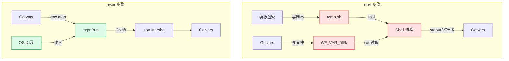

**关键差异：** expr 步骤消除了两次序列化中转（Go→文件→Shell→stdout→Go），数据始终在 Go 值域内流动。

## 6. 实施计划

### Phase 1：expr 步骤 + 核心函数 ✅ 已完成

**目标：** 新增 `type: "expr"` 步骤类型，与 `shell` 共存。

| 任务                   | 文件                                  | 状态 | 说明                                                                                                                                                     |
| ---------------------- | ------------------------------------- | ---- | -------------------------------------------------------------------------------------------------------------------------------------------------------- |
| 定义 OS 函数集         | `internal/copilot/expr_funcs.go`      | ✅    | 22 个函数：sh/git/gh/ghTry/ghAPI/readFile/writeFile/env/glob/tempDir/lineCount/fileSize/head/tail/log/merge/parallel/ctx/ctxGlob/setVar/getVar/deleteVar |
| 实现 `executeExprStep` | `internal/copilot/workflow.go`        | ✅    | expr 步骤执行分支                                                                                                                                        |
| 更新步骤路由           | `workflow.go` `executeStep`           | ✅    | `case "expr"` 分支                                                                                                                                       |
| 单元测试               | `internal/copilot/expr_funcs_test.go` | ✅    | 34 个测试用例覆盖全部函数                                                                                                                                |
| 集成测试               | `internal/copilot/workflow_test.go`   | ✅    | expr 步骤端到端                                                                                                                                          |

**不改动：**
- 现有 `shell` 步骤保持不变 ✅
- 前端无需改动（步骤类型只是后端概念）✅

### Phase 2：迁移内置 Workflow ✅ 已完成

用 expr 步骤替换 `wf-codereview-business` 的 shell 步骤。

| 步骤                                        | 迁移策略                                               | 状态 |
| ------------------------------------------- | ------------------------------------------------------ | ---- |
| `gather` (shell → expr)                     | `crExprGather`：`git()` + `gh()` + `fromJSON()`        | ✅    |
| `submit` (shell → expr)                     | `crExprSubmit`：`ghAPI()` + map 字面量 + 3 级 fallback | ✅    |
| `review` / `check_coverage` / `review_gaps` | 不变（AI 步骤）                                        | ✅    |

### Phase 3：高阶函数 + Starlark 步骤 ✅ 已完成

| 任务                    | 说明                                       | 状态 |
| ----------------------- | ------------------------------------------ | ---- |
| `parallel()` 并发执行   | 最多 8 并发，panic 恢复                    | ✅    |
| Starlark 步骤类型       | `type: "starlark"` + `executeStarlarkStep` | ✅    |
| Starlark 21 个 builtins | 与 expr OS 函数对等                        | ✅    |
| Starlark 清理机制       | `cleanups []func()` + `tempDir` 自动清理   | ✅    |

## 7. 设计决策

| 决策                | 选项                             | 选择                                 | 理由                                           |
| ------------------- | -------------------------------- | ------------------------------------ | ---------------------------------------------- |
| 函数注入方式        | env map vs `expr.Function()`     | **`expr.Function()`**                | 类型安全、编译期校验                           |
| shell 能力          | `sh()` vs `exec()` vs 不提供     | **`sh(script)`**                     | shell 降级为可调用函数，数据不经过 shell 展开  |
| 表达式来源          | `InputTemplate` vs `CommandTmpl` | **`InputTemplate`**                  | 复用现有字段，语义更通用                       |
| 返回值处理          | 强制 JSON vs 原样字符串          | **`json.Marshal`**                   | 保持 `CaptureToVar` + `CaptureFields` 语义一致 |
| 是否删除 shell 支持 | 删除 vs 共存                     | **共存**                             | 用户自定义 workflow 可能依赖 shell             |
| 变量注入方式        | 字符串 map vs typed env          | **字符串 map + `fromJSON` 按需解析** | 兼容现有 vars 语义                             |

## 8. 风险与缓解

| 风险                                       | 缓解                                                       |
| ------------------------------------------ | ---------------------------------------------------------- |
| expr 语法学习成本                          | 表达式简洁，内置函数覆盖面广；提供示例模板                 |
| `git()` / `gh()` / `sh()` 底层仍 fork 进程 | 性能与 shell 步骤持平，但数据传递更安全；`sh()` 按场景禁用 |
| expr 不支持多语句赋值                      | expr v1.17+ 支持 `let` 绑定和管道；复杂逻辑可拆为多步 expr |
| 函数错误中断整个表达式                     | 用 `??` 提供默认值，或 `try()` 包裹（如 expr 未来支持）    |
| 大输出内存压力                             | 复用 `shellStepMaxOutput` 截断策略                         |

## 9. RLM（Recursive Language Model）集成

### 9.1 什么是 RLM

RLM 的核心模式是 LLM 与程序化计算的递归循环：

```
LLM 推理 → 生成可执行指令 → 执行得到结果 → 结果回馈 LLM → 再推理 → ...
```

对应到当前 Workflow Engine，**AI 步骤**负责 LLM 推理，**shell/expr 步骤**负责执行。但现有架构中 LLM 无法动态生成要执行的程序——步骤是预定义的，不是 LLM 按需生成的。这不是真正的 RLM。

### 9.2 expr 如何实现 RLM

引入 expr 后，LLM 可以**动态生成 expr 表达式**，引擎执行后将结果喂回 LLM，形成真正的递归循环。

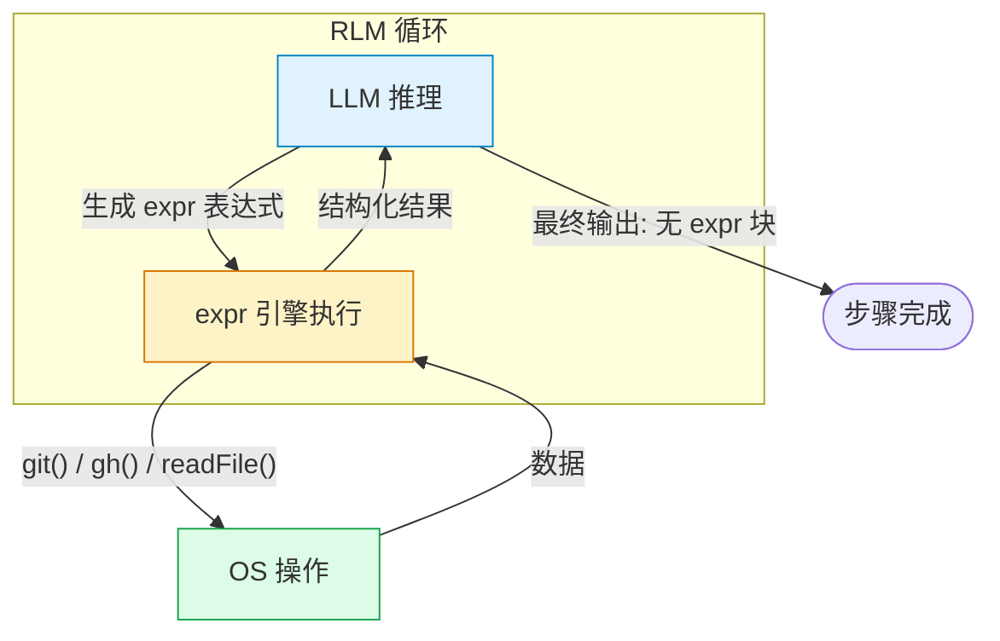

与仅作为 shell 替代品的"静态 expr"不同，RLM 模式下 **expr 表达式由 LLM 在运行时生成**，LLM 自主决定要做什么计算。

### 9.3 三种集成路径对比

#### 路径 A：步骤内循环

`executeAIStep` 中检测 LLM 输出是否包含 `` ```expr `` 代码块，若有则执行后将结果追加到会话上下文并再次调用 LLM。

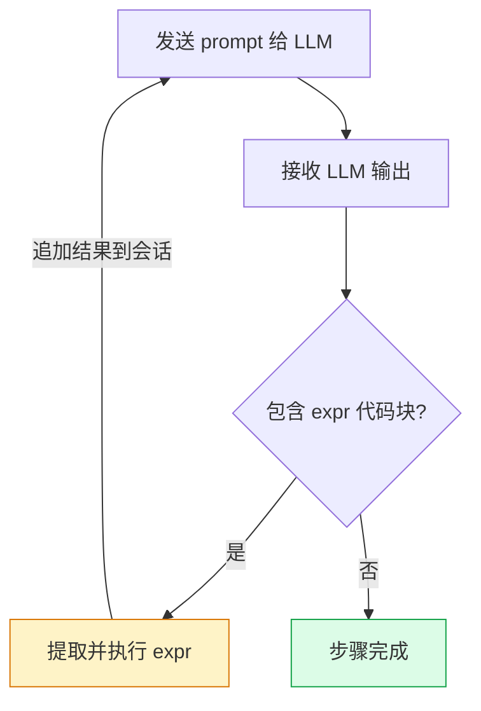

**优点：** 实现简单，不改变步骤模型。
**缺点：** 自行解析代码块，LLM 格式不稳定可能导致解析失败。

#### 路径 B：SDK Tool-Call（逐函数调用）

将每个 OS 函数（`git`、`gh`、`readFile` 等）注册为 Copilot SDK 的 Tool，由 SDK 原生 tool-call 循环驱动。

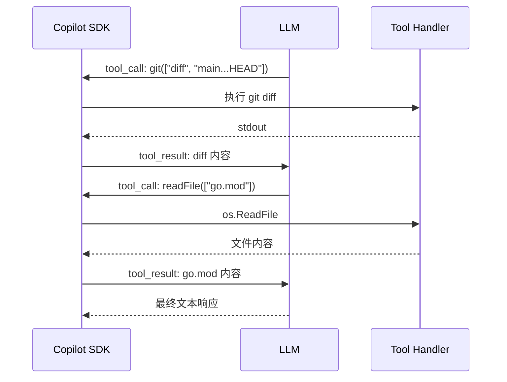

SDK `Tool` 结构体已原生支持：

```go
sdk.Tool{
    Name:        "git",
    Description: "执行 git 子命令",
    Parameters:  map[string]any{
        "type": "object",
        "properties": map[string]any{
            "args": map[string]any{"type": "array", "items": map[string]any{"type": "string"}},
        },
    },
    Handler: func(inv sdk.ToolInvocation) (sdk.ToolResult, error) {
        // 解析 args，执行 git 命令
        return sdk.ToolResult{TextResultForLLM: output}, nil
    },
}
```

**优点：** 天然 RLM，SDK 自动处理工具调用循环。
**缺点：** 每个函数调用一次 LLM 往返，N 个操作 = N 次往返，延迟和成本高。

#### 路径 C：expr-as-tool（推荐）

向 SDK 注册一个 `eval_expr` Tool，LLM 生成一段 expr 表达式作为参数，引擎一次执行多个操作后返回结构化结果。

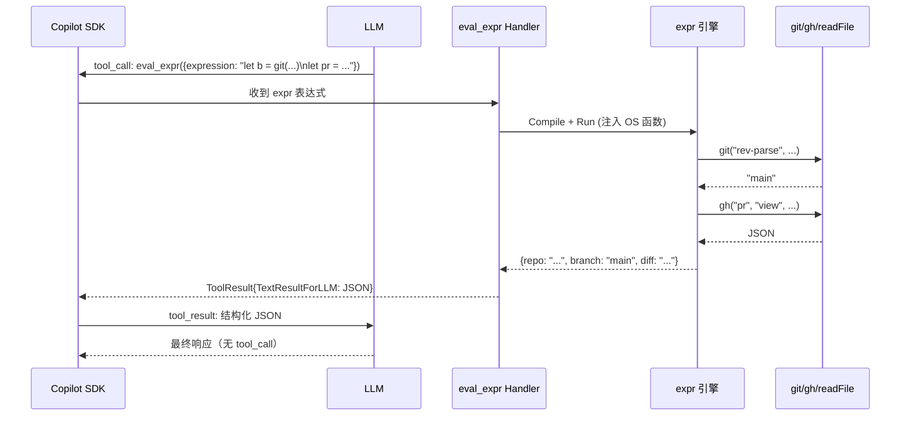

**关键优势：** LLM 在一次 tool-call 中通过 expr 组合多个操作，相比路径 B 大幅减少往返：

```
路径 B (逐函数 tool-call):               路径 C (expr-as-tool):
──────────────────────────               ───────────────────────
LLM → tool: git("branch")     → LLM     LLM → tool: eval_expr({
LLM → tool: gh("pr","view")   → LLM       expression: `
LLM → tool: git("diff",...)   → LLM       let b = git("branch")
LLM → 组装最终结果                         let pr = fromJSON(gh("pr","view",...))
                                           let d = git("diff",pr.base+"...HEAD")
4 次 LLM 往返                             {branch:b, pr:pr.number, diff:d}`
                                         }) → LLM → 最终结果
                                         1 次 LLM 往返
```

### 9.4 路径选型

| 维度            | A. 步骤内循环             | B. 逐函数 Tool         | C. expr-as-tool          |
| --------------- | ------------------------- | ---------------------- | ------------------------ |
| 是否 RLM        | ✅                         | ✅                      | ✅                        |
| LLM 往返次数    | 中（每次 expr 块一次）    | 高（每个函数一次）     | **低（一次组合多操作）** |
| 实现复杂度      | 中（自行解析代码块）      | **低（SDK 原生支持）** | 低（注册单个 tool）      |
| 格式稳定性      | ⚠️ 依赖 LLM 遵守代码块格式 | **高（SDK 标准协议）** | **高（SDK 标准协议）**   |
| 表达力          | 高                        | 低（逐个函数）         | **高（完整 expr 语法）** |
| 与 Phase 1 复用 | 完全复用                  | 需额外适配             | **完全复用 OS 函数集**   |

**推荐路径 C**：`eval_expr` 工具复用 Phase 1 的 OS 函数集，只需注册一个 SDK Tool 即可获得 RLM 能力。

### 9.5 eval_expr Tool 设计

```go
sdk.Tool{
    Name:        "eval_expr",
    Description: "执行 expr 表达式，支持 git/gh/readFile/env 等 OS 操作函数。" +
                 "可在一个表达式中组合多个操作并返回结构化结果。",
    Parameters: map[string]any{
        "type": "object",
        "properties": map[string]any{
            "expression": map[string]any{
                "type":        "string",
                "description": "expr-lang 表达式，支持 let 绑定、管道、条件等语法",
            },
        },
        "required": []string{"expression"},
    },
    SkipPermission: true,
    Handler: func(inv sdk.ToolInvocation) (sdk.ToolResult, error) {
        args := inv.Arguments.(map[string]any)
        expression := args["expression"].(string)

        // 复用 Phase 1 的 OS 函数集 + expr 执行逻辑
        result, err := evalExprWithOSFuncs(ctx, expression, run.Variables)
        if err != nil {
            return sdk.ToolResult{Error: err.Error()}, nil
        }

        jsonBytes, _ := json.Marshal(result)
        return sdk.ToolResult{
            TextResultForLLM: string(jsonBytes),
            ResultType:       "json",
        }, nil
    },
}
```

**系统提示词补充：**

```
你可以调用 eval_expr 工具执行 expr 表达式与系统交互。

可用函数：
- git(args...) → 执行 git 子命令，返回 stdout
- gh(args...) → 执行 gh CLI，返回 stdout
- readFile(path) → 读取文件内容
- env(name) → 读取环境变量
- glob(pattern) → 匹配文件路径

expr 内置函数（直接可用）：
- fromJSON(s) / toJSON(v) → JSON 解析/序列化
- split / join / filter / map / len / trim / replace 等

示例：
eval_expr({
  expression: `
    let branch = git("rev-parse", "--abbrev-ref", "HEAD")
    let files = split(git("diff", "--name-only", "main...HEAD"), "\n")
    {branch: branch, changed_files: filter(files, # != ""), count: len(files)}
  `
})
```

### 9.6 RLM 实际场景示例

#### 场景 1：自主仓库分析（eval_expr）

```mermaid
sequenceDiagram
    participant U as 用户
    participant WE as Workflow Engine
    participant LLM as LLM
    participant T as eval_expr

    U->>WE: "分析这个仓库的测试覆盖率"
    WE->>LLM: 系统提示 + 用户请求
    LLM->>T: eval_expr: let files = glob("**/*_test.go"); len(files)
    T-->>LLM: 42
    LLM->>T: eval_expr: exec("go", "test", "-cover", "./...")
    T-->>LLM: "coverage: 68.5% of statements"
    LLM->>T: eval_expr: let mod = readFile("go.mod"); ...
    T-->>LLM: {module: "coagent", go: "1.25"}
    LLM-->>WE: 最终报告：42 个测试文件，覆盖率 68.5%，建议...
    WE-->>U: 显示报告
```

适合简单的采集-组装-返回流程，每次 `eval_expr` 调用聚合多个读操作。

#### 场景 2：逐文件风险扫描（eval_starlark）

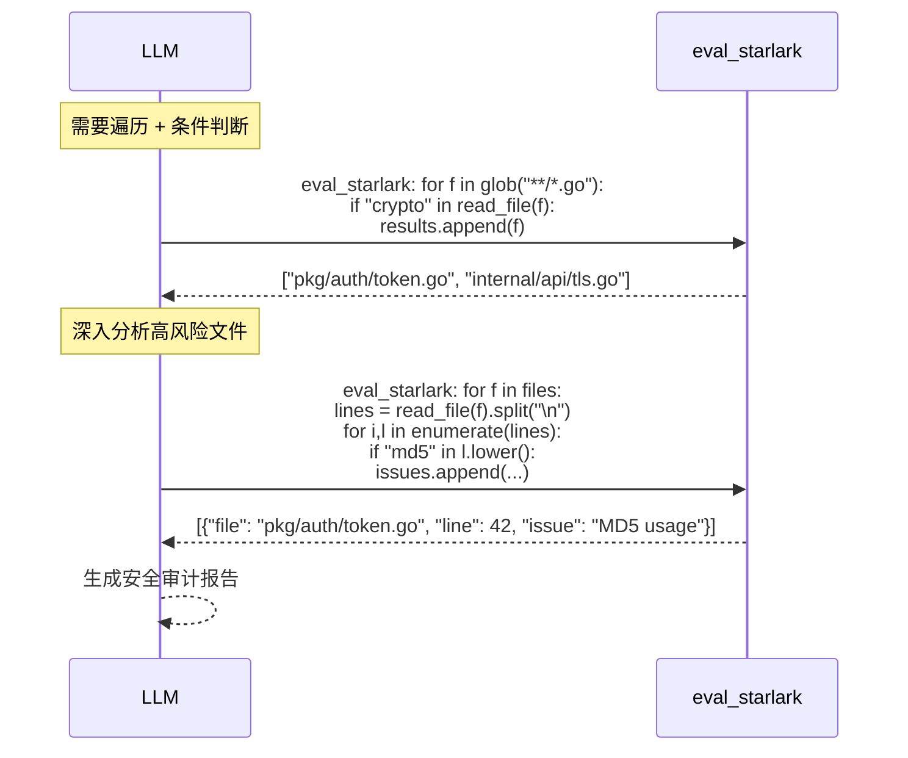

当任务需要遍历文件列表、按条件过滤、逐行分析时，starlark 的 for/if 语法比 expr 的 `filter`/`map` 更自然。

#### 场景对比：CodeReview gather（RLM 模式 vs 静态模式）

| 模式                       | 行为                                                                |
| -------------------------- | ------------------------------------------------------------------- |
| **静态 expr** (Phase 1)    | gather 步骤的 expr 在定义时写死，每次执行相同表达式                 |
| **RLM expr** (Phase 4)     | LLM 自行决定调用哪些 eval_expr 来采集上下文，可动态适应不同仓库结构 |
| **RLM starlark** (Phase 4) | LLM 生成循环脚本逐文件分析，适合需要深度遍历的场景                  |

### 9.7 Starlark 双引擎策略

#### 为什么需要 Starlark

expr-lang 是优秀的表达式引擎，但本质是**单表达式语言**——没有 `for`/`if`/`def`/`return` 等控制流语法。在 RLM 场景中，LLM 可能需要生成包含循环、条件分支和函数定义的复杂脚本来完成分析任务。

项目已集成 `go.starlark.net`（Python 子集），并实现了 21 个内置函数（与 expr 的 22 个函数对等）。Starlark 提供了 expr 缺少的完整控制流，且同样运行在安全沙箱中。

#### 双引擎对比

| 维度               | expr (`eval_expr`)                         | starlark (`eval_starlark`)                     |
| ------------------ | ------------------------------------------ | ---------------------------------------------- |
| **语法复杂度**     | 低——单表达式 + let 绑定                    | 中——Python 子集（for/if/def/return）           |
| **LLM 生成可靠性** | 高——语法简单，几乎不会出错                 | 中——大多数 LLM 熟悉 Python 语法                |
| **适合场景**       | 信息采集、组合多个读操作                   | 多步逻辑、循环处理文件列表、条件分支           |
| **round-trip**     | 1 次 tool-call 返回结构化结果              | 1 次 tool-call 返回结构化结果                  |
| **静态校验**       | ✅ `expr.Compile` 编译期检查                | ✅ `syntax.Parse` 语法解析                      |
| **OS 函数**        | 22 个（sh/git/gh/ghTry/ghAPI/readFile 等） | 21 个（sh/git_try/gh_try/gh_api/read_file 等） |
| **安全沙箱**       | ✅ 无文件系统/网络访问（除注入函数）        | ✅ 无 import/os/sys，同样受限于注入函数         |

#### 选择策略

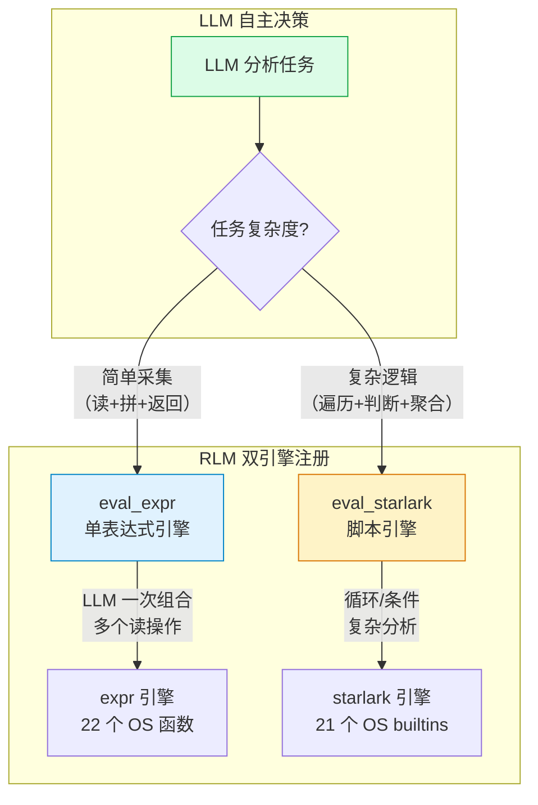

LLM 通过系统提示词了解两个工具的差异，根据任务复杂度自行选择最合适的引擎。选择原则：**能用 `eval_expr` 就用 `eval_expr`（更快、更简洁），需要 for/if/def 时用 `eval_starlark`**。

#### 典型场景对比

**场景 1：采集仓库信息（适合 expr）**

```javascript
// eval_expr — 一个表达式采集多项数据
let branch = git("rev-parse", "--abbrev-ref", "HEAD")
let files = glob("**/*.go")
let mod = readFile("go.mod")
{branch: branch, go_files: len(files), module: mod}
```

**场景 2：逐文件分析测试覆盖率（适合 starlark）**

```python
# eval_starlark — 需要循环和条件判断
files = glob("**/*_test.go")
results = []
for f in files:
    src = f.replace("_test.go", ".go")
    if file_size(src) > 0:
        test_lines = line_count(f)
        src_lines = line_count(src)
        ratio = test_lines / max(src_lines, 1)
        if ratio < 0.3:
            results.append({"file": src, "ratio": ratio, "risk": "low_coverage"})
result = json_stringify({"under_tested": results, "count": len(results)})
```

### 9.8 eval_starlark Tool 设计

与 `eval_expr` 对等，注册第二个 SDK Tool：

```go
sdk.Tool{
    Name:        "eval_starlark",
    Description: "执行 Starlark 脚本（Python 子集），支持 for/if/def 控制流。" +
                 "内置 sh/git_try/gh_try/read_file/glob 等 OS 函数。" +
                 "通过 result 变量返回结果（赋值为字符串）。",
    Parameters: map[string]any{
        "type": "object",
        "properties": map[string]any{
            "script": map[string]any{
                "type":        "string",
                "description": "Starlark 脚本，支持完整控制流语法",
            },
        },
        "required": []string{"script"},
    },
    SkipPermission: true,
    Handler: func(inv sdk.ToolInvocation) (sdk.ToolResult, error) {
        args := inv.Arguments.(map[string]any)
        script := args["script"].(string)

        rt := &starlarkRuntime{
            cwd:  run.Variables["working_directory"],
            vars: run.Variables,
            ctx:  ctx,
        }
        defer rt.cleanup()

        output, err := rt.exec(ctx, script, run.Variables)
        if err != nil {
            return sdk.ToolResult{Error: err.Error()}, nil
        }
        return sdk.ToolResult{
            TextResultForLLM: output,
            ResultType:       "text",
        }, nil
    },
}
```

#### 安全约束

| 场景                           | `sh()` | `git_try()` / `gh_try()` | `read_file()` 等 | 说明                  |
| ------------------------------ | ------ | ------------------------ | ---------------- | --------------------- |
| 内置 Workflow（codereview 等） | ✅ 允许 | ✅ 允许                   | ✅ 允许           | 可信定义              |
| 用户自定义 starlark 步骤       | ⚠️ 可选 | ✅ 允许                   | ✅ 允许           | `allow_shell` 控制    |
| RLM（LLM 生成 starlark）       | ❌ 禁用 | ✅ 允许                   | ✅ 允许           | 防止 LLM 执行任意命令 |

与 `eval_expr` 的安全策略一致：RLM 模式下 `sh()` 函数不注入。

### 9.9 系统提示词设计

在 Workflow Session 创建时注入以下工具使用指南：

```
你有两个代码执行工具，根据任务复杂度选择：

## eval_expr — 表达式引擎（优先使用）
适合一次性信息采集、组合多个读操作、简单数据转换。
语法：expr-lang 表达式，支持 let 绑定、管道（|）、空值合并（??）、三元运算。
可用函数：git(), gh(), ghTry(), ghAPI(), readFile(), writeFile(), env(), glob(),
  tempDir(), lineCount(), fileSize(), head(), tail(), log(), merge(), parallel(),
  ctx(), ctxGlob(), setVar(), getVar(), deleteVar()

示例：
eval_expr({
  expression: "let files = glob('**/*.go'); let count = len(files); {files: files, count: count}"
})

## eval_starlark — 脚本引擎（需要控制流时使用）
适合需要 for 循环、if 条件判断、函数定义、多步处理的复杂逻辑。
语法：Starlark（Python 子集），通过 result 变量返回结果。
可用函数：sh(), sh_try(), git_try(), gh_try(), gh_api(), read_file(), write_file(),
  env(), glob(), temp_dir(), line_count(), file_size(), head(), tail(), log(),
  get_var(), set_var(), delete_var(), ctx_read(), json_parse(), json_stringify()

示例：
eval_starlark({
  script: "files = glob('**/*.go')\nresult = json_stringify({'count': len(files)})"
})

## 选择原则
- 能用 eval_expr 就用 eval_expr（更快、更简洁、LLM 生成更可靠）
- 需要循环遍历、条件分支、函数定义时用 eval_starlark
- 两个工具可在同一轮对话中混用
```

### 9.10 实施阶段（最终）

在原有 Phase 1-3 基础上更新状态，Phase 4 升级为双引擎 RLM：

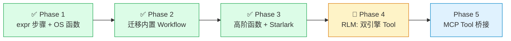

| Phase       | 目标                     | 状态     | 引擎            | 说明                                  |
| ----------- | ------------------------ | -------- | --------------- | ------------------------------------- |
| **Phase 1** | expr 步骤 + OS 函数      | ✅ 已完成 | expr            | 22 个 OS 函数，`executeExprStep`      |
| **Phase 2** | 迁移 codereview workflow | ✅ 已完成 | expr            | `crExprGather` + `crExprSubmit`       |
| **Phase 3** | 高阶函数 + Starlark 步骤 | ✅ 已完成 | expr + starlark | `parallel()`、21 个 starlark builtins |
| **Phase 4** | RLM: 双引擎 SDK Tool     | 🔧 进行中 | expr + starlark | `eval_expr` + `eval_starlark`         |
| **Phase 5** | MCP Tool 桥接            | 📋 计划中 | expr            | `MCPPool` + 动态函数注入              |

Phase 4 核心工作量极小——复用 Phase 1-3 的全部基础设施，仅需：

1. 抽出 `evalExprWithOSFuncs()` 为独立可调用函数（从 `executeExprStep` 提取）
2. 抽出 `evalStarlarkWithOSFuncs()` 包装（复用 `starlarkRuntime.exec()`）
3. 注册 `sdk.Tool{Name: "eval_expr"}` + `sdk.Tool{Name: "eval_starlark"}`
4. 在 `ensureWorkflowSession` 创建 Session 时注入两个 Tool
5. 系统提示词中补充双引擎使用指南（§9.9）

## 10. MCP Tool → expr 函数桥接

### 10.1 动机

项目已通过 `mcp-go` 客户端连接外部 MCP 服务器（stdio / HTTP / SSE），每个服务器暴露一组 Tool（`ListTools`）。当前这些 Tool 只能通过 Copilot SDK 的 tool-call 循环由 LLM 逐个调用。

如果把 MCP Tool 自动注入为 expr 函数，就能在 expr 表达式中**像调用本地函数一样调用远端 MCP 服务**，且一次表达式可组合多个 MCP 调用 + 本地 OS 操作：

```javascript
// expr 中直接调用 MCP 工具，无需知道它来自哪个服务器
let timeline = trace_timeline({"session_id": sid})
let repos = search_repositories({"query": "expr-lang", "per_page": 5})
let diff = git("diff", "main...HEAD")

{events: len(timeline), repos: len(repos), diff_lines: len(split(diff, "\n"))}
```

### 10.2 桥接机制

核心思路：Workflow 启动时连接 MCP 服务器 → `ListTools` 枚举全部工具 → 为每个 Tool 自动生成一个同名 `expr.Function()`。

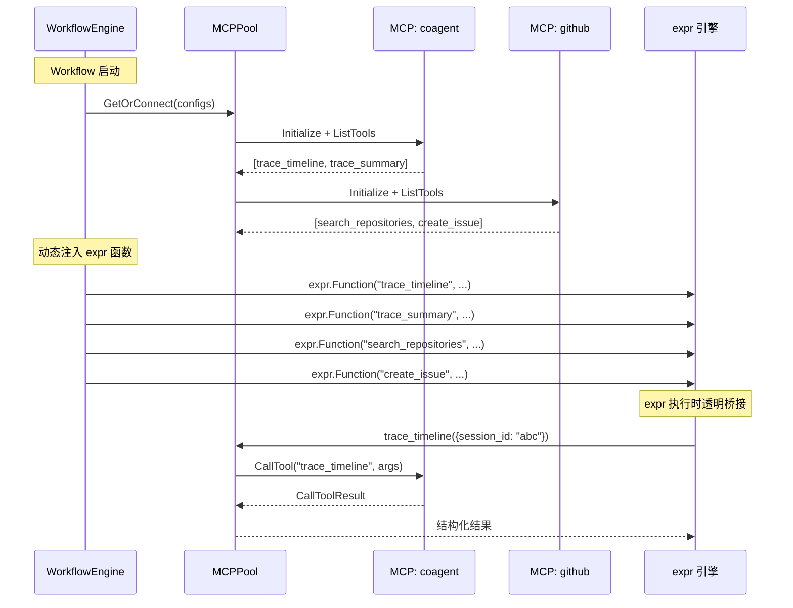

每个注入函数内部调用 `client.CallTool()`，将 MCP 协议的 `CallToolResult` 转换为 expr 值（`map[string]any` / `string`）。

### 10.3 实现设计

#### 函数生成器

```go
// mcpToolsAsExprFunctions 连接 MCP 服务器，枚举工具，
// 为每个 Tool 生成一个同名 expr.Function()。
func mcpToolsAsExprFunctions(ctx context.Context, pool *MCPPool) []expr.Option {
    var opts []expr.Option
    nameCount := map[string]int{} // 检测冲突

    for serverName, entry := range pool.clients {
        for _, tool := range entry.tools {
            nameCount[tool.Name]++
        }
    }

    for serverName, entry := range pool.clients {
        for _, tool := range entry.tools {
            toolName := tool.Name
            // 冲突时加 server_ 前缀
            if nameCount[toolName] > 1 {
                toolName = serverName + "_" + tool.Name
            }
            c := entry.client // 闭包捕获
            rawName := tool.Name

            opts = append(opts, expr.Function(toolName,
                func(params ...any) (any, error) {
                    var args any
                    if len(params) > 0 {
                        args = params[0]
                    }
                    result, err := c.CallTool(ctx, mcp.CallToolRequest{
                        Params: mcp.CallToolParams{
                            Name:      rawName,
                            Arguments: args,
                        },
                    })
                    if err != nil {
                        return nil, fmt.Errorf("mcp %s/%s: %w", serverName, rawName, err)
                    }
                    if result.IsError {
                        return nil, fmt.Errorf("mcp %s/%s: %s", serverName, rawName, extractMCPText(result))
                    }
                    // 优先结构化内容，否则文本
                    if result.StructuredContent != nil {
                        return result.StructuredContent, nil
                    }
                    return extractMCPText(result), nil
                },
                new(func(map[string]any) any),
            ))
        }
    }
    return opts
}
```

#### MCP 连接池

```go
type MCPPool struct {
    mu      sync.RWMutex
    clients map[string]*mcpClientEntry
}

type mcpClientEntry struct {
    client mcpclient.MCPClient
    tools  []mcp.Tool  // ListTools 缓存
}

func (p *MCPPool) GetOrConnect(ctx context.Context, configs map[string]*MCPServerConfig) error {
    for name, cfg := range configs {
        if _, exists := p.clients[name]; exists {
            continue
        }
        client, err := dialMCP(cfg)       // 复用现有 dialMCP()
        if err != nil { return err }
        // Initialize + ListTools
        // ...
        p.clients[name] = &mcpClientEntry{client: client, tools: tools}
    }
    return nil
}

func (p *MCPPool) Close() {
    for _, entry := range p.clients {
        entry.client.Close()
    }
}
```

#### 结果提取

MCP `CallToolResult` 包含 `[]Content`（TextContent / ImageContent / EmbeddedResource）和可选 `StructuredContent`。提取策略：

```go
func extractMCPText(result *mcp.CallToolResult) string {
    var parts []string
    for _, c := range result.Content {
        if tc, ok := c.(mcp.TextContent); ok {
            parts = append(parts, tc.Text)
        }
    }
    return strings.Join(parts, "\n")
}
```

优先级：`StructuredContent`（直接返回 `map[string]any`）> `TextContent`（尝试 `fromJSON`，失败则原样返回字符串）。

### 10.4 名称冲突处理

不同 MCP 服务器可能暴露同名工具（如两个服务器都提供 `search`）。

| 策略                    | 示例                                         | 适用场景     |
| ----------------------- | -------------------------------------------- | ------------ |
| 无前缀（短名）          | `trace_timeline(...)`                        | 无冲突时默认 |
| 自动加 `{server}_` 前缀 | `coagent_search(...)` / `github_search(...)` | 检测到冲突时 |
| 通用 `mcp()` 函数       | `mcp("github", "search", {...})`             | 备用方案     |

**策略：** 先按短名注入；检测到同名时，冲突的 Tool 全部改为 `{server}_{tool}` 格式。额外注入 `mcp(server, tool, args)` 通用函数作为兜底。

### 10.5 与 OS 函数 / RLM / Starlark 的统一视图

expr 和 starlark 函数集由三个来源汇聚，对调用者完全透明：

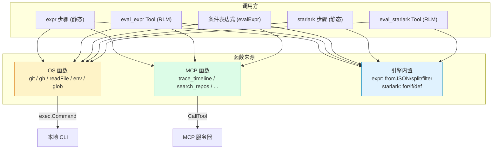

**关键点：** 表达式中 `git("branch")` 和 `trace_timeline({...})` 的调用语法完全一致，调用者无需关心函数背后是本地进程还是远端 MCP 服务。MCP 桥接当前仅对 expr 引擎可用（Phase 5），starlark 引擎的 MCP 桥接为后续扩展。

### 10.6 RLM 下的 MCP 调用效率（双引擎）

通过 `eval_expr` Tool，LLM 在一次 tool-call 中可跨多个 MCP 服务器 + 本地操作：

```javascript
// LLM 生成的 expr（一次 eval_expr 调用）
let timeline = trace_timeline({"session_id": sid})
let diff = git("diff", "main...HEAD")
let issues = search_issues({"q": "repo:owner/repo is:open label:bug"})

{
  "session_events": len(timeline),
  "changed_lines": len(split(diff, "\n")),
  "open_bugs": len(issues),
  "risk": len(issues) > 5 ? "high" : "low"
}
```

对比逐个 SDK tool-call（每个操作一次 LLM 往返）：

| 模式                   | LLM 往返次数 | 延迟        |
| ---------------------- | ------------ | ----------- |
| 逐个 Tool-Call（传统） | 3 次         | ~9s（3×3s） |
| eval_expr + MCP 桥接   | **1 次**     | ~3s         |

### 10.7 生命周期管理

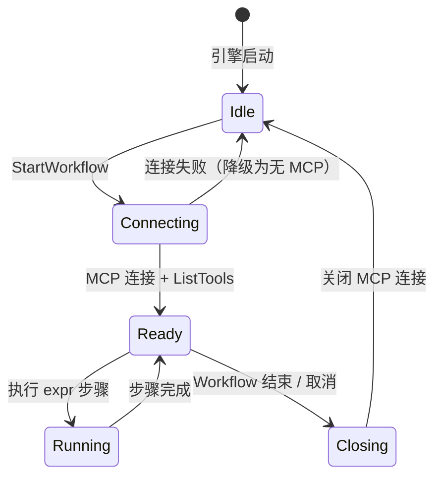

- **连接时机：** Workflow 启动时按需连接（不是引擎启动时全局连接）
- **降级策略：** MCP 连接失败不阻塞 Workflow，仅该服务器的函数不可用
- **清理时机：** Workflow 结束（完成 / 失败 / 取消）时关闭连接
- **工具刷新：** 长时间运行的 Workflow 可定期 `ListTools` 刷新（MCP 服务器可能动态注册新工具）

### 10.8 实施阶段（最终）

将 MCP 桥接纳入 Phase 5（Phase 1-3 已完成，Phase 4 双引擎进行中）：


| Phase       | 目标                | 新增能力                                           |
| ----------- | ------------------- | -------------------------------------------------- |
| **Phase 1** | expr 步骤 + OS 函数 | ✅ `git()` `gh()` `readFile()` `env()` 等 22 个函数 |
| **Phase 2** | 迁移 codereview     | ✅ `crExprGather` + `crExprSubmit` 替代 shell       |
| **Phase 3** | 高阶函数 + Starlark | ✅ `parallel()`、21 个 starlark builtins            |
| **Phase 4** | RLM 双引擎          | 🔧 `eval_expr` + `eval_starlark` SDK Tool           |
| **Phase 5** | MCP 桥接            | 📋 `MCPPool` + 动态函数注入                         |

Phase 5 依赖 Phase 1（expr 函数注入基础设施），与 Phase 4 可并行开发。核心工作量：

| 任务              | 文件                                           | 说明                        |
| ----------------- | ---------------------------------------------- | --------------------------- |
| MCPPool 连接池    | `internal/copilot/mcp_pool.go` (新)            | 连接管理 + ListTools 缓存   |
| MCP→expr 桥接函数 | `internal/copilot/expr_funcs_mcp.go` (新)      | `mcpToolsAsExprFunctions()` |
| Workflow 启动集成 | `workflow.go`                                  | 启动时连接 MCP + 注入函数   |
| 名称冲突处理      | `expr_funcs_mcp.go`                            | 短名 / 前缀策略             |
| 单元测试          | `internal/copilot/expr_funcs_mcp_test.go` (新) | Mock MCP 服务器测试         |

## 11. 大数据处理策略

### 11.1 问题

当前数据流路径中，步骤输出全量存入 `vars`，下一步通过 `{{key}}` 模板注入 LLM prompt：

```
步骤输出 → vars["key"] (字符串) → 下一步模板 {{key}} → LLM prompt
```

如果 `git("diff", "main...HEAD")` 返回 10MB 的 diff，它会被整体塞进 prompt。`shellStepMaxOutput` 的截断是暴力裁剪——丢失的可能是关键尾部内容，且 LLM 上下文窗口被大量低信息密度的数据占满。

### 11.2 两层存储模型

核心思路：引入 `vars`（内存）和 `files`（磁盘）两层存储，大数据只放磁盘，vars 中仅保留路径和元信息。

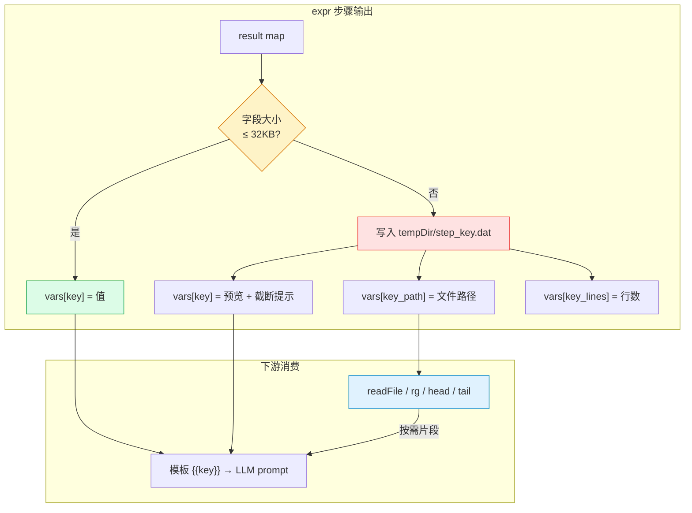

| 层级    | 存储位置 | 进入 LLM 上下文    | 适用数据                                      |
| ------- | -------- | ------------------ | --------------------------------------------- |
| `vars`  | 内存 map | 是（通过模板渲染） | 小数据：分支名、PR 号、文件列表、摘要         |
| `files` | 磁盘文件 | 否（除非主动读取） | 大数据：完整 diff、代码文件、日志、覆盖率报告 |

### 11.3 三种消费模式

#### 模式 A：expr 步骤中显式拆分

在 expr 步骤中，大数据写入文件，只把路径和元数据放入 vars：

```javascript
let diff = git("diff", base + "...HEAD")
let diffPath = writeFile(tempDir() + "/diff.patch", diff)
let files = split(git("diff", "--name-only", base + "...HEAD"), "\n") | filter(# != "")

{
  "diff_path": diffPath,                    // 路径，不占上下文
  "diff_lines": lineCount(diffPath),         // 元数据
  "diff_preview": head(diffPath, 50),        // 前 50 行预览
  "changed_files": files,                    // 文件列表（小数据）
  "file_count": len(files)
}
```

AI 步骤的 prompt 只引用元数据和预览：

```
变更了 {{file_count}} 个文件：{{changed_files}}
Diff 共 {{diff_lines}} 行，前 50 行预览：
{{diff_preview}}
完整 diff 路径：{{diff_path}}（可通过 eval_expr 的 readFile 按需读取）
```

#### 模式 B：RLM 下 LLM 自主按需读取

在 Phase 4（RLM）模式下，LLM 拿到文件路径后，用 `eval_expr` 自己决定读哪些部分：

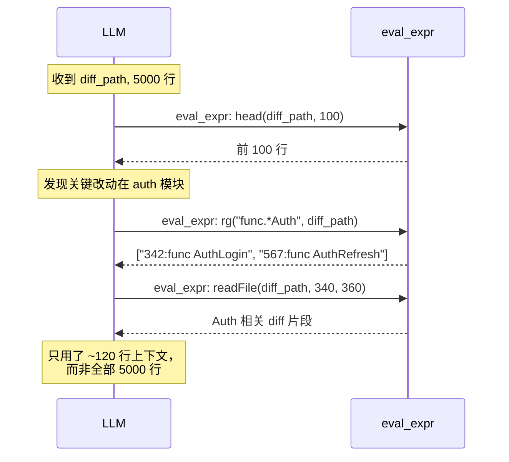

这是最高效的模式：LLM 像开发者一样先概览、再定位、再精读，上下文利用率最大化。

#### 模式 C：自动阈值分流（推荐基础设施层）

在 `captureStepOutput` 阶段，自动检测结果大小，超过阈值的字段透明落盘。**不改变现有 workflow 定义**：

```go
const varSizeThreshold = 32 * 1024  // 32KB

func captureStepOutput(run *WorkflowRun, step *WorkflowStep, result any) {
    resultMap, ok := result.(map[string]any)
    if !ok { /* 原逻辑 */ return }

    for key, val := range resultMap {
        s := fmt.Sprint(val)
        if len(s) > varSizeThreshold {
            // 大数据 → 写文件，vars 中存路径 + 元信息
            path := filepath.Join(run.TempDir, step.ID+"_"+key+".dat")
            os.WriteFile(path, []byte(s), 0600)
            run.Variables[key+"_path"] = path
            run.Variables[key+"_size"] = strconv.Itoa(len(s))
            run.Variables[key+"_lines"] = strconv.Itoa(strings.Count(s, "\n"))
            // vars 中只留预览
            run.Variables[key] = truncateWithHint(s, 4096, path)
        } else {
            run.Variables[key] = s
        }
    }
}

func truncateWithHint(s string, maxLen int, path string) string {
    if len(s) <= maxLen { return s }
    return s[:maxLen] +
        fmt.Sprintf("\n...[truncated, full content at %s, use readFile() to access]", path)
}
```

vars 中的截断值末尾自带路径提示，LLM 看到后可通过 `eval_expr` 按需读取完整内容。

### 11.4 模式组合建议

三种模式互补，不冲突：

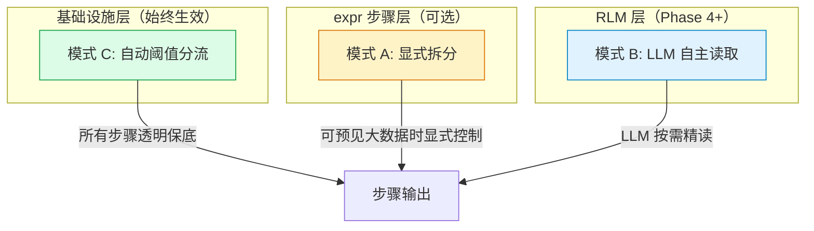

| 模式                 | 生效阶段 | 触发方式                             | 特点                         |
| -------------------- | -------- | ------------------------------------ | ---------------------------- |
| **C — 自动分流**     | Phase 1+ | 自动（> 32KB 时触发）                | 零配置保底，对现有定义零侵入 |
| **A — 显式拆分**     | Phase 1+ | expr 步骤中手动 `writeFile` + 元数据 | 对大数据有精确控制           |
| **B — LLM 自主读取** | Phase 4+ | LLM 调用 `eval_expr`                 | 最高效，上下文利用率最大化   |

### 11.5 辅助函数

为支持按需读取大文件，§3.2 函数清单新增以下辅助函数：

| 函数                   | 签名                             | 说明                                                   |
| ---------------------- | -------------------------------- | ------------------------------------------------------ |
| `lineCount(path)`      | `string → int`                   | 统计文件行数（`bufio.Scanner` 逐行扫描，不加载全文）   |
| `fileSize(path)`       | `string → int`                   | 文件字节数（`os.Stat`，零 IO 开销）                    |
| `rg(pattern, path)`    | `(string, string) → []string`    | 单文件搜索匹配行，返回 `"行号:内容"` 列表（封装 `rg`） |
| `rg(pattern, args...)` | `(string, ...string) → []string` | 递归搜索目录/多选项（封装 `rg` CLI）                   |
| `head(path, n)`        | `(string, int) → string`         | 读前 n 行，等价于 `readFile(path, 1, n)` 的语法糖      |
| `tail(path, n)`        | `(string, int) → string`         | 读末尾 n 行（先 `lineCount`，再 `readFile` 尾部范围）  |

`rg` 封装 ripgrep CLI，利用多签名重载支持两种调用模式：

```javascript
rg("func.*Auth", "main.go")              // 单文件搜索 → ["42:func AuthLogin", ...]
rg("TODO", ".", "-g", "*.go")            // 递归搜索当前目录下所有 .go 文件
rg("handleRequest", "internal/")          // 递归搜索目录
rg("error", ".", "--count")               // 统计每个文件的匹配数
```

底层实现通过 `exec.CommandContext(ctx, "rg", ...)` 调用，自动继承 `working_directory` 和超时控制。相比 Go 原生正则逐行扫描，`rg` 利用 SIMD 加速和内存映射，在大仓库递归搜索场景下快一个数量级。

这些函数全部使用流式/增量读取，不会将大文件全量加载到内存。与 `readFile(path, s, e)` 配合，构成完整的大文件按需访问工具集。

### 11.6 实施优先级

| 任务                                                          | 阶段    | 说明                                             |
| ------------------------------------------------------------- | ------- | ------------------------------------------------ |
| 自动阈值分流（模式 C）                                        | Phase 1 | `captureStepOutput` + `truncateWithHint`         |
| 辅助函数（`lineCount` / `rg` / `head` / `tail` / `fileSize`） | Phase 1 | 注入到 `exprOSFunctions()`                       |
| expr 显式拆分模式（模式 A）                                   | Phase 1 | 无额外代码，`writeFile` + `tempDir` 已在函数集中 |
| LLM 自主读取（模式 B）                                        | Phase 4 | 依赖 `eval_expr` Tool，自然获得                  |

## 12. 验收标准

### Phase 1 验收 ✅ 已通过

1. ✅ 可创建包含 `type: "expr"` 步骤的 Workflow 定义
2. ✅ expr 步骤中可调用 `git()`、`gh()`、`readFile()`、`env()` 等 22 个函数
3. ✅ 函数执行结果可通过 `CaptureToVar` / `CaptureFields` 存入 vars
4. ✅ 条件表达式中 `result` 可引用 expr 步骤输出的结构化数据
5. ✅ 超时、取消、错误处理与 shell 步骤行为一致
6. ✅ 现有 shell 步骤 workflow 不受影响
7. ✅ 单元测试覆盖所有注入函数 + expr 步骤执行流程
8. ✅ 步骤输出超过 32KB 的字段自动落盘，vars 中保留预览 + 路径提示
9. ✅ `lineCount` / `fileSize` / `rg` / `head` / `tail` 辅助函数可用且使用流式读取
10. ✅ `rg` 支持单文件搜索和跨目录递归搜索两种签名

### Phase 2 验收 ✅ 已通过

1. ✅ `crExprGather` 替代原 shell gather 步骤
2. ✅ `crExprSubmit` 替代原 shell submit 步骤，含 3 级 fallback（REQUEST_CHANGES → COMMENT+comments → COMMENT only）
3. ✅ `ghAPI()` helper 函数简化 GitHub API 调用
4. ✅ CodeReview Workflow 端到端运行通过（PR #5 实测验证）

### Phase 3 验收 ✅ 已通过

1. ✅ `parallel()` 并发执行，最多 8 并发，panic 恢复
2. ✅ `type: "starlark"` 步骤类型 + `executeStarlarkStep`
3. ✅ Starlark 21 个 builtins 与 expr OS 函数对等
4. ✅ Starlark `cleanups` 机制支持 `temp_dir` 自动清理
5. ✅ 全部 34 个 expr 测试 + 17 个 starlark 测试通过

### Phase 4 验收标准（进行中）

1. `evalExprWithOSFuncs()` 可独立调用（从 `executeExprStep` 提取）
2. `evalStarlarkWithOSFuncs()` 可独立调用（包装 `starlarkRuntime.exec()`）
3. `eval_expr` SDK Tool 注册成功，LLM 可通过 tool-call 生成并执行 expr 表达式
4. `eval_starlark` SDK Tool 注册成功，LLM 可通过 tool-call 生成并执行 starlark 脚本
5. RLM 模式下 `sh()` 函数不注入（安全约束）
6. 系统提示词包含双引擎使用指南
7. LLM 能根据任务复杂度自行选择合适的引擎
8. 单元测试覆盖两个 Tool 的注册、执行、错误处理
