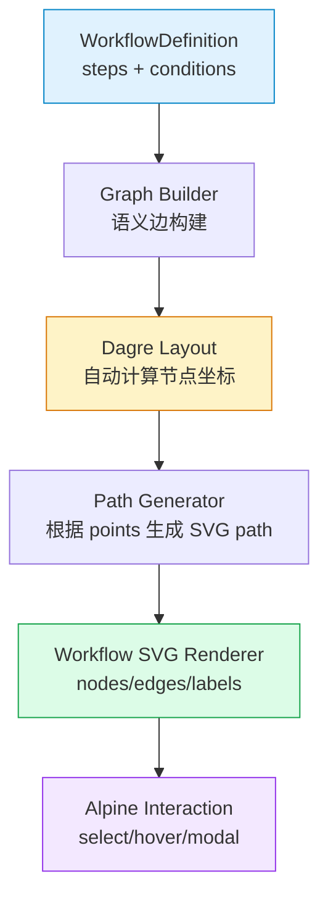
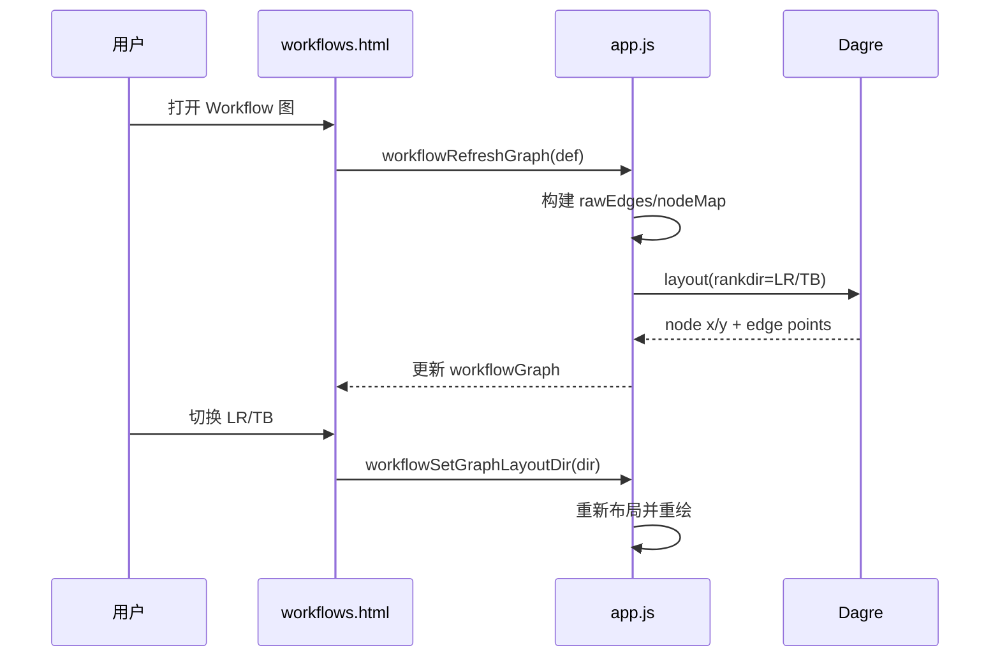

# Workflow 图布局改造（Dagre）设计

> 设计文档 v1.0 | 2026-04-15

## 1. 目标

当前 Workflow 图在复杂分支（多扇出、回边、重试环）下可读性较弱，主要表现为“横向排布感强、图结构感不足、边标签与边缘裁切风险”。

本次改造目标：

- 引入自动布局引擎，增强复杂图的结构表达能力
- 支持布局方向切换（`LR` / `TB`）
- 保留现有交互能力（节点/边点击联动、边详情、全屏缩放）
- 保持无构建工具前端架构（CDN 依赖）

## 2. 方案选型

选择 **Dagre（布局）+ 现有 SVG 渲染层**，而非整体替换为新图形组件。

理由：

1. 改造范围小：只替换坐标计算层，不推翻渲染与交互层
2. 风险可控：可保留现有 edge metadata、hover/selection 行为
3. 兼容现状：项目前端无构建工具，Dagre 可直接通过 CDN 注入

## 3. 系统架构

- **Graph Builder**：复用现有 `rawEdges` 语义（default / condition / missing）
- **Dagre Layout**：计算节点中心点与边路由 points
- **Path Generator**：将 Dagre points 转为 SVG path，并生成 label 坐标
- **Renderer**：沿用 `workflows.html` 现有分层渲染与事件绑定

## 4. 功能与数据变更

### 4.1 前端状态字段新增

- `workflowGraphLayoutDir`：布局方向，`LR`（默认）/`TB`

### 4.2 方法新增

- `workflowSetGraphLayoutDir(dir)`：切换布局方向并重绘

### 4.3 图布局逻辑变更

- `workflowRefreshGraph` 新增 Dagre 分支：
  - 若 `window.dagre` 可用，优先使用自动布局
  - 若不可用，回退到现有手工布局（兼容保障）

### 4.4 UI 变更

- 在 Workflow 图工具栏新增“布局方向”切换按钮：
  - `横向(LR)`
  - `纵向(TB)`

## 5. 交互流程

## 6. 边界条件与降级策略

- **Dagre 不可用**：自动回退旧布局算法，不阻塞页面使用
- **缺失目标步骤**：继续生成 missing 节点与红色虚线边
- **自环 retry 边**：优先使用 Dagre points；不足时保留自定义回环路径兜底
- **画布边界裁切**：基于节点与边 points 计算外包围盒，动态补足边距

## 7. 验收标准

- 复杂内置图（`wf-release-complex`）在普通视图与全屏视图下：
  - 节点布局不再呈单一“列表横铺”观感
  - 回边、分支边、标签均可完整显示
  - 节点/边点击联动功能无回归
- 方向切换可用：`LR` 与 `TB` 布局均可稳定渲染
- 无前端运行时报错，后端测试保持通过

## 8. 风险与后续

- Dagre 对超高密度图（大量平行边）仍可能出现标签重叠；后续可增加标签碰撞偏移策略。
- 若未来需要更高级交互（折叠子图、动画、拖拽编辑），可再评估迁移到 Cytoscape.js。
