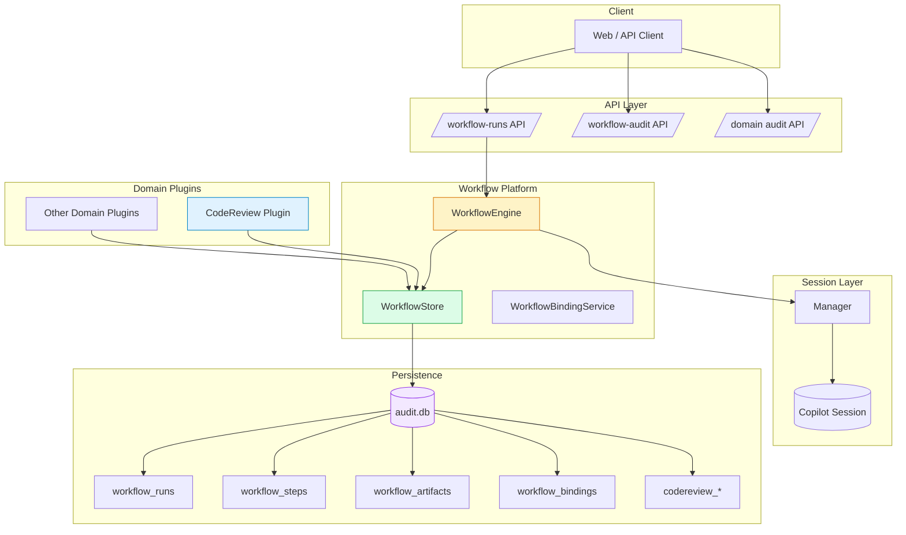
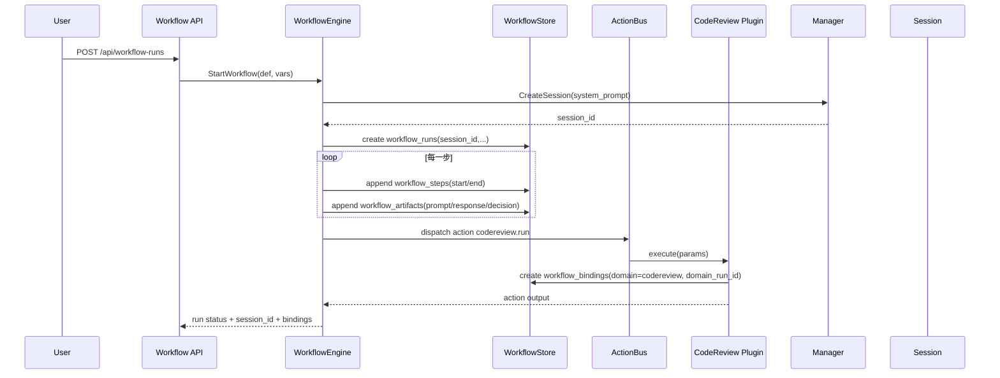

# Workflow 平台化改造设计（独立存储 + Session 绑定）

> 状态：Implemented（已实施）  
> 日期：2026-04-20

## 1. 背景与目标

你提出的方向非常关键：

- `workflow` 应该是独立的通用能力（平台层），而不是附属功能。
- `workflow` 需要自己的持久化存储（不仅是运行时内存）。
- `workflow` 运行与 `session_id` 强绑定，保证可追溯与可观测。
- `codereview` 只是绑定到 `workflow` 的一个业务实现（domain plugin），未来可扩展更多业务。

本设计将现有能力从“可用”升级到“可平台化扩展”。

---

## 2. 设计原则

1. **平台与业务解耦**：Workflow Core 不包含业务语义，仅提供执行、编排、追踪能力。
2. **运行全量可追溯**：Run / Step / Artifact 全链路持久化，按 `run_id + session_id + trace_id` 可回放。
3. **业务原生编排**：通过 `shell` + `ai` 原生步骤组合接入 codereview、blueprint、release 等业务。
4. **API 稳定向前兼容**：保留现有 `/api/workflow-runs/*`，新增增强查询 API，不破坏旧前端。
5. **数据先通用，业务后投影**：先落 workflow 通用表，再按业务需要做 domain 表。

---

## 3. 系统架构（目标态）

下面的结构图展示了“Workflow 作为平台层、业务能力作为插件层”的边界。



### 架构要点

- **WorkflowEngine** 继续负责步骤执行状态机（running/completed/failed/cancelled）。
- **WorkflowStore** 统一负责 workflow 运行数据写入与查询（通用层）。
- **WorkflowBindingService** 维护 workflow 与 domain run 的绑定关系。
- **ActionBus/HandlerRegistry** 已移除，业务能力通过原生 shell + ai 步骤直接编排。

---

## 4. 存储模型设计（独立于业务）

### 4.1 workflow_runs（运行主表）

| 字段                      | 说明                                       |
| ------------------------- | ------------------------------------------ |
| `run_id` PK               | workflow run id                            |
| `trace_id`                | 跨系统追踪 id                              |
| `workflow_id`             | 定义 id                                    |
| `session_id`              | 绑定的 copilot session id                  |
| `status`                  | pending/running/completed/failed/cancelled |
| `current_step_id`         | 当前步骤                                   |
| `round`                   | 重启轮次                                   |
| `total_steps`             | 累计执行步数                               |
| `input_snapshot`          | 启动输入快照 JSON                          |
| `variables_snapshot`      | 当前变量快照 JSON                          |
| `error_text`              | 失败原因                                   |
| `started_at` / `ended_at` | 运行起止时间                               |

### 4.2 workflow_steps（步骤执行表）

| 字段                                   | 说明                     |
| -------------------------------------- | ------------------------ |
| `id` PK                                | `run:round:step:attempt` |
| `run_id`                               | 归属 workflow run        |
| `step_id` / `step_name` / `step_index` | 步骤定位                 |
| `round` / `attempt`                    | 轮次与重试               |
| `step_type`                            | ai/shell/action          |
| `action_name`                          | action 步骤名（可空）    |
| `input_snapshot`                       | 入参快照                 |
| `output_snapshot`                      | 输出快照                 |
| `decision_expr`                        | 命中的条件表达式         |
| `decision_action`                      | goto/retry/exit/default  |
| `next_step_id`                         | 下一个步骤               |
| `duration_ms`                          | 耗时                     |
| `error_text`                           | 错误文本                 |
| `started_at` / `ended_at`              | 执行时间                 |

### 4.3 workflow_artifacts（通用工件表）

> 用于承接“更详细信息”，避免每次都改表结构。

| 字段            | 说明                                                                        |
| --------------- | --------------------------------------------------------------------------- |
| `id` PK         | 工件 id                                                                     |
| `run_id`        | workflow run                                                                |
| `step_id`       | 来源步骤（可空）                                                            |
| `artifact_type` | 如 `prompt.system` / `prompt.user` / `model.raw_response` / `gate.snapshot` |
| `artifact_key`  | 如 `round:2`、`codereview:coverage`                                         |
| `content_json`  | JSON 内容                                                                   |
| `content_text`  | 文本内容（可选）                                                            |
| `created_at`    | 写入时间                                                                    |

### 4.4 workflow_bindings（跨域绑定表）

| 字段              | 说明                                                     |
| ----------------- | -------------------------------------------------------- |
| `id` PK           | 绑定记录 id                                              |
| `workflow_run_id` | workflow run                                             |
| `domain`          | 例如 `codereview`                                        |
| `domain_run_id`   | 例如 codereview run id                                   |
| `session_id`      | 该 domain run 使用的 session（可与 workflow 一致或独立） |
| `trace_id`        | 追踪 id                                                  |
| `metadata_json`   | 业务元数据                                               |
| `created_at`      | 建立时间                                                 |

---

## 5. API 对外暴露增强

在保留现有端点的基础上，新增统一观测 API：

1. `GET /api/workflow-runs/{id}/timeline`
   - 返回 run + steps + artifacts（按时间线聚合）
2. `GET /api/workflow-runs/{id}/bindings`
   - 返回绑定的 domain run（如 codereview）
3. `GET /api/workflow-runs/{id}/artifacts?type=...`
   - 按工件类型过滤（系统提示词、模型原文、门禁快照）
4. `GET /api/workflow-runs?trace_id=&session_id=&status=`
   - 增强查询，支持分页

### 返回结构（建议）

```json
{
  "run": {},
  "steps": [],
  "artifacts": [],
  "bindings": [
    {
      "domain": "codereview",
      "domain_run_id": "cr-xxx"
    }
  ]
}
```

---

## 6. 交互时序（以 codereview 为例）

下面展示 `workflow` 调起 `codereview` 的统一链路，体现“codereview 是 workflow 的特化实现”。



---

## 7. codereview 在新架构中的定位

- **不是 workflow 本体**，而是 `domain=codereview` 的 action 组合。
- codereview 自身仍可保留 domain 表（`codereview_runs/rounds/submissions`），但必须通过 `workflow_bindings` 与 workflow run 关联。
- 所有关键可观测信息优先写入 `workflow_artifacts`：
  - `prompt.system`
  - `prompt.user`
  - `model.raw_response`
  - `coverage.snapshot`
  - `submission.payload`

这样后续新增业务（如 release-plan、security-audit）时，不需要复制一套观测体系。

---

## 8. 实施计划（分阶段）

### Phase 1（平台基础）

1. 新增 `workflow_artifacts`、`workflow_bindings` 表与查询方法。
2. `WorkflowEngine` 在 run/step 执行中写 artifacts（先支持 prompt/output/decision）。
3. 增强 `/api/audit/workflows/{id}` 返回 `artifacts`。

### Phase 2（API 丰富）

1. 新增 timeline / bindings / artifacts API。
2. 增加过滤与分页（`trace_id`、`session_id`、`artifact_type`）。

### Phase 3（业务统一化）

1. codereview action 强制写 `workflow_bindings`。
2. codereview 详细信息逐步通过 `workflow_artifacts` 对外暴露（保留原接口兼容）。

---

## 9. 风险与控制

1. **数据膨胀**：`raw_response` 体积大。  
   - 控制：文本截断 + 可配置保留策略。
2. **敏感信息暴露**：提示词/响应可能含密钥。  
   - 控制：统一脱敏器（token/key/authorization）。
3. **写入性能影响主流程**：审计写入过重。  
   - 控制：审计失败不阻断主流程 + 批量/异步写入可选。

---

## 10. 验收标准

1. 任意 workflow run 都能通过 `run_id` 查询到完整时间线（run + steps + artifacts）。
2. 每个 workflow run 都能拿到 `session_id`，并与 session API 对上。
3. codereview run 可通过 `workflow_bindings` 反查到其 workflow run。
4. 新增业务插件不改 workflow 核心表结构即可接入可观测体系。

---

## 11. 结论

这次改造后，`workflow` 会成为真正的平台基座：

- 有独立存储（通用运行+工件+绑定）
- 有清晰 session 绑定
- codereview 变成标准的业务插件实现
- 后续业务扩展只加动作与投影，不重造执行与观测基础设施

---

## 12. 实施结果（2026-04-20）

本次已完成 Phase 1 的核心落地：

1. 审计存储扩展：
    - 新增 `workflow_artifacts`、`workflow_bindings` 两类持久化模型。
    - `workflow_runs` 增加 `current_step_id`、`round`、`total_steps`、`vars_snapshot` 字段。
    - `workflow_steps` 增加 `step_type` 字段。

2. workflow 审计增强：
    - run 级写入系统提示词快照（`prompt.system`）与运行状态快照（`workflow.run.state`）。
    - step 级写入输入、输出、决策三类 artifact（`workflow.step.input/output/decision`）。

3. codereview 与 workflow 绑定：
    - 在 `codereview.run` action 成功后写入 `workflow_bindings`（`domain=codereview`）。
    - codereview run/round/submission 审计同步投影到 workflow artifacts（`domain.codereview.*`）。

4. 对外 API 增强：
    - 新增 `GET /api/workflow-runs/{id}/timeline`
    - 新增 `GET /api/workflow-runs/{id}/artifacts?type=...`
    - 新增 `GET /api/workflow-runs/{id}/bindings?domain=...`
    - `GET /api/audit/workflows/{id}` 响应扩展为 `run + steps + artifacts + bindings`。

5. 回归验证：
    - 定向测试通过（新增/改动相关 API 与存储测试）。
    - 全量测试通过（`go test ./...`）。

6. Phase 2 增量落地：
    - `GET /api/workflow-runs/{id}/timeline` 已支持统一 `events` 时间轴输出。
    - `events` 聚合来源：run started/ended、step started/ended、artifact created、binding created。
    - 保持向后兼容：原有 `run/steps/artifacts/bindings` 字段仍完整返回。
