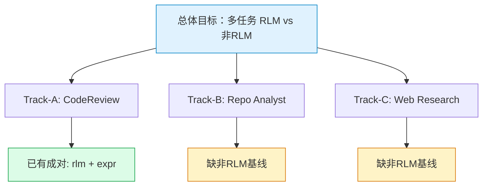
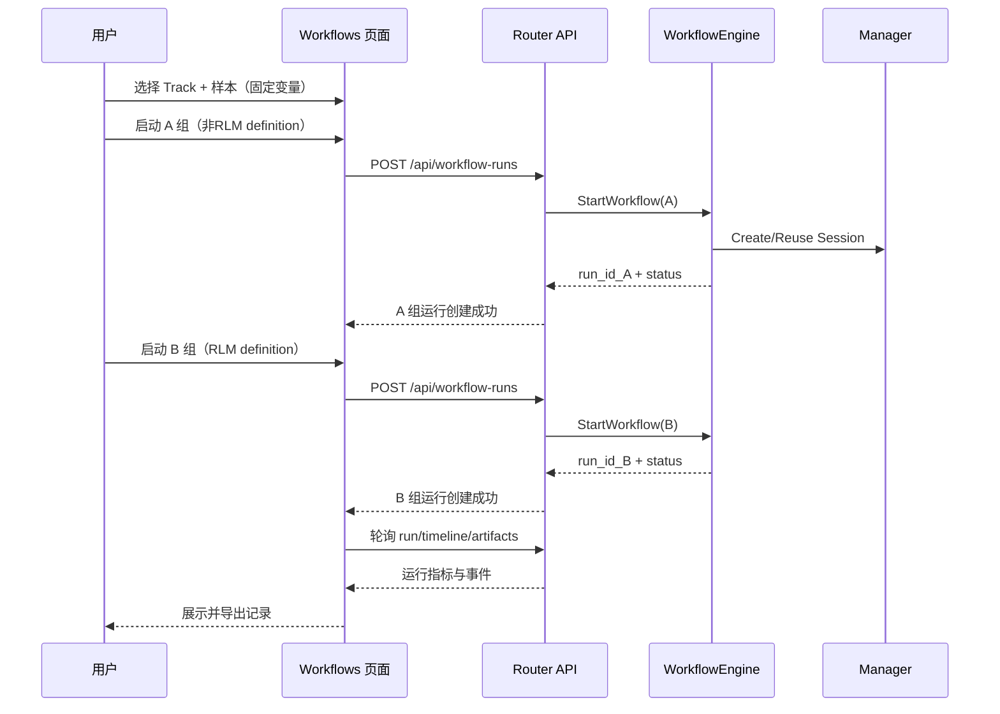

# Workflow 对照实验设计（多任务 RLM vs 非RLM）

> 设计文档 v1.1 | 2026-04-24

## 1. 目标与背景

本文档定义一套可复现、可量化、可审计的 **多任务 RLM vs 非RLM** 对照实验方案。

目标不是只做单一任务，而是确保每个任务域都能形成“RLM 组 vs 非RLM 组”的成对对照。



## 2. 对照矩阵与当前完成度

| Track | 任务域       | RLM 组              | 非RLM 组                         | 状态          |
| ----- | ------------ | ------------------- | -------------------------------- | ------------- |
| A     | CodeReview   | `wf-codereview-rlm` | `wf-codereview-expr`             | ✅ 已具备      |
| B     | Repo Analyst | `wf-rlm-analyst`    | `wf-repo-analyst-native`（待补） | ⏳ 缺 baseline |
| C     | Web Research | `wf-web-research`   | `wf-web-research-native`（待补） | ⏳ 缺 baseline |

结论口径：

- 现阶段可先跑 Track-A。
- Track-B/C 必须先补齐非RLM workflow，再进入正式 A/B 统计。

## 3. 约束与设计原则

### 3.1 约束

- 同一实验轮次中，必须固定以下控制变量：
  - 同一 PR/commit（同一 diff 集）
  - 同一模型（默认 `gpt-5.3-codex`）
  - 同一 `working_directory`
  - 同一 `auto_submit` 配置
- 阶段一默认 `auto_submit=false`，优先比较“审查能力”，避免提交链路噪声干扰。
- 每组建议每个样本重复执行 2~3 次，用于测量波动性。

### 3.2 设计原则

- **先可比，再可优**：先保证对比公平，再讨论效果优劣。
- **分层指标**：质量、稳定性、效率分层观测，不混为单一结论。
- **可追溯**：每个结论可回溯到 run 详情、timeline、step history 和 artifacts。

## 4. 系统架构与数据流

下图展示多 Track 对照时的统一执行与观测路径。

```mermaid
graph TD
    subgraph 前端
        U[用户在 Workflows 面板发起对照]
        UI1[选择 Track + RLM/非RLM definition]
    end

    subgraph 后端
        API[/api/workflow-runs]
        WE[WorkflowEngine]
        REG[Registry]
        MGR[Manager]
        SESS[(Copilot Session)]
    end

    subgraph 观测面
        RUN[/api/workflow-runs/{id}]
        TL[/api/workflow-runs/{id}/timeline]
        ART[/api/workflow-runs/{id}/artifacts]
        BIND[/api/workflow-runs/{id}/bindings]
        MSG[/api/sessions/{id}/messages]
    end

    U --> UI1 --> API
    API --> WE
    WE --> REG
    WE --> MGR --> SESS
    WE --> RUN
    WE --> TL
    WE --> ART
    WE --> BIND
    MGR --> MSG

    style U fill:#e0f2fe,stroke:#0284c7
    style WE fill:#fef3c7,stroke:#d97706
    style SESS fill:#dcfce7,stroke:#16a34a
    style TL fill:#f3e8ff,stroke:#9333ea
```

图中关键点：

- 同一 Track 中 A/B 的唯一区分是 `definition_id`；其余输入保持一致。
- 实验观测数据从运行详情、时间线、产出物和会话消息四个面提取，避免单一数据源偏差。

## 5. 功能描述（输入 / 输出 / 状态 / 边界）

### 5.1 输入

每次运行统一输入：

- `track_id`：A/B/C
- `definition_id`：该 Track 内的 RLM 或非RLM组
- `variables`：至少包含 `working_directory`、`auto_submit`
- 实验样本标识：`sample_id`（建议外部记录表维护）

### 5.2 输出

每次运行输出采集字段建议：

- 运行级：`status`、`total_steps`、`created_at`、`updated_at`
- 步骤级：`retry_count`、`degraded_count`、关键失败原因
- 评审级：`comments_count`、`file_coverage`、分类覆盖情况

### 5.3 状态变化

`WorkflowRun` 状态重点关注：

- `running -> completed`
- `running -> failed`
- `running -> cancelled`

以及失败后是否可通过 `resume/restart` 恢复。

### 5.4 边界条件

- 若 `changed_files_count = 0`，该样本记为“空样本”，不进入质量评分。
- 若运行失败但无有效输出，计入稳定性统计，不计入质量评分。
- 若同一样本重复运行结果差异过大（高波动），需单独标记“不可稳定复现”。

## 6. 交互流程（用户操作到系统响应）

下图描述任一 Track 的标准 A/B 执行链路。



流程要点：

- 同一样本中 A/B 应在相近时间窗口执行，降低外部环境变化影响。
- 先完成阶段一（`auto_submit=false`），再进入阶段二（`auto_submit=true`）。

## 7. A/B 实验执行 SOP

### 7.1 阶段 0：补齐缺失 baseline（先决条件）

1. 新增 `wf-repo-analyst-native`（非RLM，原生工具链）。
2. 新增 `wf-web-research-native`（非RLM，原生工具链）。
3. 通过 smoke run 验证两条 workflow 可正常结束并产出结果。

### 7.2 阶段一：Track-A 先跑（当前可执行）

1. 选定样本（PR 或 commit）并固定控制变量。
2. 启动 A 组 `wf-codereview-expr`，记录 `run_id`。
3. 启动 B 组 `wf-codereview-rlm`，记录 `run_id`。
4. 从运行详情和时间线采集指标。
5. 对评论做人工标注（TP/FP/FN）。

### 7.3 阶段二：Track-B/C 对照（补齐后执行）

1. 统一问题集（repo-fact / web-practice 分层）。
2. 在同一 Track 内跑“非RLM vs RLM”。
3. 统计该 Track 的质量、稳定性、效率。

### 7.4 阶段三：提交可靠性（可选）

1. 将 `auto_submit=true`，建议在沙箱仓库执行。
2. 重点观察 submit 相关失败、降级、重试行为。
3. 仅比较“提交链路工程可靠性”，不与阶段一质量分直接混算。

## 8. 指标体系与评分口径

### 8.1 质量指标

- 精确率：$Precision = \frac{TP}{TP+FP}$
- 召回率：$Recall = \frac{TP}{TP+FN}$
- F1：$F1 = \frac{2PR}{P+R}$
- 覆盖率：$Coverage = \frac{|ReviewedFiles \cap ChangedFiles|}{|ChangedFiles|}$

### 8.2 稳定性指标

- 运行成功率（`completed / total_runs`）
- 失败率（`failed / total_runs`）
- 平均重试次数（`retry_count / run`）
- 平均降级次数（`degraded_count / run`）

### 8.3 效率指标

- 平均总耗时（秒）
- 平均总步数
- 单位文件成本（`duration / changed_files_count`）

### 8.4 综合评分（建议权重）

推荐在汇总层使用：

- $Score = 0.50 \times Quality + 0.25 \times Stability + 0.25 \times Efficiency$

说明：

- `Quality` 优先，适合代码审查场景。
- 若团队更重视可用性，可将 `Stability` 权重上调。

### 8.5 核心验证指标：流程与 Token 降幅

本实验核心目标：验证 RLM 是否显著减少“流程复杂度”和“Token 消耗”。

建议观测字段（每次 run）：

- 流程指标
    - `workflow_steps`：来自 `run.total_steps`
    - `tool_calls`：会话事件中 `tool.execution_start` 计数
    - `turns`：会话事件中 `assistant.turn_end` 计数（可选）
- Token 指标
    - `input_tokens`
    - `output_tokens`
    - `total_tokens = input_tokens + output_tokens`

按 Track 聚合后的降幅公式：

- 流程降幅：$FlowReduction = 1 - \frac{\overline{workflow\_steps}_{RLM}}{\overline{workflow\_steps}_{NonRLM}}$
- 工具调用降幅：$ToolCallReduction = 1 - \frac{\overline{tool\_calls}_{RLM}}{\overline{tool\_calls}_{NonRLM}}$
- Token 降幅：$TokenReduction = 1 - \frac{\overline{total\_tokens}_{RLM}}{\overline{total\_tokens}_{NonRLM}}$

数据来源：

- `GET /api/workflow-runs/{id}`：步骤与状态
- `GET /api/sessions/{id}/messages`：usage/tool 事件（或前端 Chat 统计条）

## 9. 实验记录模板

建议按三张表记录，便于后续统计与复盘。

### 9.1 样本配置表

| sample_id | track_id | pr_or_commit_or_question | changed_files_count | model         | auto_submit | working_directory | order |
| --------- | -------- | ------------------------ | ------------------: | ------------- | ----------- | ----------------- | ----- |
| S01       | A        | PR#5@HEAD                |                  18 | gpt-5.3-codex | false       | repo root         | A→B   |
| S11       | B        | 当前仓库技术栈与活跃度   |                   - | gpt-5.3-codex | false       | repo root         | A→B   |
| S21       | C        | mergerfs 最佳实践梳理    |                   - | gpt-5.3-codex | false       | repo root         | A→B   |

### 9.2 运行记录表

| run_id | sample_id | track_id | group   | definition_id      | status    | total_duration_s | total_steps | retry_count | degraded_count | quality_score |
| ------ | --------- | -------- | ------- | ------------------ | --------- | ---------------: | ----------: | ----------: | -------------: | ------------: |
| run_x  | S01       | A        | A(expr) | wf-codereview-expr | completed |              142 |           9 |           1 |              0 |          0.83 |

### 9.3 评论标注表

| sample_id | track_id | run_id | evidence_ref                               | category    | judge | reason         |
| --------- | -------- | ------ | ------------------------------------------ | ----------- | ----- | -------------- |
| S01       | A        | run_x  | internal/copilot/template.go:120           | correctness | TP    | 命中真实问题   |
| S21       | C        | run_z  | https://trapexit.github.io/mergerfs/latest | evidence    | TP    | 结论有来源支撑 |

## 10. 风险与偏差控制

- **顺序偏差**：使用交叉顺序（半数样本 A→B，半数 B→A）。
- **样本偏差**：样本应覆盖后端、前端、模板相关改动，不仅单一类型文件。
- **环境偏差**：固定模型、工作目录和仓库状态；实验期间避免插入额外代码变更。

## 11. 验收标准

当满足以下条件时，认为该轮实验有效：

1. 每个 Track 的每个样本均有 A/B 两组有效 `run_id`。
2. 运行级指标采集完整（状态、耗时、步数、重试、降级）。
3. 结果已完成人工标注，可计算质量指标（含 Precision/Recall/F1 或证据评分）。
4. 最终形成样本级与总体级结论，并保留原始记录可追溯。

---

如需进入执行阶段，可在本设计文档确认后追加一份 `docs/` 下的“实验结果记录文档”（按轮次持续更新）。

## 12. 缺失非RLM workflow 设计草案（原生工具版）

### 12.1 `wf-repo-analyst-native`（非RLM）

目标：作为 `wf-rlm-analyst` 的 baseline，在非RLM路径下通过“描述式任务 + 原生工具调用”完成仓库分析。

建议步骤：

1. `explore`（ai）：要求模型使用原生工具采集仓库事实（分支、提交、目录、依赖）
2. `analyze`（ai）：基于采集结果生成分析报告
3. `summary`（ai）：输出健康度摘要与改进建议

建议变量：`working_directory`、`question`

### 12.2 `wf-web-research-native`（非RLM）

目标：作为 `wf-web-research` 的 baseline，在非RLM路径下通过“描述式任务 + 原生工具调用”完成网页研究。

建议步骤：

1. `fetch_seed`（ai）：抓取目标 URL 并提取核心结构
2. `deep_research`（ai）：继续抓取关键子链接并补足证据
3. `report`（ai）：生成结构化 Markdown 报告
4. `save`（ai）：调用原生文件工具保存到 `output_path`

建议变量：`target_url`、`max_pages`、`output_path`

### 12.3 设计约束

- 非RLM基线必须在功能上尽量等价于对应 RLM 组。
- 不追求步骤完全相同，但必须保证输入目标、输出格式、评分口径一致。
- 非RLM基线不启用 `EnableRLM`，保留原生工具链；RLM 组启用 `EnableRLM` 并使用 `eval_expr` 能力。
- 本文“原生工具链”指 SDK 内建工具（如 `bash`、`view`、`edit`、`grep`、`str_replace_editor` 等）；RLM 组会排除这些工具并改由 `eval_expr` 统一调度。
- 对照结论必须同时报告：步骤变化、工具调用变化、Token 变化。

## 13. 当前执行建议

1. 立刻执行 Track-A（已具备成对定义）。
2. 并行补齐 Track-B/C 的非RLM baseline（按第 12 节草案）。
3. baseline 通过 smoke 验证后，扩展到三 Track 全量 A/B 对照。