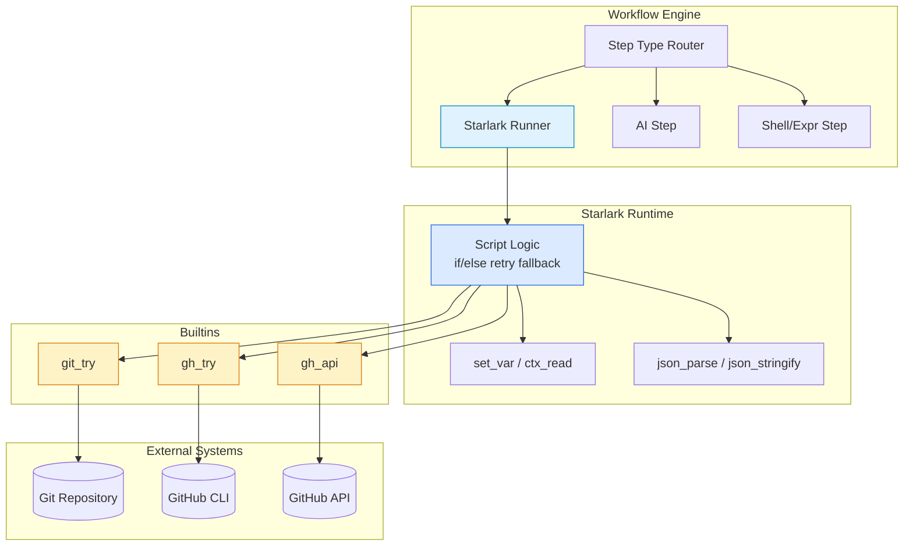
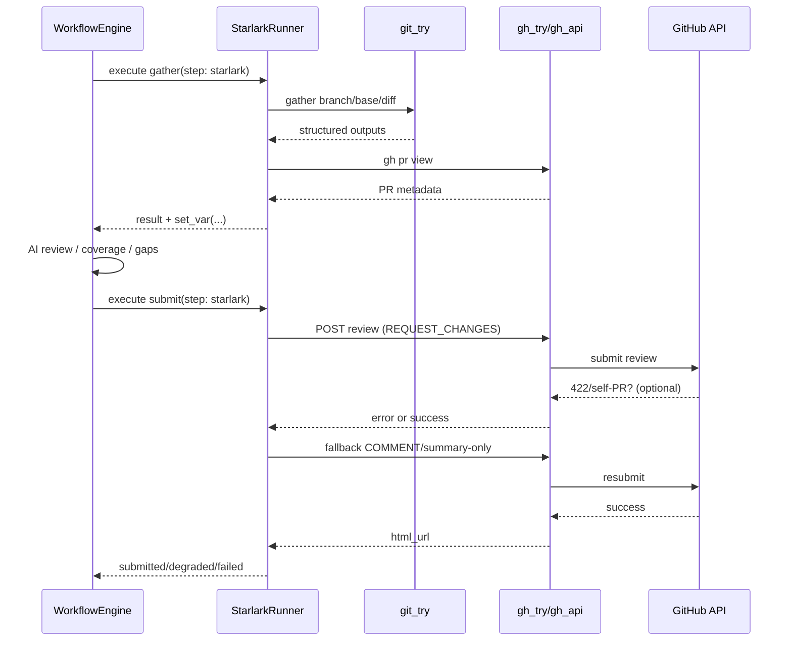

# Starlark Workflow 最佳实践与演进路线

## 目标与结论

本文档用于将当前仓库中的 Starlark 工作流实践沉淀为可执行规范，目标如下：

1. 明确 Starlark 在 Workflow 中的定位与边界。
2. 固化可维护、可测试、可观测的工程实践。
3. 给出分阶段演进路线，支持后续平台化。

当前建议结论：**采用“Starlark 编排 + Builtin 执行”的混合模式，不追求纯 Bash 或纯 Starlark 的极端方案。**

## 架构定位

Starlark 负责流程决策与结构化数据处理，底层系统能力通过内置函数（如 `git_try`、`gh_try`、`gh_api`）提供。

上图体现的关键边界：

- **业务流程语义**在脚本层（可读、可审计）。
- **外部副作用**集中在 Builtin（可控、可治理）。
- Workflow Engine 仅做类型分发与生命周期管理。

## 运行时流程（以 CodeReview 为例）

该流程强调“**显式降级链**”：主路径失败后进入受控 fallback，而不是脚本异常中断。

## 性能与容量实践

在当前架构下，端到端耗时主要由外部调用决定。可用如下近似模型评估：

$$
T_{total} \approx T_{script} + N_{proc}\cdot t_{proc} + N_{api}\cdot t_{api}
$$

其中：

- $T_{script}$：Starlark 解释执行时间（通常较小）。
- $N_{proc}$：子进程调用次数（如 `git` / `gh`）。
- $N_{api}$：远程 API 请求次数。

优化优先级：

1. **先降调用次数**（合并 gather、减少重复查询）。
2. 再做重试策略优化（只对可重试错误生效）。
3. 最后再考虑脚本微优化。

## 最佳实践清单

### 1) 契约稳定

- 固定 step 输出字段：`status`、`error`、`details`、`degraded`。
- `set_var` 字段版本化，遵循“新增字段优先，避免破坏重命名”。
- 统一空值语义（如空字符串 vs `null`）。

### 2) 幂等与重入

- 对可能重试的提交步骤，保证重复执行不会放大副作用。
- 对外提交前做最小必要检查（PR context、repo、commit_id）。

### 3) 错误分层

- 区分：可重试（网络抖动、限流）与不可重试（权限、参数、业务禁止）。
- fallback 逻辑必须输出原始错误与降级原因，便于审计。

### 4) 可观测性

- 统一日志字段：`workflow_id`、`run_id`、`step_id`、`retry_count`、`duration_ms`。
- 记录降级链路（`original_event`、`effective_event`、`fallback_error`）。

### 5) 安全边界

- Builtin 参数白名单，禁止拼接不受控命令。
- 敏感数据（token、secret）不得写入结果上下文与普通日志。

### 6) 测试分层

- Runtime 单测：类型转换、内置函数、错误路径。
- Definition 契约测试：step type、条件分支、重试/退出规则。
- 关键链路集成测试：gather→review→submit（含 fallback）。

## 未来路线图

### 阶段 A（0-2 周）：稳定化

目标：统一契约，减少维护歧义。

- 产出 gather/submit 字段字典与示例。
- 统一状态枚举：`submitted | failed | skipped | degraded`。
- 统一 builtin 超时与错误包装格式。

### 阶段 B（1-2 月）：性能与可靠性

目标：降低外部调用成本，提升失败可恢复性。

- 增加“批量 gather builtin”减少多次 `git_try`。
- 为 `gh_api` 引入受控退避重试（按错误类型启用）。
- 在 run 内引入短时缓存（PR metadata / repo 信息）。

### 阶段 C（1 个季度）：平台化治理

目标：将脚本治理从“可用”提升到“可规模化演进”。

- 增加 Starlark 预检/lint（契约字段、危险调用、未使用变量）。
- 增加 dry-run/simulate 模式（不提交、只验证流程决策）。
- Workflow 定义引入版本与迁移策略。

## 可执行验收标准

1. 默认 CodeReview Starlark Workflow 在无 PR、self PR、422 三类场景下都有可解释结果。
2. 回归测试覆盖 submit fallback 分支，且构建通过。
3. 日志可追踪单次 run 的每个 step 决策与降级原因。
4. 文档与实现字段保持一致，变更时同步更新本文件。

## 适用边界

适合使用 Starlark 的场景：

- 需要结构化流程编排、分支与重试控制。
- 需要 JSON 语义处理与可审计结果。

不建议完全替代 Bash 的场景：

- 超重 shell 管道/文本流处理（依赖 awk/sed 生态）。
- 强系统环境耦合的一次性运维脚本。

结论：**未来建议持续推进“Starlark 为主、Bash 为辅、Builtin 收口”的渐进演进路线。**
