# Projects / Issues / Tasks 自动化编排设计

> 版本：v1.0  
> 日期：2026-04-13

## 1. 目标与约束

### 1.1 目标

在 Coagent 现有 `Session / TeamOrchestrator / TeamManager / Mission` 基础上，新增三层抽象：

- **Project**：业务目标与范围容器
- **Issue**：待解决问题（需求、缺陷、风险、债务）
- **Task**：Issue 的可执行最小工作单元

并形成自动闭环：

1. 自动检测并生成 Issue
2. 自动将 Issue 拆解为 Task
3. 自动路由 Task 给合适的 Agent 角色执行
4. 自动验证并回写结果，直至关闭 Issue

### 1.2 约束

- 保持与现有模块兼容，不破坏当前 `chat / teams / team-orchestrator` 行为
- 所有自动动作必须可追溯（谁触发、为何触发、证据是什么）
- 支持“建议模式（shadow mode）”与“自动执行模式（auto mode）”
- 高风险动作默认需要人工确认

---

## 2. 领域模型设计

先定义清晰边界，避免把“会话消息流”直接当“项目管理数据”。

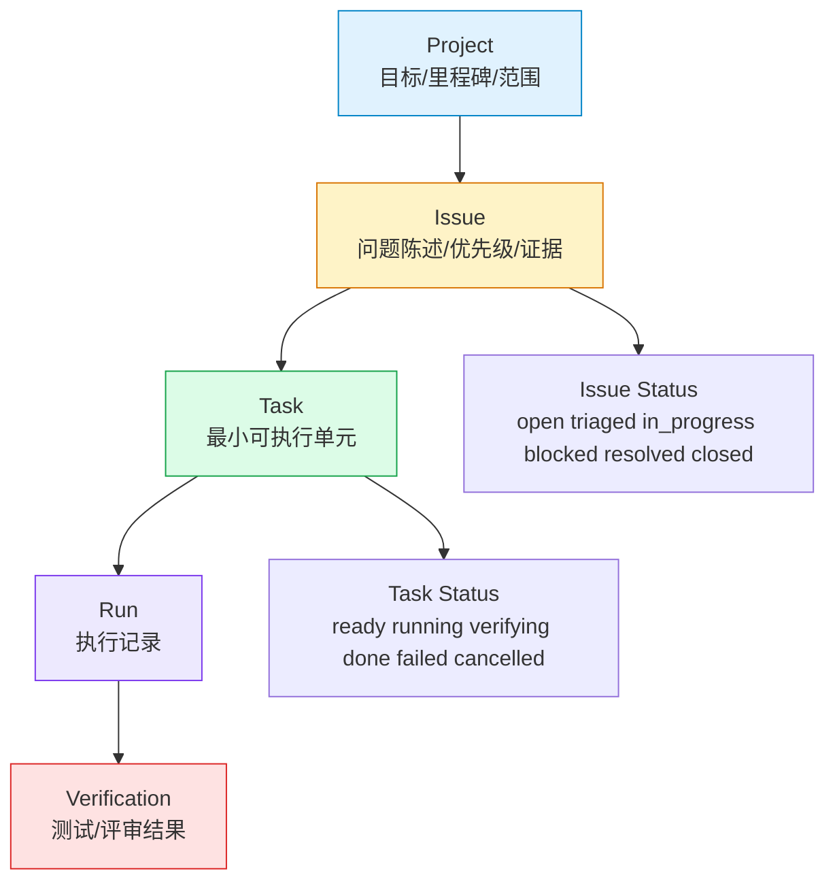

上图将“业务管理对象（Project/Issue/Task）”与“执行痕迹（Run/Verification）”拆开，便于审计和回放。

### 2.1 关键关系

- `Project 1 - N Issue`
- `Issue 1 - N Task`
- `Task 1 - N Run`
- `Run 1 - N Verification Artifact`

---

## 3. 系统架构与模块边界

该方案以“检测器 + 规划器 + 执行器 + 验证器”四段式组织，并复用既有模块能力。

```mermaid
graph TD
    subgraph UI
        U1[Projects 面板]
        U2[Issues 面板]
        U3[Tasks 面板]
    end

    subgraph API
        A1[/api/projects/*]
        A2[/api/issues/*]
        A3[/api/tasks/*]
        A4[/api/automation/*]
    end

    subgraph Core
        D[Issue Detector]
        PL[Task Planner]
        RR[Role Router]
        EX[Task Executor]
        VF[Verifier]
    end

    subgraph Existing Components
        MGR[Manager]
        TOR[TeamOrchestrator]
        TMG[TeamManager]
        REG[Registry]
        EVT[EventStore]
    end

    subgraph Storage
        DB[(SQLite)]
    end

    U1 --> A1
    U2 --> A2
    U3 --> A3
    A4 --> D --> PL --> RR --> EX --> VF

    EX --> MGR
    EX --> TOR
    EX --> TMG
    RR --> REG
    D --> EVT
    A1 --> DB
    A2 --> DB
    A3 --> DB
    A4 --> DB

    style U1 fill:#e0f2fe,stroke:#0284c7
    style U2 fill:#e0f2fe,stroke:#0284c7
    style U3 fill:#e0f2fe,stroke:#0284c7
    style D fill:#fef3c7,stroke:#d97706
    style PL fill:#dcfce7,stroke:#16a34a
    style EX fill:#ede9fe,stroke:#7c3aed
```

### 3.1 复用策略

- **Issue Detector**：消费 `EventStore`、测试失败、用户反馈
- **Task Planner**：用 Prompt + Agent 规则拆解任务
- **Role Router**：复用 `RouteTaskToRole` 关键词路由能力
- **Executor**：调用 `Manager/TeamOrchestrator/TeamManager` 执行
- **Verifier**：整合测试、静态检查、审查结果

---

## 4. 功能描述（输入/输出/状态/边界）

### 4.1 Project

- 输入：名称、目标、里程碑、优先级策略
- 输出：Project 详情、进度摘要
- 状态：`active / paused / archived`
- 边界：Project 不直接执行代码，仅承载范围与治理

### 4.2 Issue

- 输入：检测信号（日志、失败、变更、用户提报）
- 输出：Issue 卡片（标题、描述、证据、置信度、影响范围）
- 状态：`open -> triaged -> in_progress -> resolved -> closed`
- 边界：Issue 是问题定义，不承载执行细节

### 4.3 Task

- 输入：Issue + 规划策略
- 输出：可执行任务（owner role、验收条件、依赖）
- 状态：`ready -> running -> verifying -> done/failed/cancelled`
- 边界：Task 是执行单元，不做问题归因

---

## 5. 自动化流程设计

以下时序体现“自动检测 -> 自动拆解 -> 自动执行 -> 自动验证”的完整链路。

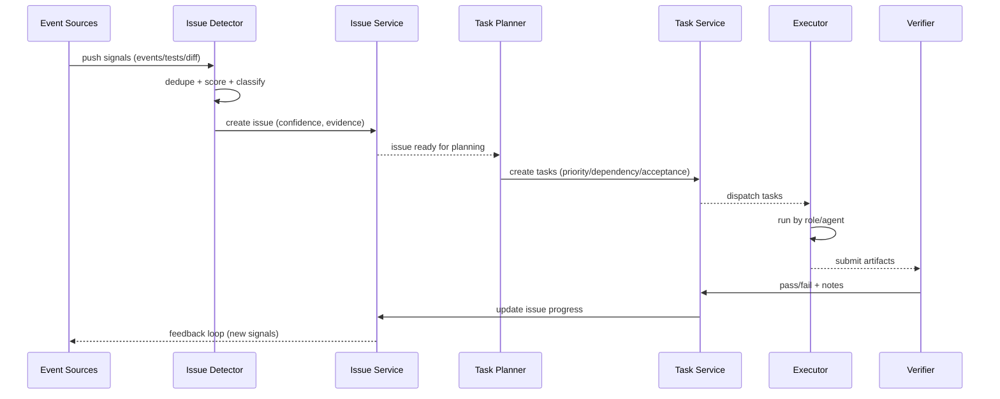

### 5.1 自动检测策略

- 信号源：
  - `session.*` 事件异常（error/abort/retry）
  - 测试失败摘要
  - 代码审查问题
  - 用户主动反馈
- 去重键建议：`(project_id, normalized_title, file_scope_hash)`
- 置信度分段：
  - `>= 0.8`：自动建 Issue
  - `0.5 - 0.8`：进入候选池待确认
  - `< 0.5`：仅记录信号，不升级

### 5.2 自动拆解策略

- 每个 Issue 默认拆解 2~6 个 Task，限制爆炸增长
- 每个 Task 强制包含：
  - `owner_role`
  - `acceptance_criteria`
  - `verification_type`（test/lint/review/manual）
- 若无法生成可验证验收条件，Task 不可自动执行

### 5.3 自动执行策略

- 执行模式：
  - `shadow`：仅生成建议，不执行
  - `assisted`：用户批准后执行
  - `auto`：高置信度路径自动执行
- 失败回路：
  - Task 失败可自动创建后续修复 Task
  - 连续失败超过阈值转 `blocked` 并请求人工介入

---

## 6. 状态机设计

先明确状态迁移，防止自动化失控。

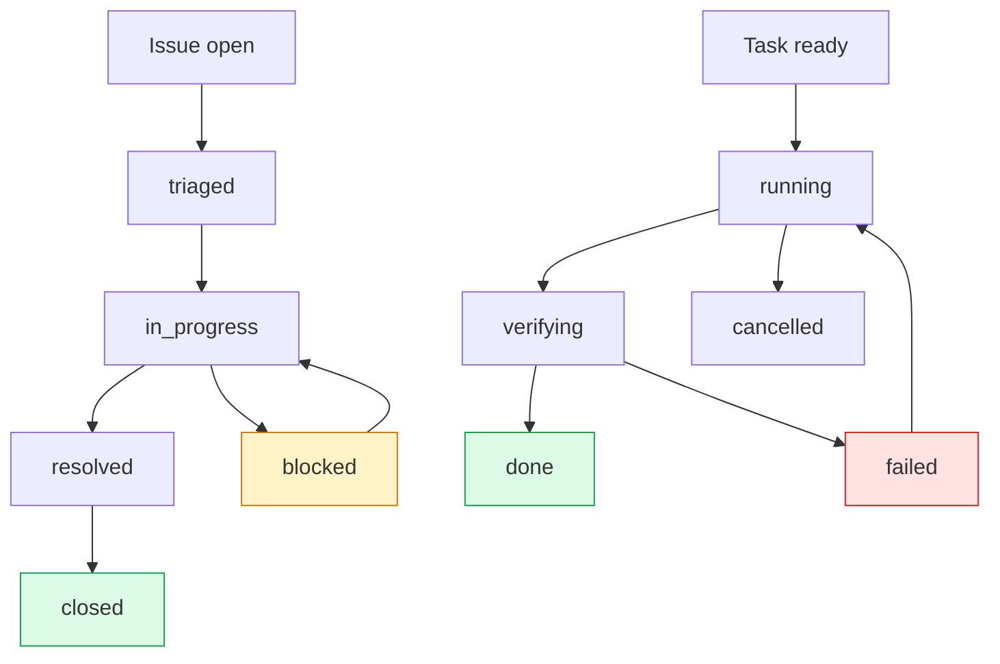

状态机约束建议：

- `Issue closed` 前必须全部 Task 处于 `done/cancelled`
- `Task done` 前必须有验证记录
- `blocked` 状态必须携带阻塞原因

---

## 7. API 草案（第一版）

### 7.1 Projects

- `POST /api/projects`
- `GET /api/projects`
- `GET /api/projects/{id}`
- `PUT /api/projects/{id}`
- `POST /api/projects/{id}/archive`

### 7.2 Issues

- `POST /api/projects/{id}/issues`
- `GET /api/projects/{id}/issues`
- `POST /api/projects/{id}/issues/detect`（批量检测）
- `PUT /api/issues/{id}/status`
- `POST /api/issues/{id}/triage`

### 7.3 Tasks

- `POST /api/issues/{id}/plan-tasks`
- `GET /api/issues/{id}/tasks`
- `POST /api/tasks/{id}/start`
- `POST /api/tasks/{id}/retry`
- `PUT /api/tasks/{id}/status`

### 7.4 Automation

- `POST /api/automation/detect-cycle`
- `POST /api/automation/execute-cycle`
- `GET /api/automation/runs/{id}`

---

## 8. 数据存储草案（SQLite）

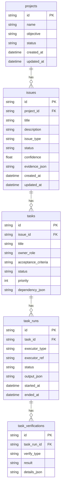

---

## 9. 分阶段实施计划

### Phase 1（MVP）

- 新增 Project/Issue/Task 基础模型与 CRUD API
- 前端新增基础看板（列表 + 详情）
- 人工触发 Issue 检测与 Task 规划

### Phase 2（半自动）

- 引入 Issue Detector 周期任务
- 支持 `assisted mode`：自动建议 + 人工批准执行
- 接入 `RouteTaskToRole` 自动路由

### Phase 3（自动闭环）

- 支持 `auto mode` 高置信度自动执行
- 失败回路与阻塞升级
- 指标面板（吞吐、成功率、平均修复时长）

---

## 10. 验证与验收标准

### 10.1 功能验收

1. 可创建 Project，并在其下管理 Issue/Task
2. 可自动检测并产出去重后的 Issue
3. 可自动拆解 Task 并执行
4. 可根据验证结果自动更新状态

### 10.2 质量验收

- 自动检测误报率可配置（阈值可调）
- 自动执行可全链路追溯（含证据与日志）
- 失败链路可恢复，不会陷入无限重试

### 10.3 安全验收

- 高风险动作默认需确认
- 所有自动执行支持暂停/停止
- 数据层保留审计字段（触发源、触发时间、执行者）

---

## 11. 开放决策点（实现前确认）

1. **Issue Detector 触发频率**：事件驱动、定时轮询，还是混合模式
2. **auto mode 默认开关**：全局关闭还是按 Project 配置
3. **Task 执行载体优先级**：优先 `TeamOrchestrator` 还是 `TeamManager`
4. **与 GitHub Issues 同步策略**：仅本地、单向同步、双向同步

以上 4 点确认后，可进入实现阶段（后端模型/API → 前端看板 → 自动化引擎）。

---

## 12. 本地实现同步（Phase 2：半自动执行）

本节用于同步 `dev1` 分支的 Phase 2 落地内容：在已有 Project/Issue/Task CRUD 与 detect/plan 基础上，新增 Task 执行入口，打通“任务路由 → 会话发送 → 状态回写”的最小闭环。

### 12.1 新增执行链路

```mermaid
graph TD
    UI[Projects 面板点击 Execute/Retry] --> API1[POST /api/tasks/{id}/start]
    UI --> API2[POST /api/tasks/{id}/retry]

    API1 --> LOAD[加载 Task/Issue/Project]
    API2 --> LOAD

    LOAD --> ROUTE[RouteTaskToRole\n关键词路由 owner_role]
    ROUTE --> MODE{mode}

    MODE -->|shadow| PREVIEW[仅返回执行计划\n不发送消息]
    MODE -->|assisted/auto| SESSION[选择或创建 Session]
    SESSION --> SEND[Manager.SendMessage]
    SEND --> WRITE[Task status=running\nIssue status=in_progress]
    WRITE --> RESP[返回执行结果与追踪信息]

    style UI fill:#e0f2fe,stroke:#0284c7
    style ROUTE fill:#fef3c7,stroke:#d97706
    style SEND fill:#ede9fe,stroke:#7c3aed
    style WRITE fill:#dcfce7,stroke:#16a34a
```

设计要点：

- `shadow` 模式用于“只看计划不执行”，方便人工确认。
- `assisted/auto` 模式才会进入会话发送。
- `owner_role` 允许自动路由补全，避免手工遗漏角色。
- 执行后回写 `task.output_summary`，保证可追溯。

### 12.2 执行请求/响应（草案）

执行请求（`start/retry` 共用）：

- `mode`: `shadow | assisted | auto`（默认 `assisted`）
- `session_id`: 可选，指定目标会话
- `model`: 可选，新建会话时使用

执行响应核心字段：

- `started`: 是否已实际发送
- `mode`: 实际执行模式
- `session_id`: 发送目标会话
- `created_new_session`: 是否自动创建新会话
- `routed`: 路由候选
- `selected_route`: 采用的路由
- `task / issue / project`: 最新对象快照

### 12.3 时序（assisted/auto）

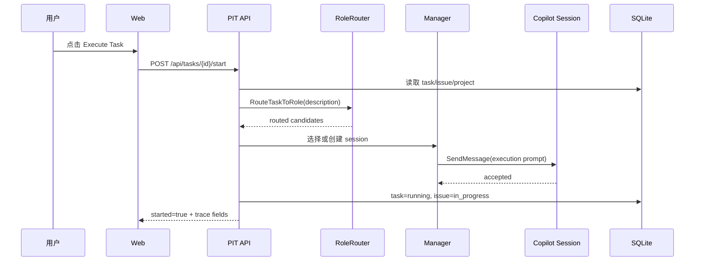

### 12.4 边界与回退策略

- 未启动 Copilot 且无法复用现有 session：返回可解释错误，不静默失败。
- `retry` 仅允许 `failed/cancelled` 任务进入重试。
- `shadow` 不改写为 `running`，仅更新摘要与建议。
- 若 Project 触发了新会话，可将 session 自动补充到 `project.session_ids`，便于后续 detect 与复用。

---

## 13. 本地实现同步（Phase 2.5：Task→Issue 状态自动回写）

在 Phase 2 已具备任务执行入口后，本阶段补齐“执行结果回写”闭环：当 Task 状态变化时，自动汇总并刷新 Issue 状态，减少手动维护。

### 13.1 状态汇总规则

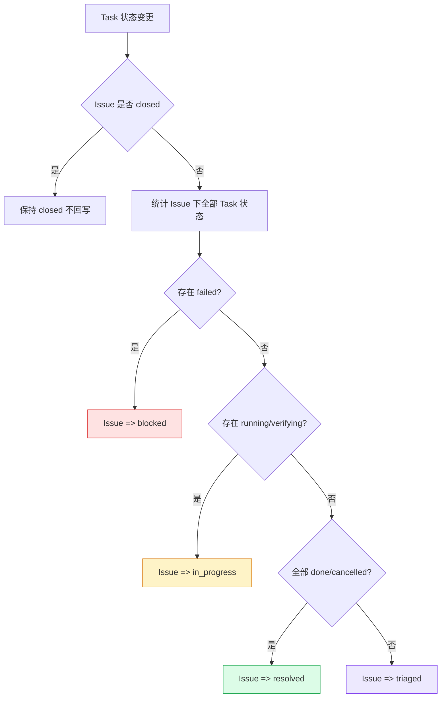

说明：

- `closed` 视为人工终态，不自动改写。
- `failed` 优先级最高，直接标记 `blocked`。
- 存在执行中任务（`running/verifying`）则为 `in_progress`。
- 全部完成（`done/cancelled`）时自动进入 `resolved`。
- 其余待办态归并为 `triaged`。

### 13.2 回写触发点

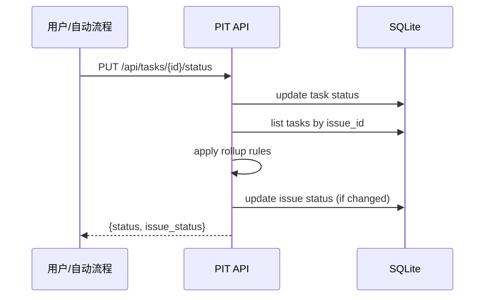

执行回写目标：

- API 返回 `issue_status`，前端可即时刷新 Issue 卡片。
- 自动执行（`start/retry`）与手工改状态使用同一套汇总规则，避免分叉逻辑。

---

## 14. 本地实现同步（Phase 2.6：Issue 自动关闭建议）

在 Phase 2.5 具备状态回写后，进一步增加“关闭建议”能力：当 Issue 已 `resolved` 且任务条件满足时，系统给出可关闭建议，避免人工反复核对。

### 14.1 关闭建议判定规则

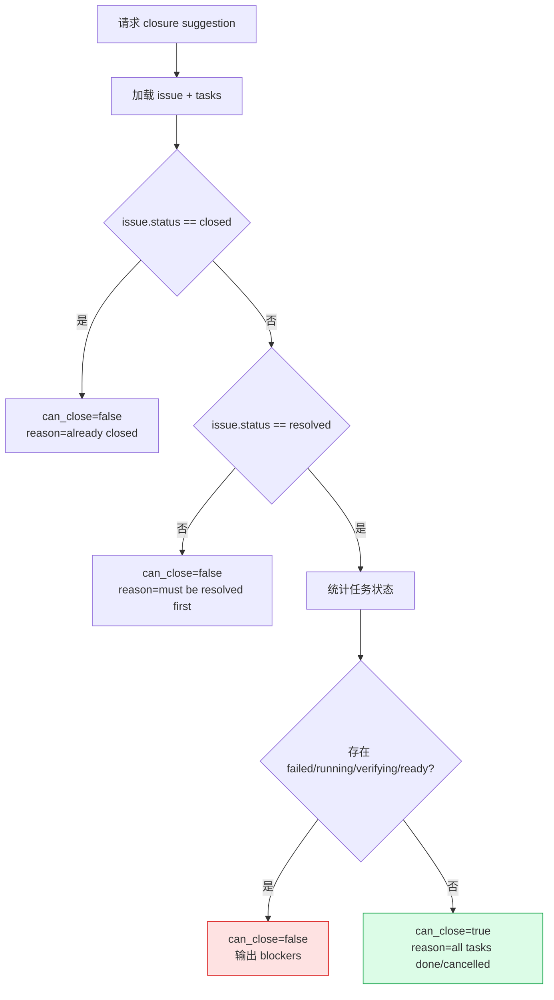

### 14.2 接口草案

- `GET /api/issues/{id}/closure-suggestion`

响应字段：

- `can_close`: 是否建议关闭
- `reason`: 建议说明
- `blockers`: 阻塞项（failed/running/pending 等）
- `total_tasks / done_tasks / cancelled_tasks / failed_tasks / active_tasks / pending_tasks`

### 14.3 前端联动

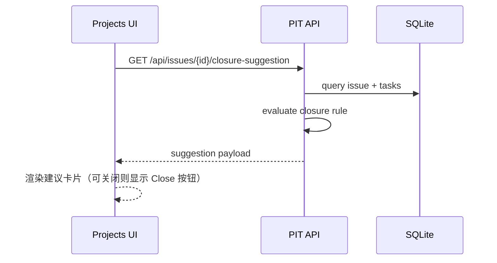

联动触发点：

- 选择 Issue
- 更新 Task 状态
- 执行/重试 Task
- 规划/新增 Task

---

## 15. 本地实现同步（Phase 2.7：Close 安全闸门）

为避免前端绕过或并发状态漂移导致“误关闭 Issue”，在后端对 `close` 动作增加强校验闸门。

### 15.1 闸门规则

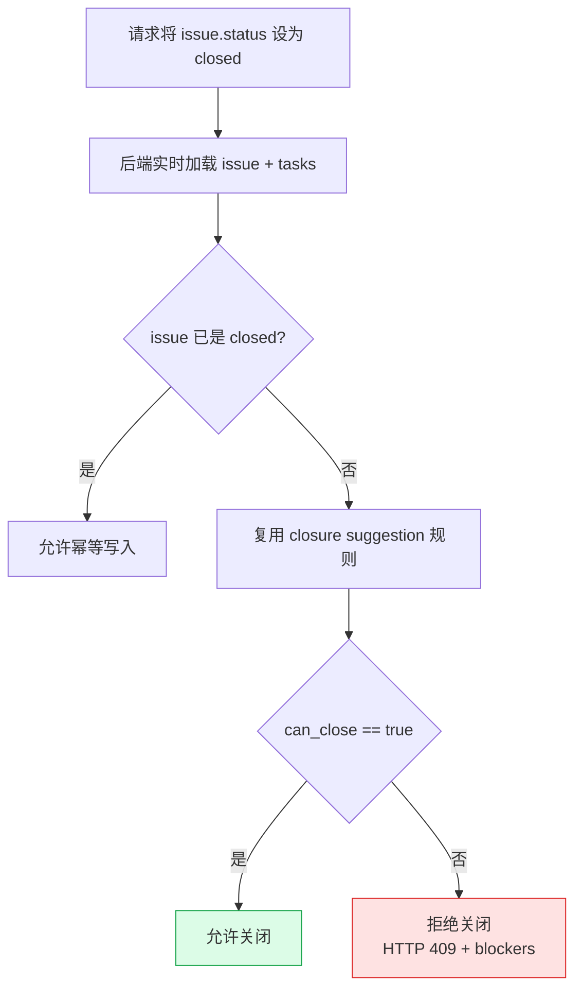

### 15.2 生效范围

- `PUT /api/issues/{id}/status`（显式状态更新）
- `PUT /api/issues/{id}`（通用更新中包含 `status=closed`）

两条路径统一执行同一套闸门逻辑，避免 API 分叉。

### 15.3 拒绝关闭响应

```json
{
    "error": "issue cannot be closed: issue is not ready to close",
    "reason": "issue is not ready to close",
    "blockers": ["1 failed tasks", "2 pending tasks"]
}
```

说明：前端据此直接展示阻塞原因，无需再做二次推断。

---

## 16. 本地实现同步（Phase 2.8：Close 审计日志）

Phase 2.7 已保证“能不能关”由后端统一判定；Phase 2.8 进一步解决“谁在什么条件下尝试关闭、为何被拒绝/放行”的可追溯性问题。

### 16.1 审计写入路径

```mermaid
graph TD
    REQ[关闭请求
PUT /api/issues/{id}
PUT /api/issues/{id}/status] --> LOAD[实时加载 issue + tasks]
    LOAD --> GUARD[执行 close safety gate]
    GUARD -->|允许| ALLOW[写入 issue=closed]
    GUARD -->|拒绝| BLOCK[返回 409 + blockers]

    ALLOW --> AUDIT1[写入 close audit
result=allowed]
    BLOCK --> AUDIT2[写入 close audit
result=blocked]

    AUDIT1 --> RESP1[返回成功响应]
    AUDIT2 --> RESP2[返回冲突响应]

    style GUARD fill:#fef3c7,stroke:#d97706
    style AUDIT1 fill:#dcfce7,stroke:#16a34a
    style AUDIT2 fill:#fee2e2,stroke:#dc2626
```

关键点：

- 仅当请求目标状态为 `closed` 时写审计日志。
- 两条入口（`PUT /api/issues/{id}` 与 `PUT /api/issues/{id}/status`）统一落审计，保证口径一致。
- 审计写入不影响主流程返回语义：关闭成功仍返回 200，关闭被拒仍返回 409。

### 16.2 审计模型与字段

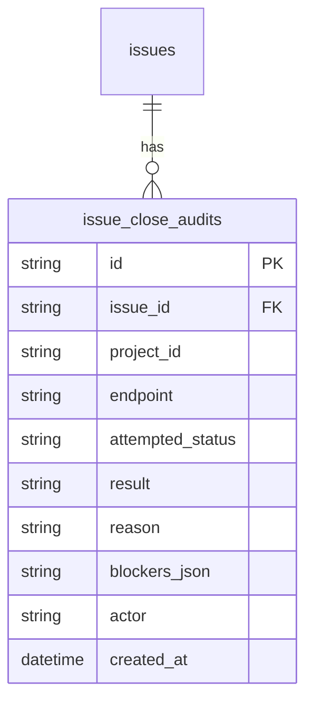

字段说明：

- `endpoint`：记录触发入口（如 `update_issue` / `update_issue_status`）
- `attempted_status`：本次请求目标状态（固定为 `closed`，便于后续扩展）
- `result`：`allowed | blocked`
- `reason` / `blockers_json`：与关闭建议返回一致，支持问题回放
- `actor`：调用侧标识（默认 `user`，可由请求头覆盖）

### 16.3 查询接口与前端展示

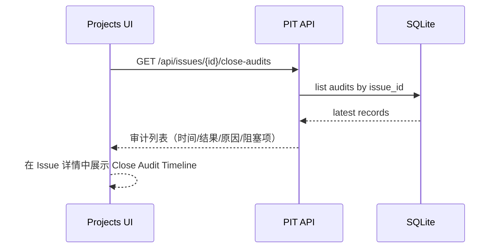

UI 目标：

- 默认展示最近若干条关闭尝试，帮助快速定位“为什么一直关不掉”。
- 允许与 `closure suggestion` 同屏对照：**当前建议** + **历史尝试**。
