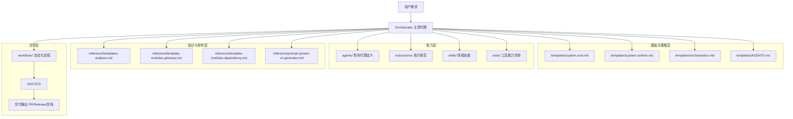
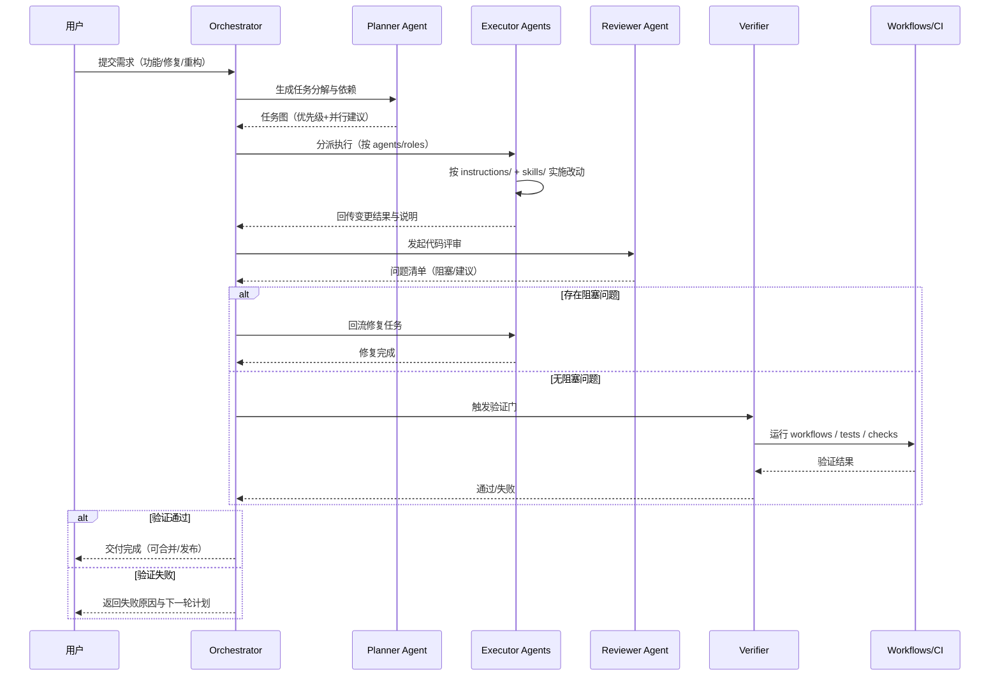
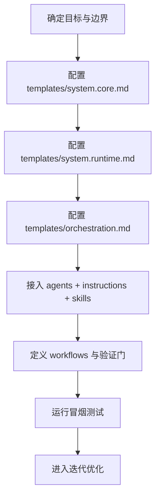

# 多 Agent 协作开发架构图与流程图（仓库映射版）

本文基于当前仓库结构（`agents/`、`instructions/`、`skills/`、`tools/`、`workflows/`、`templates/`）给出可直接使用的 Mermaid 图。

---

## 1) 系统架构图（目录映射版）

---

## 2) 协作流程图（需求到交付）

---

## 3) 模块装配流程图（你后续搭系统提示词可用）

---

## 4) 使用建议

- 架构图用于说明“模块关系”，适合设计评审
- 协作流程图用于说明“执行路径”，适合团队协作
- 模块装配图用于说明“落地顺序”，适合搭建新项目

如果后续你要区分 Go/Frontend/Docs 三条 lane，我可以再给你一版带“并行泳道”的时序图。
