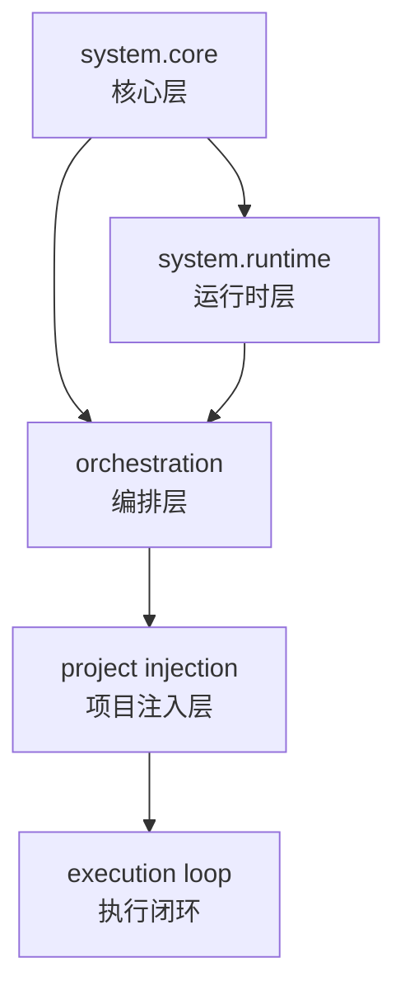
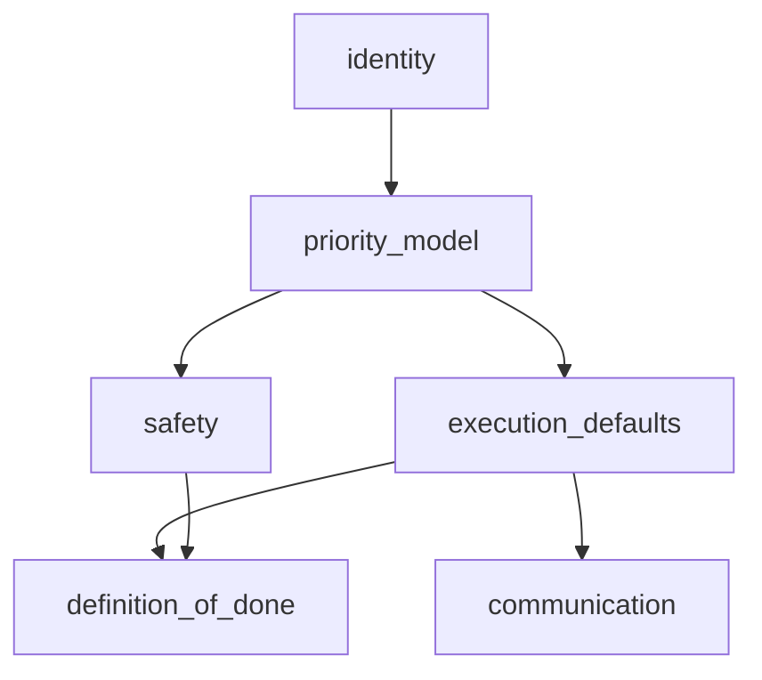
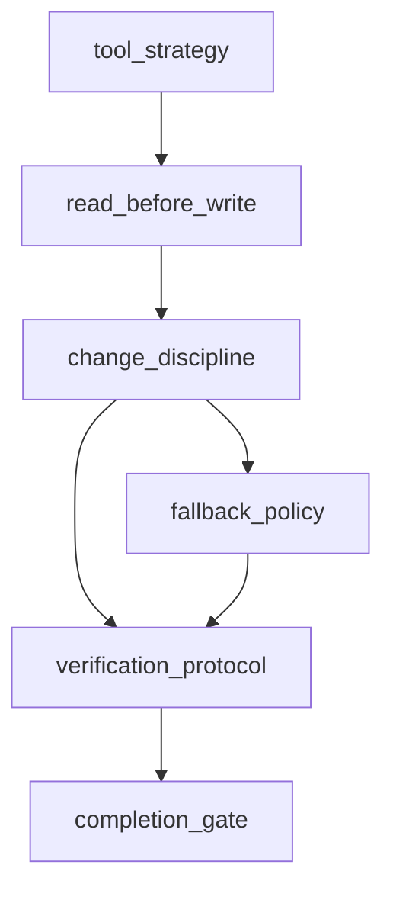
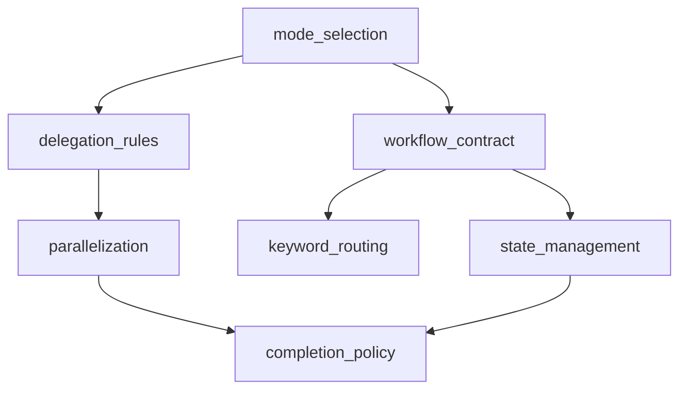

# 模板模块依赖关系图与组装顺序

本文回答两个问题：

1. 模块之间谁依赖谁
2. 你应该按什么顺序搭建自己的系统提示词

---

## 一、全局依赖关系（高层）

说明：

- `system.core` 定义底线与优先级，是所有层的前置依赖
- `system.runtime` 负责工具与执行协议，依赖 core
- `orchestration` 依赖 core + runtime，负责模式与委派
- 项目注入层（skills/agents/instructions）依赖前三层
- 最终统一进入执行闭环（Plan -> Execute -> Verify -> Close）

---

## 二、核心层内部依赖（`system.core.md`）

解释：

- `identity` 给出角色与目标
- `priority_model` 是冲突裁决中心，优先建立
- `safety` 和 `execution_defaults` 都要服从优先级
- `definition_of_done` 同时受安全和执行策略约束

---

## 三、运行时层内部依赖（`system.runtime.md`）

解释：

- 先定工具策略，再定读写顺序
- 改动纪律决定改动边界
- 验证协议与 completion gate 共同形成质量门
- fallback_policy 是失败时的替代路径，不应绕过验证

---

## 四、编排层内部依赖（`orchestration.md`）

解释：

- 先确定模式，再确定是否委派
- 并行策略受委派规则约束
- workflow_contract 是运行主线
- 关键词路由与状态管理是 workflow 的增强层
- completion_policy 基于执行与状态综合判定完成

---

## 五、跨文件关键依赖（你最容易踩坑的地方）

## 1) `priority_model` -> 全文件

- 这是最高杠杆模块
- 没有它，冲突规则会导致行为漂移

## 2) `definition_of_done` + `completion_gate` + `completion_policy`

- 三者要一致，不然会出现：
  - core 说完成了
  - runtime 还没验证
  - orchestration 却已收尾

建议：三处使用同一套完成标准，只在粒度上细化。

## 3) `verification_protocol` 与编排流

- 编排流中的 `Verify` 阶段应直接复用 runtime 验证协议
- 不要在编排层再定义一套冲突验证规则

---

## 六、推荐组装顺序（实践版）

按以下顺序搭建，稳定性最高：

1. `identity`
2. `priority_model`
3. `safety`
4. `execution_defaults`
5. `definition_of_done`
6. `tool_strategy`
7. `read_before_write`
8. `change_discipline`
9. `verification_protocol`
10. `completion_gate`
11. `mode_selection`
12. `delegation_rules`
13. `workflow_contract`
14. `state_management`
15. `completion_policy`
16. 最后再加 `keyword_routing`

原因：`keyword_routing` 最容易引发误触发，应该最后加。

---

## 七、最小可用依赖子集（MVP）

如果你要快速起一版可运行模板，只保留这些：

- core：`identity`、`priority_model`、`safety`、`definition_of_done`
- runtime：`tool_strategy`、`read_before_write`、`verification_protocol`
- orchestration：`mode_selection`、`workflow_contract`、`completion_policy`

这 10 个模块已经足够让系统提示词稳定运行。

---

## 八、扩展策略（防膨胀）

每新增一个模块，先回答：

1. 这个模块解决哪个具体失效点？
2. 它依赖谁？会和谁冲突？
3. 它是否可以复用已有模块而不是新增？

如果这三个问题回答不清，先不要加。

---

## 九、落地建议

- 把本文件和 `template-modules-glossary.md` 一起维护：
  - glossary 负责“模块说明”
  - dependency 负责“模块关系与顺序”
- 每次模板升级后，至少核对一次 Mermaid 依赖图是否仍成立

这样你的系统提示词会从“可用”升级为“可治理”。
